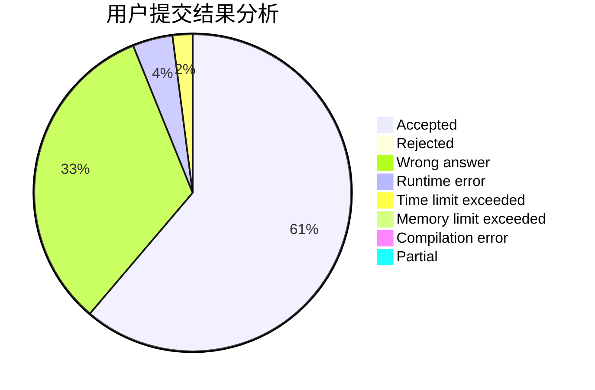
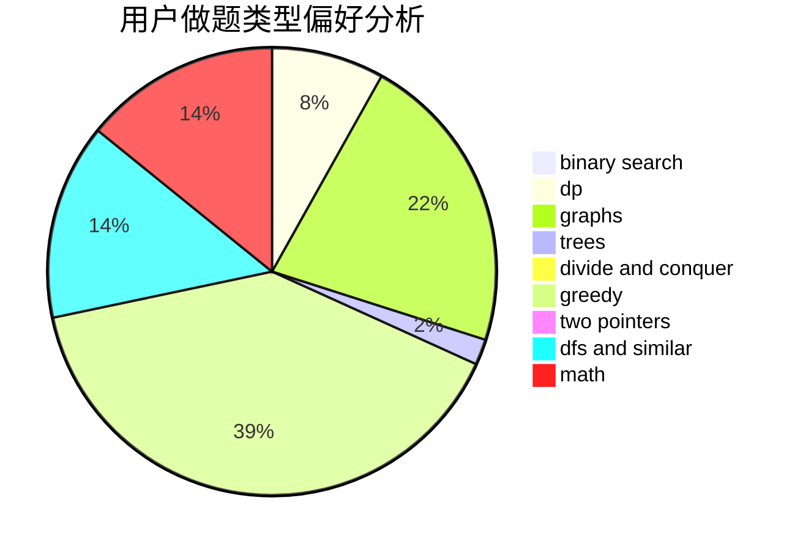

# polkmn

<!-- tabs:start -->

#### **用户提交结果分析**

#### **用户做题类型偏好分析**

<!-- tabs:end -->
# 推荐题目
[1442B](https://codeforces.com/contest/1442/problem/B)
[543E](https://codeforces.com/contest/543/problem/E)
[601C](https://codeforces.com/contest/601/problem/C)
[1131F](https://codeforces.com/contest/1131/problem/F)
[740D](https://codeforces.com/contest/740/problem/D)
[758D](https://codeforces.com/contest/758/problem/D)
[1353F](https://codeforces.com/contest/1353/problem/F)
[1136C](https://codeforces.com/contest/1136/problem/C)
[434A](https://codeforces.com/contest/434/problem/A)
[224B](https://codeforces.com/contest/224/problem/B)
