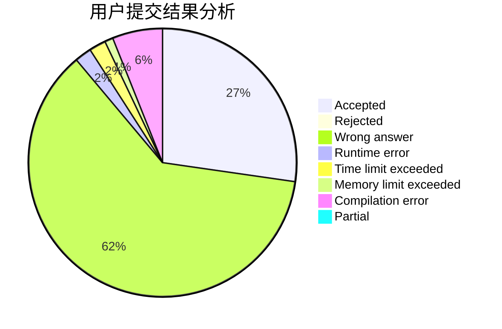
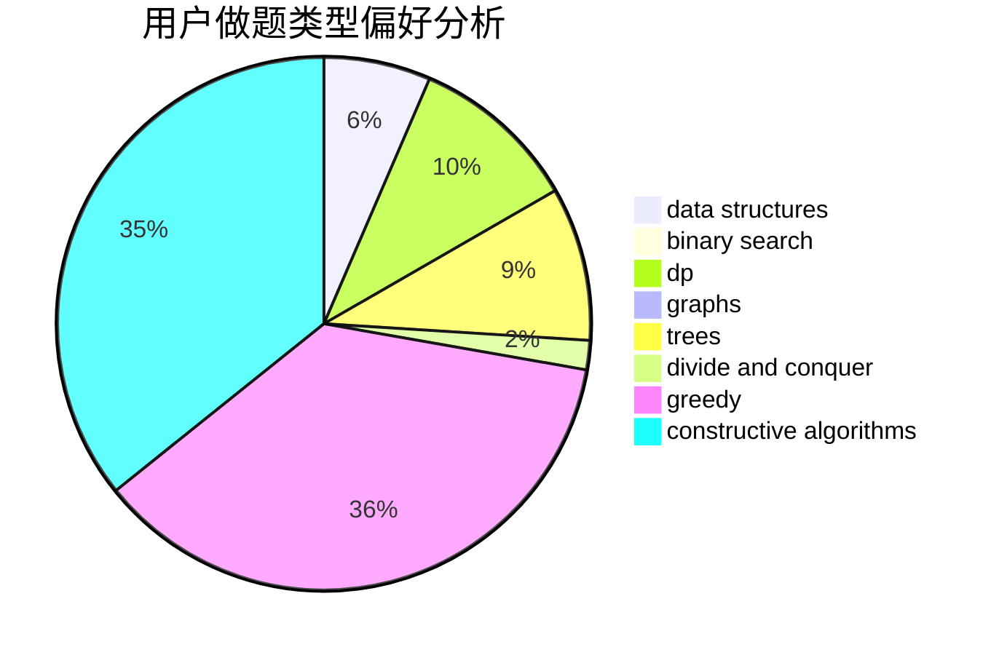
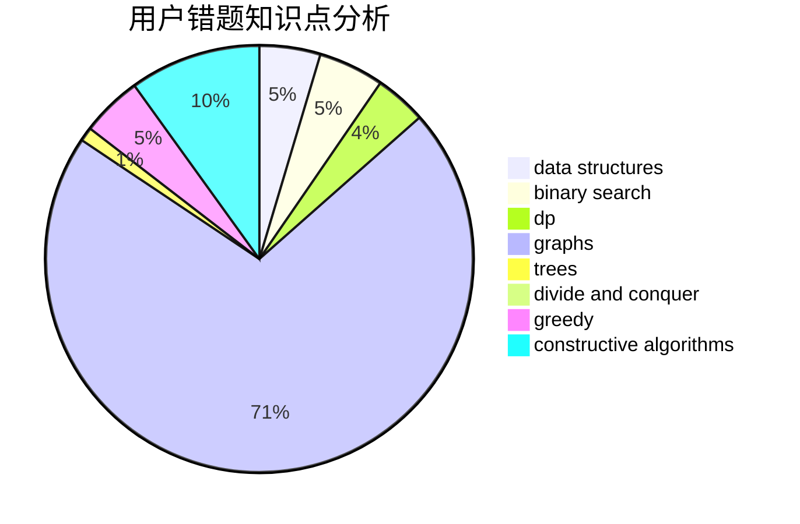

# pophirasawa

<!-- tabs:start -->

#### **用户提交结果分析**

#### **用户做题类型偏好分析**

#### **用户错题知识点分析**

<!-- tabs:end -->
# 推荐题目
[125A](https://codeforces.com/contest/125/problem/A)		math		  
[957B](https://codeforces.com/contest/957/problem/B)		dsu,graphs,sortings,trees		  
[763E](https://codeforces.com/contest/763/problem/E)		data structures,
                        divide and conquer,
                        dsu		  
[163E](https://codeforces.com/contest/163/problem/E)		data structures,
                        dfs and similar,
                        dp,
                        strings,
                        trees		  
[71A](https://codeforces.com/contest/71/problem/A)		strings		  
[1082F](https://codeforces.com/contest/1082/problem/F)		dp,
                        strings,
                        trees		  
[906A](https://codeforces.com/contest/906/problem/A)		implementation,
                        strings		  
[1099A](https://codeforces.com/contest/1099/problem/A)		implementation		  
[567F](https://codeforces.com/contest/567/problem/F)		dp		  
[576D](https://codeforces.com/contest/576/problem/D)		dp,
                        matrices		  
