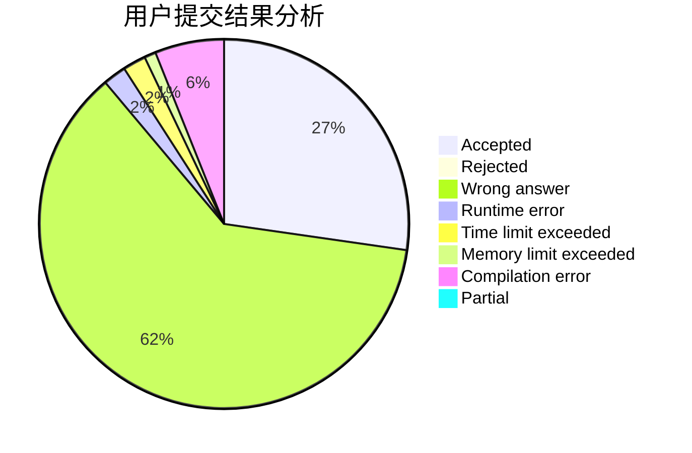
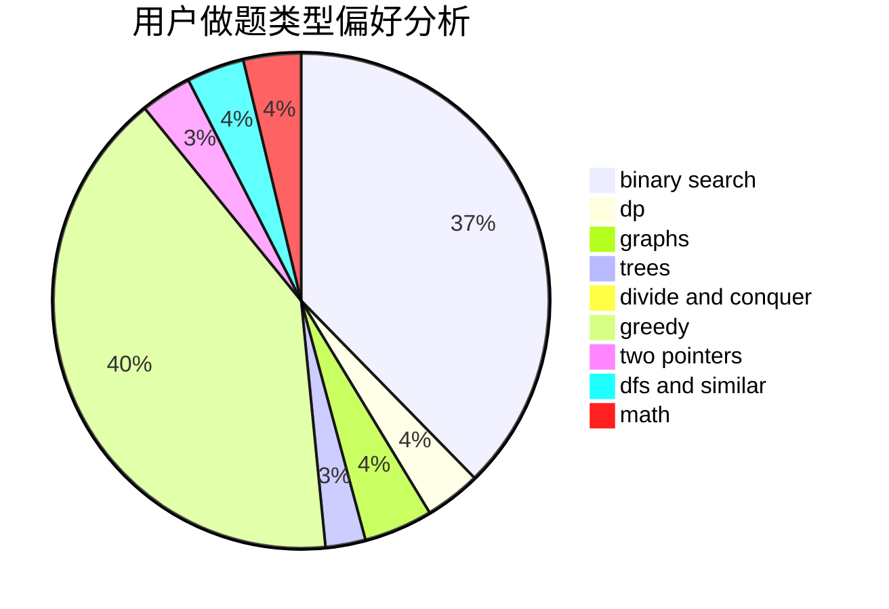

# pophirasawa

<!-- tabs:start -->

#### **用户提交结果分析**

#### **用户做题类型偏好分析**

<!-- tabs:end -->
# 推荐题目
[1265C](https://codeforces.com/contest/1265/problem/C)
[978E](https://codeforces.com/contest/978/problem/E)
[782C](https://codeforces.com/contest/782/problem/C)
[189E](https://codeforces.com/contest/189/problem/E)
[737A](https://codeforces.com/contest/737/problem/A)
[1083B](https://codeforces.com/contest/1083/problem/B)
[91A](https://codeforces.com/contest/91/problem/A)
[1099D](https://codeforces.com/contest/1099/problem/D)
[587E](https://codeforces.com/contest/587/problem/E)
[598D](https://codeforces.com/contest/598/problem/D)
