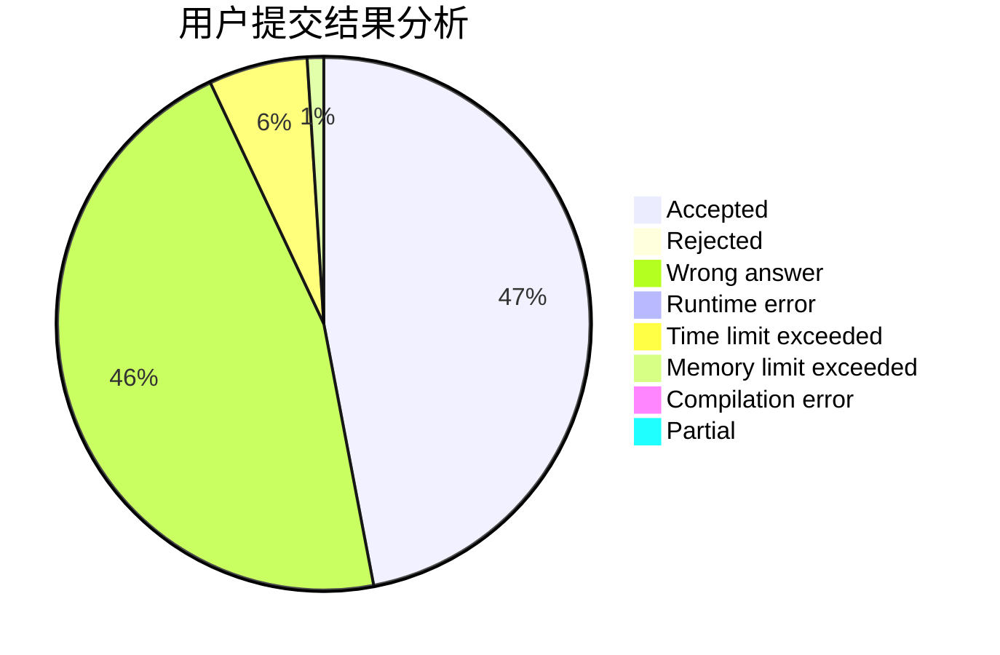
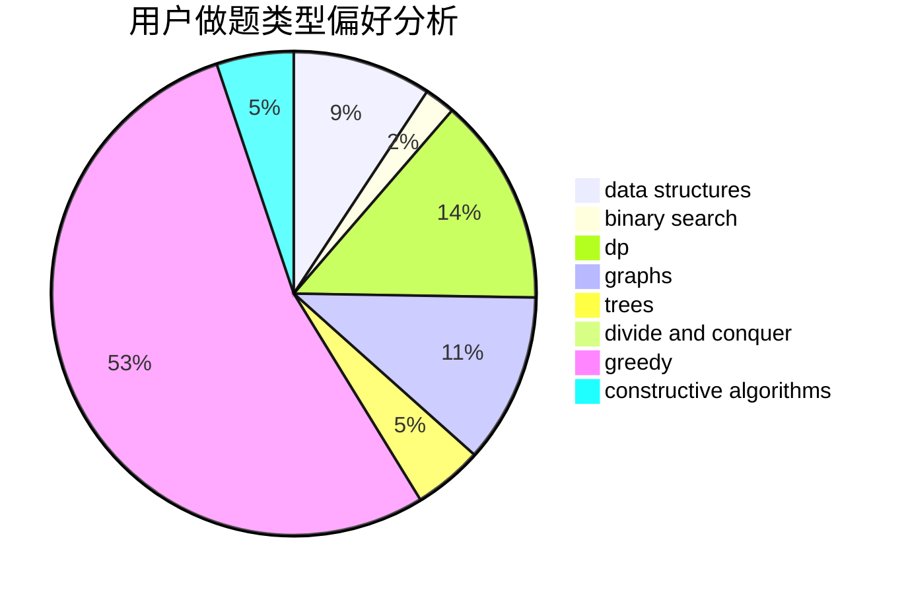

# poplpr

<!-- tabs:start -->

#### **用户提交结果分析**

#### **用户做题类型偏好分析**

#### **用户错题知识点分析**

<!-- tabs:end -->
# 推荐题目
[125A](https://codeforces.com/contest/125/problem/A)		math		  
[895D](https://codeforces.com/contest/895/problem/D)		combinatorics,
                        math,
                        strings		  
[1199E](https://codeforces.com/contest/1199/problem/E)		dsu,graphs,sortings,trees		  
[1184B2](https://codeforces.com/contest/1184B/problem/2)		flows,
                        graph matchings,
                        graphs,
                        shortest paths,
                        sortings		  
[264E](https://codeforces.com/contest/264/problem/E)		data structures,
                        dp		  
[452A](https://codeforces.com/contest/452/problem/A)		brute force,
                        implementation,
                        strings		  
[316G3](https://codeforces.com/contest/316G/problem/3)		string suffix structures		  
[567B](https://codeforces.com/contest/567/problem/B)		implementation		  
[1132D](https://codeforces.com/contest/1132/problem/D)		binary search,
                        greedy		  
[840B](https://codeforces.com/contest/840/problem/B)		constructive algorithms,
                        data structures,
                        dfs and similar,
                        dp,
                        graphs		  
