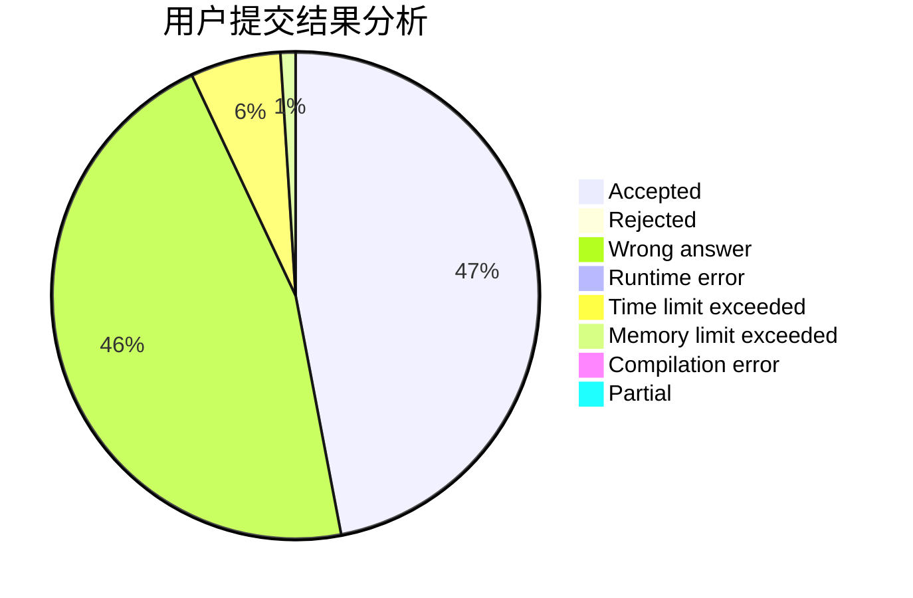
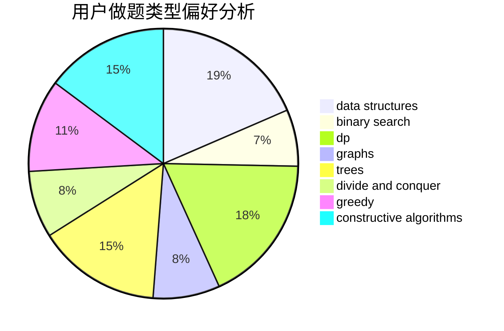

# poplpr

<!-- tabs:start -->

#### **用户提交结果分析**

#### **用户做题类型偏好分析**

#### **用户错题知识点分析**

<!-- tabs:end -->
# 推荐题目
[1265C](https://codeforces.com/contest/1265/problem/C)		dsu,graphs,sortings,trees		  
[913B](https://codeforces.com/contest/913/problem/B)		implementation,
                        trees		  
[1203A](https://codeforces.com/contest/1203/problem/A)		implementation		  
[1187E](https://codeforces.com/contest/1187/problem/E)		dfs and similar,
                        dp,
                        trees		  
[280E](https://codeforces.com/contest/280/problem/E)		data structures,
                        dp,
                        implementation,
                        math		  
[474A](https://codeforces.com/contest/474/problem/A)		implementation		  
[346A](https://codeforces.com/contest/346/problem/A)		games,
                        math,
                        number theory		  
[586F](https://codeforces.com/contest/586/problem/F)		dsu,graphs,sortings,trees		  
[1136C](https://codeforces.com/contest/1136/problem/C)		constructive algorithms,
                        sortings		  
[859F](https://codeforces.com/contest/859/problem/F)		greedy		  
