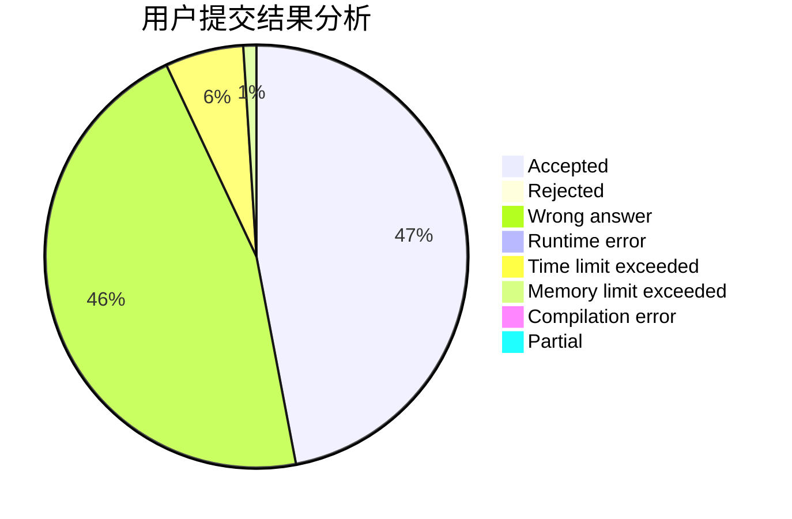
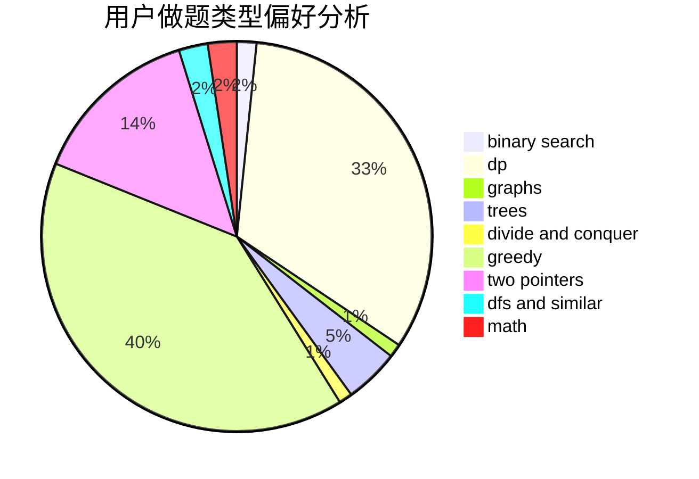

# poplpr

<!-- tabs:start -->

#### **用户提交结果分析**

#### **用户做题类型偏好分析**

<!-- tabs:end -->
# 推荐题目
[1265C](https://codeforces.com/contest/1265/problem/C)
[913B](https://codeforces.com/contest/913/problem/B)
[1203A](https://codeforces.com/contest/1203/problem/A)
[1187E](https://codeforces.com/contest/1187/problem/E)
[280E](https://codeforces.com/contest/280/problem/E)
[474A](https://codeforces.com/contest/474/problem/A)
[346A](https://codeforces.com/contest/346/problem/A)
[586F](https://codeforces.com/contest/586/problem/F)
[1136C](https://codeforces.com/contest/1136/problem/C)
[859F](https://codeforces.com/contest/859/problem/F)
