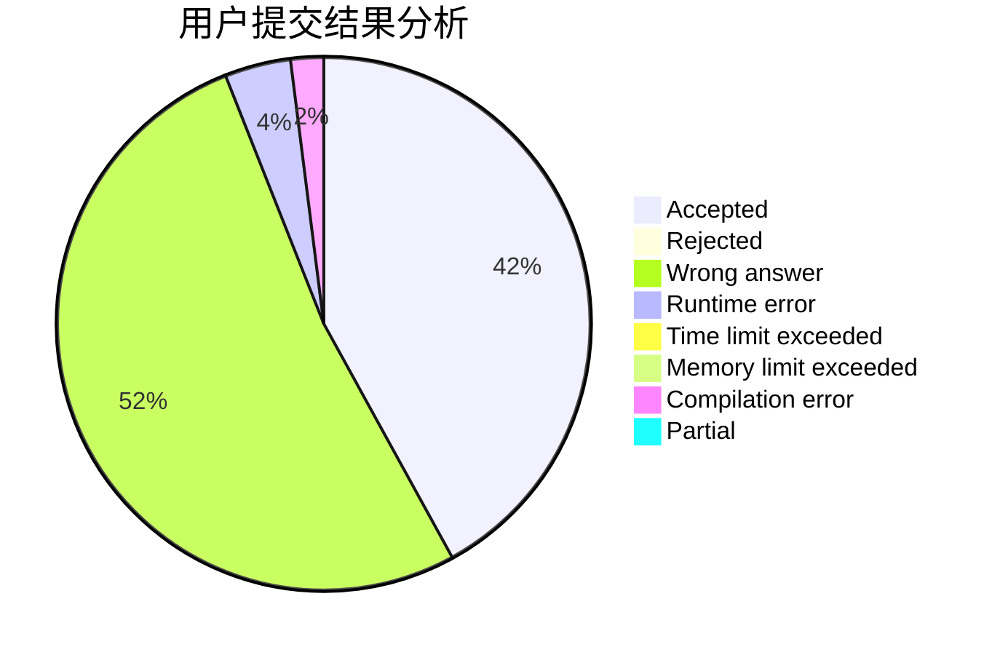
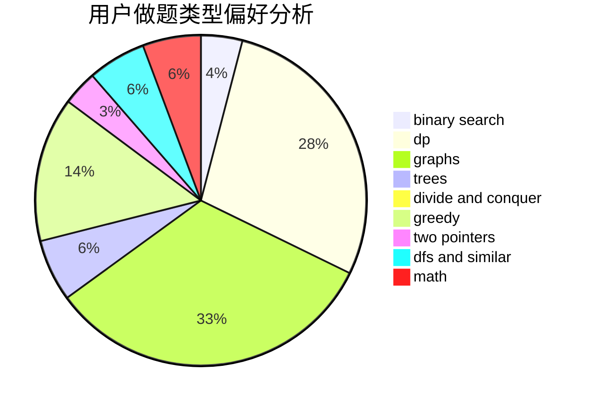

# C.jiangchao

<!-- tabs:start -->

#### **用户提交结果分析**

#### **用户做题类型偏好分析**

<!-- tabs:end -->
# 推荐题目
[1422D](https://codeforces.com/contest/1422/problem/D)
[598E](https://codeforces.com/contest/598/problem/E)
[598C](https://codeforces.com/contest/598/problem/C)
[455A](https://codeforces.com/contest/455/problem/A)
[1057B](https://codeforces.com/contest/1057/problem/B)
[354E](https://codeforces.com/contest/354/problem/E)
[1001B](https://codeforces.com/contest/1001/problem/B)
[264D](https://codeforces.com/contest/264/problem/D)
[1261A](https://codeforces.com/contest/1261/problem/A)
[599A](https://codeforces.com/contest/599/problem/A)
