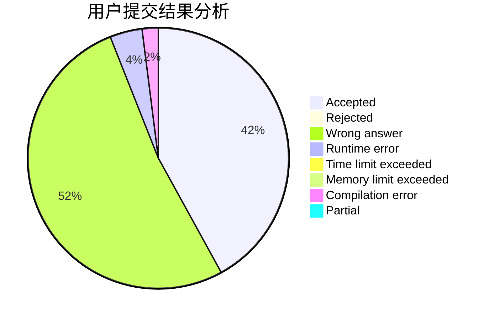
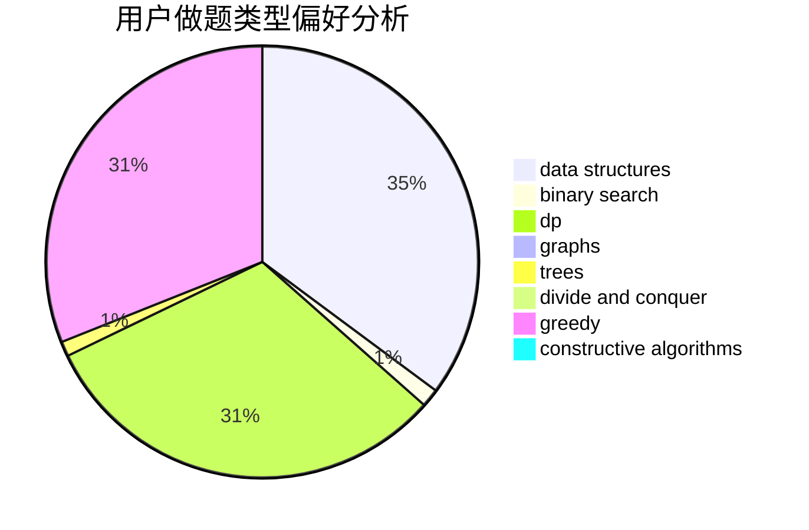
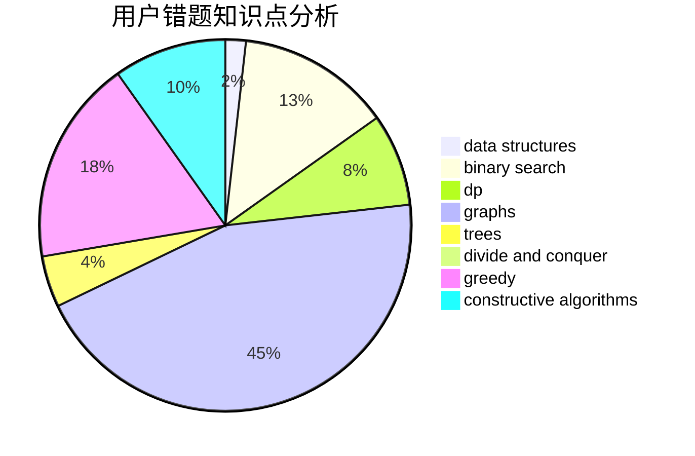

# C.jiangchao

<!-- tabs:start -->

#### **用户提交结果分析**

#### **用户做题类型偏好分析**

#### **用户错题知识点分析**

<!-- tabs:end -->
# 推荐题目
[1413B](https://codeforces.com/contest/1413/problem/B)		implementation		  
[576E](https://codeforces.com/contest/576/problem/E)		binary search,
                        data structures		  
[576C](https://codeforces.com/contest/576/problem/C)		constructive algorithms,
                        divide and conquer,
                        geometry,
                        greedy,
                        sortings		  
[434B](https://codeforces.com/contest/434/problem/B)		dsu,graphs,sortings,trees		  
[1056F](https://codeforces.com/contest/1056/problem/F)		binary search,
                        dp,
                        math		  
[325D](https://codeforces.com/contest/325/problem/D)		dsu		  
[1001B](https://codeforces.com/contest/1001/problem/B)		*special problem		  
[243C](https://codeforces.com/contest/243/problem/C)		dfs and similar,
                        implementation		  
[1254A](https://codeforces.com/contest/1254/problem/A)		constructive algorithms,
                        greedy,
                        implementation		  
[577B](https://codeforces.com/contest/577/problem/B)		combinatorics,
                        data structures,
                        dp,
                        two pointers		  
