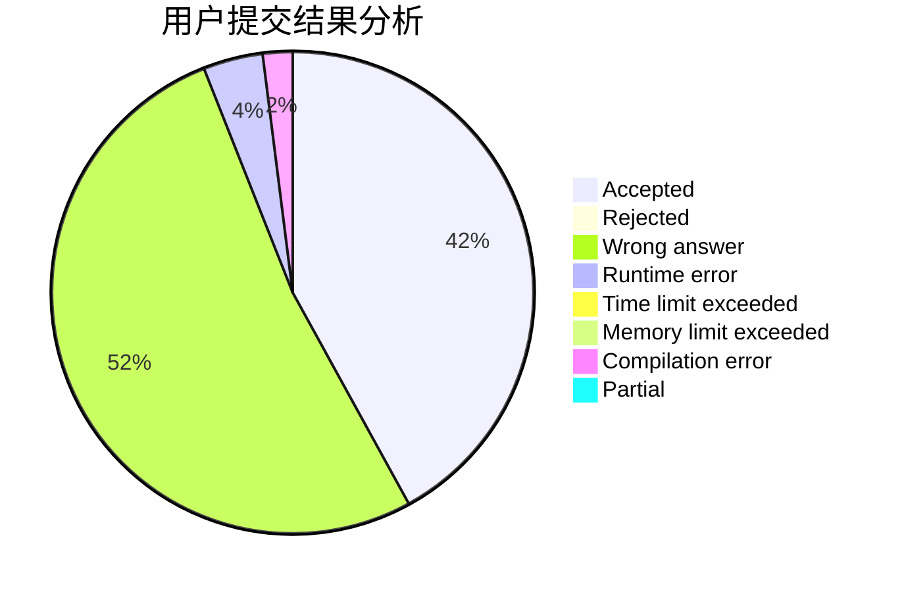
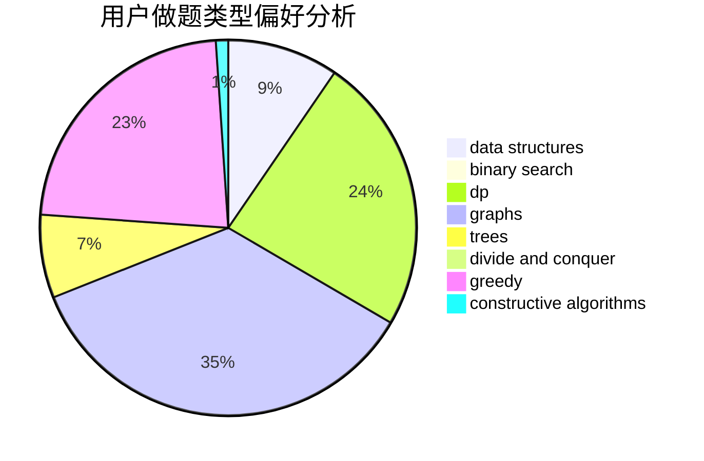
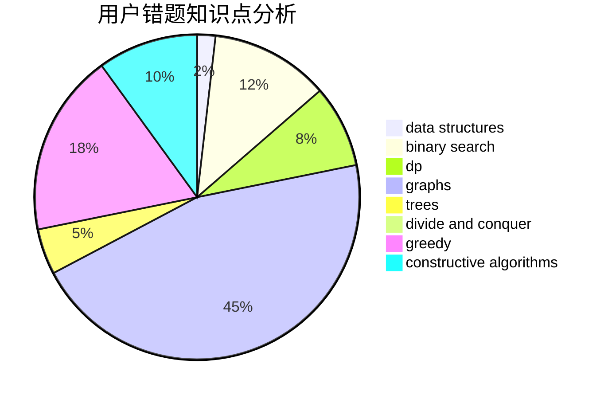

# C.jiangchao

<!-- tabs:start -->

#### **用户提交结果分析**

#### **用户做题类型偏好分析**

#### **用户错题知识点分析**

<!-- tabs:end -->
# 推荐题目
[1422D](https://codeforces.com/contest/1422/problem/D)		graphs,
                        shortest paths,
                        sortings		  
[598E](https://codeforces.com/contest/598/problem/E)		brute force,
                        dp		  
[598C](https://codeforces.com/contest/598/problem/C)		geometry,
                        sortings		  
[455A](https://codeforces.com/contest/455/problem/A)		dp		  
[1057B](https://codeforces.com/contest/1057/problem/B)		*special problem,
                        brute force		  
[354E](https://codeforces.com/contest/354/problem/E)		constructive algorithms,
                        dfs and similar,
                        dp		  
[1001B](https://codeforces.com/contest/1001/problem/B)		*special problem		  
[264D](https://codeforces.com/contest/264/problem/D)		dp,
                        two pointers		  
[1261A](https://codeforces.com/contest/1261/problem/A)		dsu,graphs,sortings,trees		  
[599A](https://codeforces.com/contest/599/problem/A)		implementation		  
