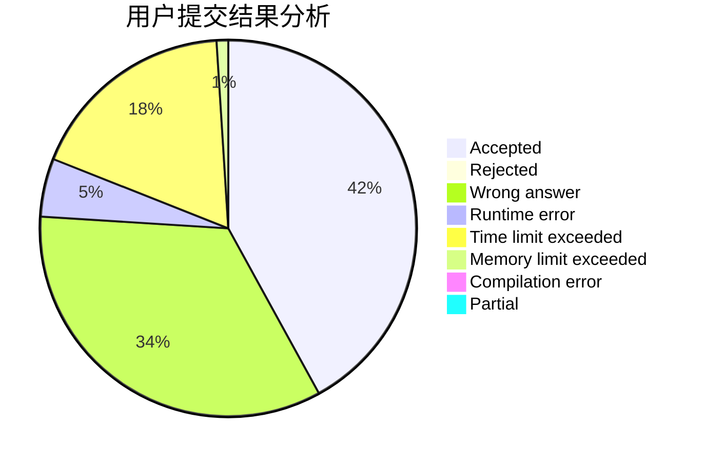
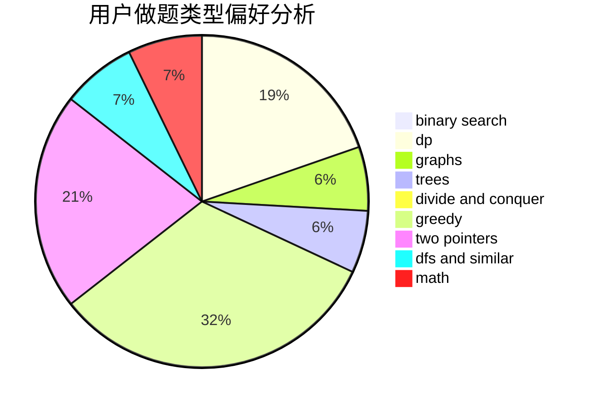

# priority

<!-- tabs:start -->

#### **用户提交结果分析**

#### **用户做题类型偏好分析**

<!-- tabs:end -->
# 推荐题目
[755C](https://codeforces.com/contest/755/problem/C)
[518B](https://codeforces.com/contest/518/problem/B)
[916B](https://codeforces.com/contest/916/problem/B)
[215C](https://codeforces.com/contest/215/problem/C)
[1101D](https://codeforces.com/contest/1101/problem/D)
[350B](https://codeforces.com/contest/350/problem/B)
[1234E](https://codeforces.com/contest/1234/problem/E)
[745C](https://codeforces.com/contest/745/problem/C)
[875E](https://codeforces.com/contest/875/problem/E)
[839E](https://codeforces.com/contest/839/problem/E)
