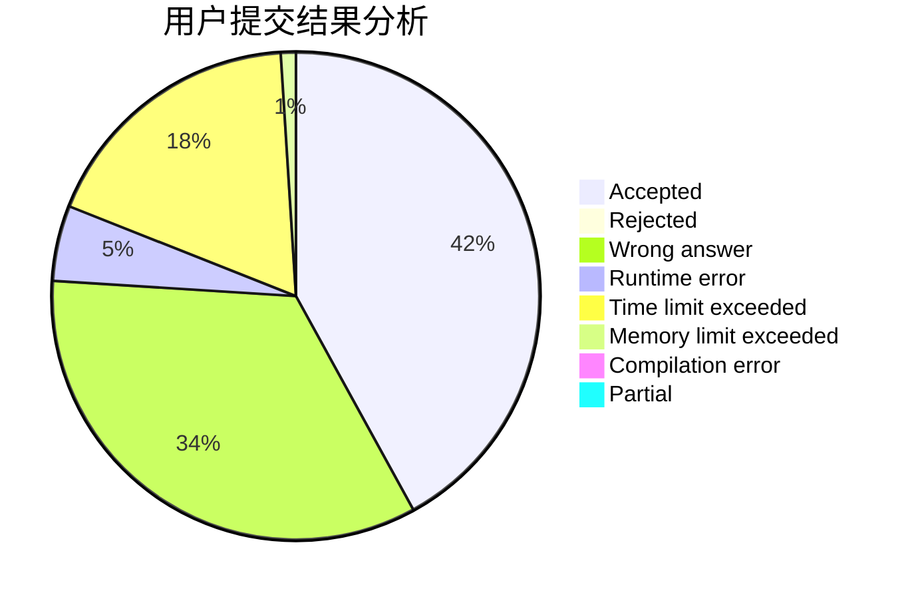
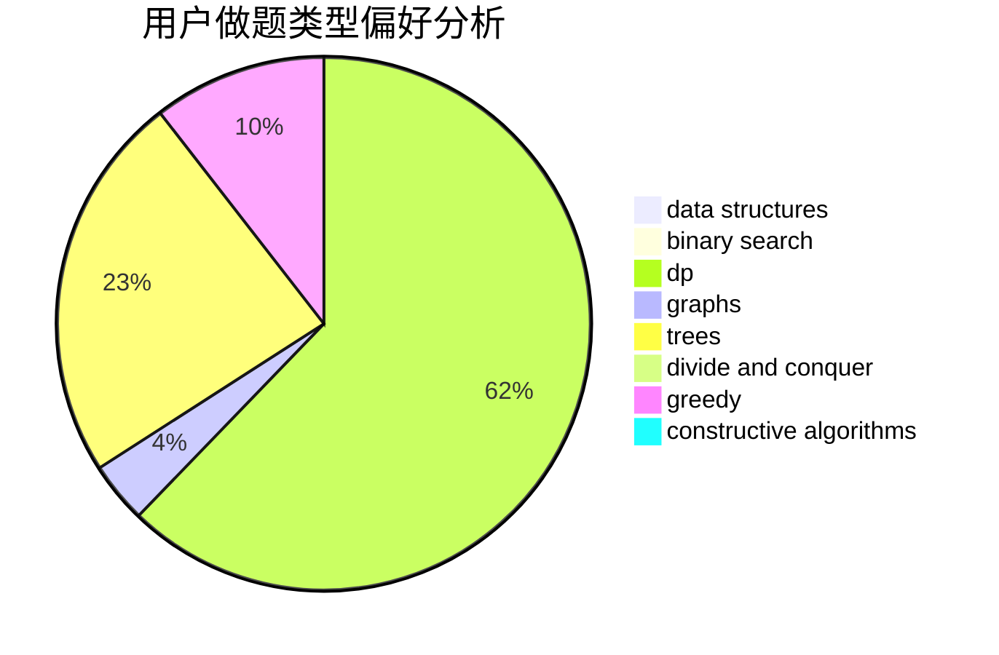
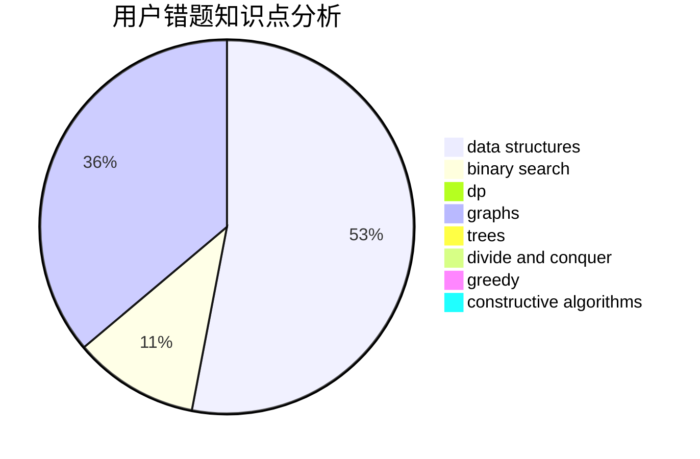

# priority

<!-- tabs:start -->

#### **用户提交结果分析**

#### **用户做题类型偏好分析**

#### **用户错题知识点分析**

<!-- tabs:end -->
# 推荐题目
[734D](https://codeforces.com/contest/734/problem/D)		implementation		  
[497E](https://codeforces.com/contest/497/problem/E)		dp,
                        matrices		  
[8D](https://codeforces.com/contest/8/problem/D)		binary search,
                        geometry		  
[18E](https://codeforces.com/contest/18/problem/E)		dp		  
[1101A](https://codeforces.com/contest/1101/problem/A)		math		  
[319E](https://codeforces.com/contest/319/problem/E)		data structures		  
[1227A](https://codeforces.com/contest/1227/problem/A)		math		  
[727F](https://codeforces.com/contest/727/problem/F)		binary search,
                        dp,
                        greedy		  
[856E](https://codeforces.com/contest/856/problem/E)		nan		  
[81C](https://codeforces.com/contest/81/problem/C)		greedy,
                        math,
                        sortings		  
