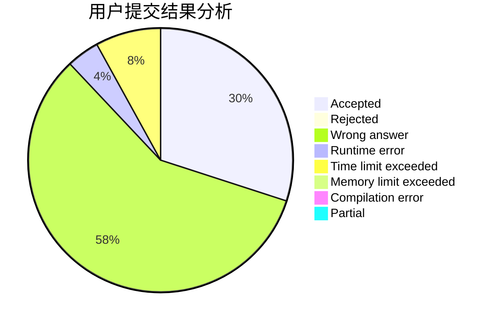
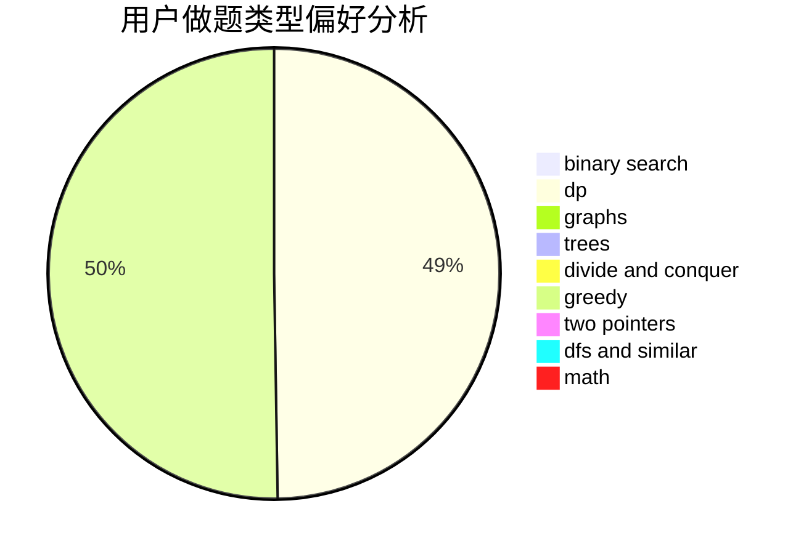

# psychocosine

<!-- tabs:start -->

#### **用户提交结果分析**

#### **用户做题类型偏好分析**

<!-- tabs:end -->
# 推荐题目
[979D](https://codeforces.com/contest/979/problem/D)
[608A](https://codeforces.com/contest/608/problem/A)
[691F](https://codeforces.com/contest/691/problem/F)
[1501C](https://codeforces.com/contest/1501/problem/C)
[1451C](https://codeforces.com/contest/1451/problem/C)
[1490C](https://codeforces.com/contest/1490/problem/C)
[1497B](https://codeforces.com/contest/1497/problem/B)
[1491C](https://codeforces.com/contest/1491/problem/C)
[1484C](https://codeforces.com/contest/1484/problem/C)
[1480A](https://codeforces.com/contest/1480/problem/A)
