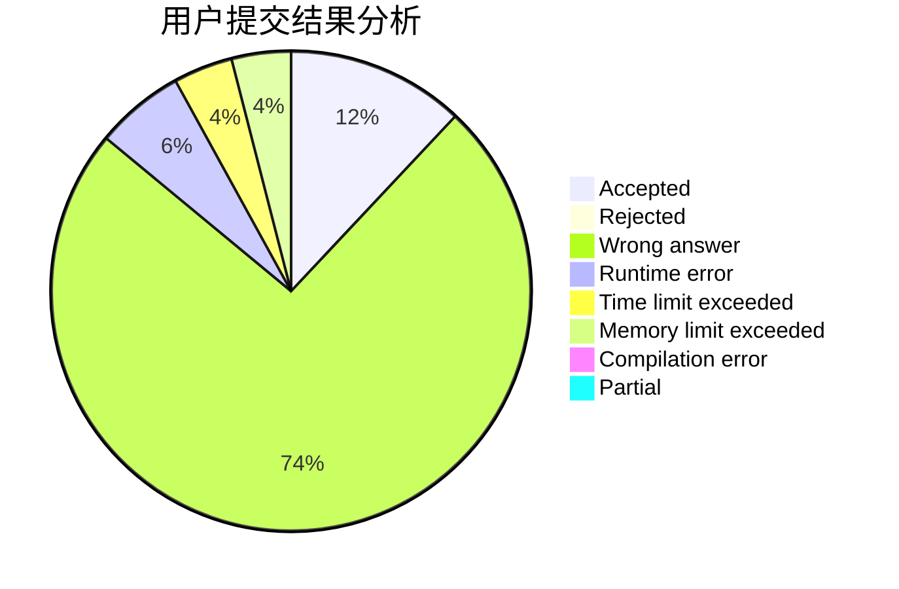
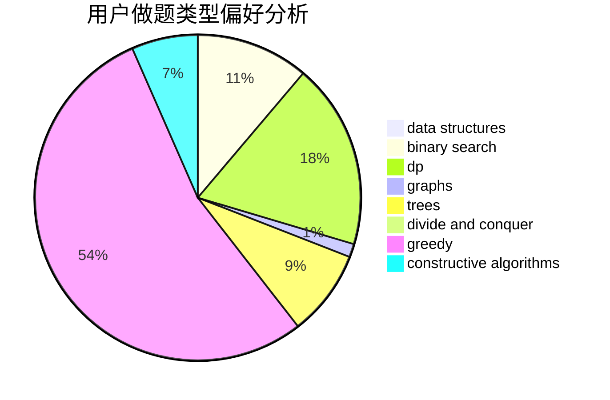
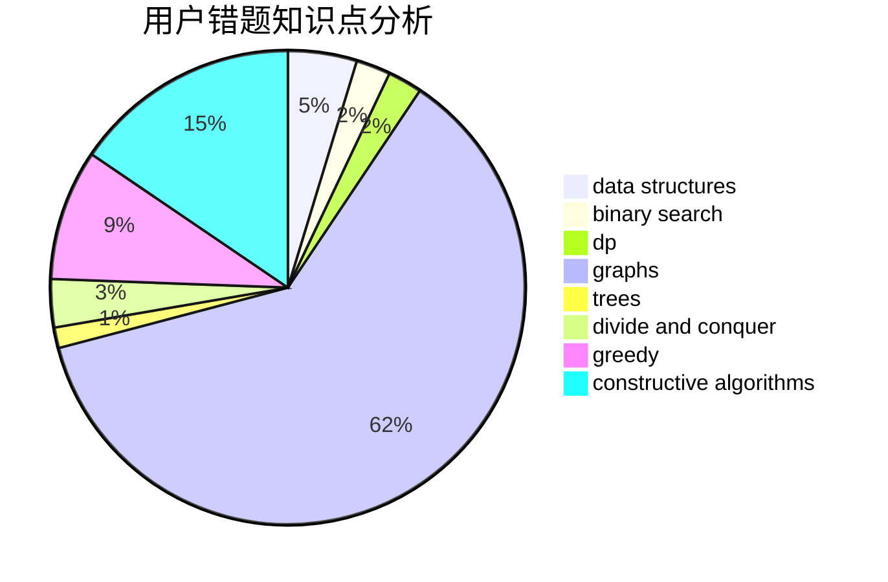

# pty6666

<!-- tabs:start -->

#### **用户提交结果分析**

#### **用户做题类型偏好分析**

#### **用户错题知识点分析**

<!-- tabs:end -->
# 推荐题目
[598A](https://codeforces.com/contest/598/problem/A)		math		  
[911E](https://codeforces.com/contest/911/problem/E)		constructive algorithms,
                        data structures,
                        greedy,
                        implementation		  
[868E](https://codeforces.com/contest/868/problem/E)		dp,
                        graphs,
                        trees		  
[1130C](https://codeforces.com/contest/1130/problem/C)		brute force,
                        dfs and similar,
                        dsu		  
[223C](https://codeforces.com/contest/223/problem/C)		combinatorics,
                        math,
                        number theory		  
[219C](https://codeforces.com/contest/219/problem/C)		brute force,
                        dp,
                        greedy		  
[1344B](https://codeforces.com/contest/1344/problem/B)		constructive algorithms,
                        dfs and similar,
                        dsu,
                        graphs		  
[38C](https://codeforces.com/contest/38/problem/C)		brute force		  
[468B](https://codeforces.com/contest/468/problem/B)		2-sat,
                        dfs and similar,
                        dsu,
                        graph matchings,
                        greedy		  
[231D](https://codeforces.com/contest/231/problem/D)		brute force,
                        geometry		  
