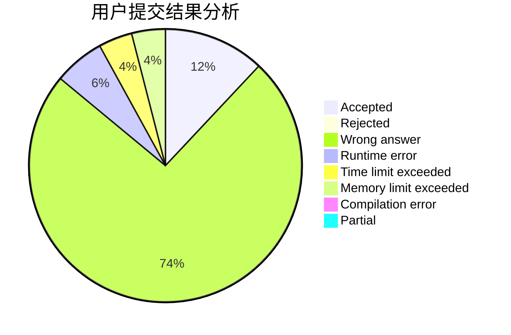
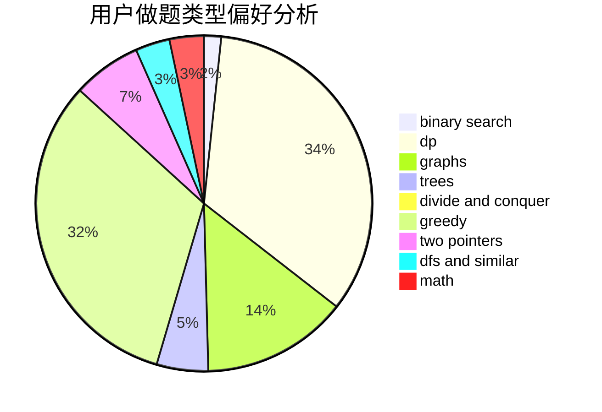

# pty6666

<!-- tabs:start -->

#### **用户提交结果分析**

#### **用户做题类型偏好分析**

<!-- tabs:end -->
# 推荐题目
[615D](https://codeforces.com/contest/615/problem/D)
[930A](https://codeforces.com/contest/930/problem/A)
[888A](https://codeforces.com/contest/888/problem/A)
[1132C](https://codeforces.com/contest/1132/problem/C)
[241E](https://codeforces.com/contest/241/problem/E)
[238D](https://codeforces.com/contest/238/problem/D)
[1351A](https://codeforces.com/contest/1351/problem/A)
[41B](https://codeforces.com/contest/41/problem/B)
[487C](https://codeforces.com/contest/487/problem/C)
[253B](https://codeforces.com/contest/253/problem/B)
