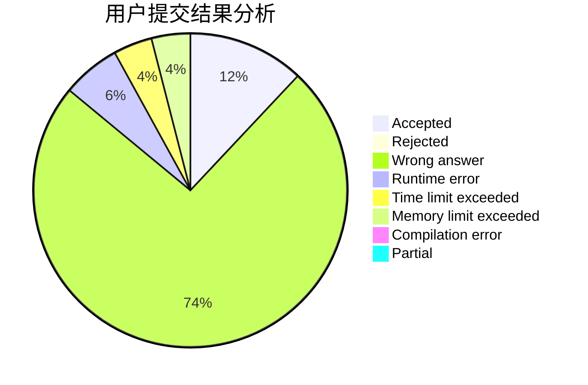
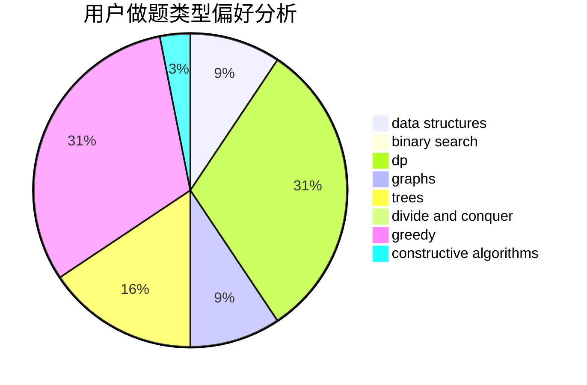
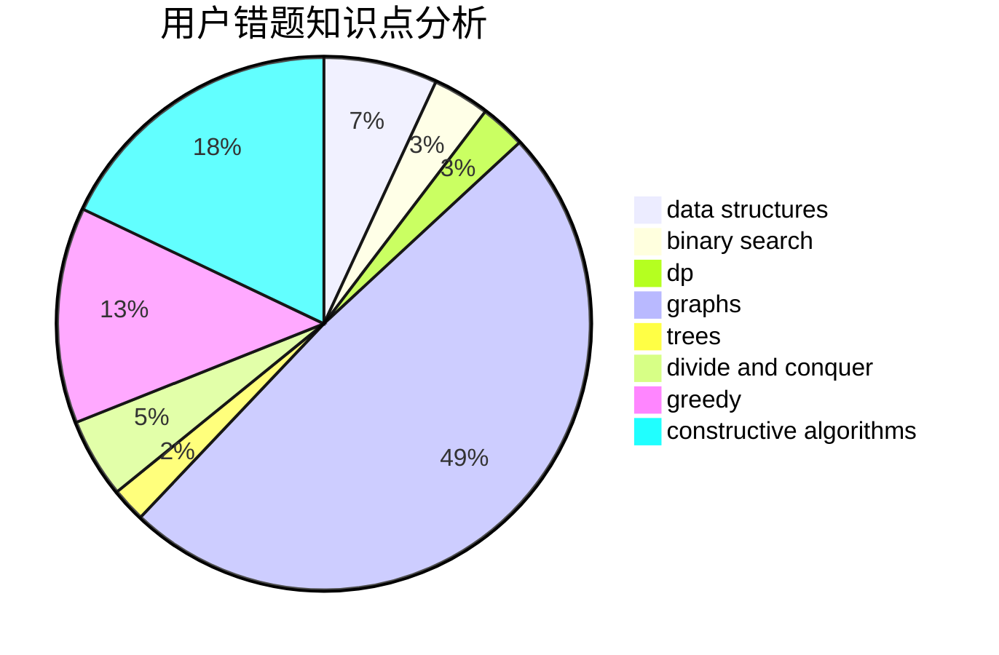

# pty6666

<!-- tabs:start -->

#### **用户提交结果分析**

#### **用户做题类型偏好分析**

#### **用户错题知识点分析**

<!-- tabs:end -->
# 推荐题目
[615D](https://codeforces.com/contest/615/problem/D)		math,
                        number theory		  
[930A](https://codeforces.com/contest/930/problem/A)		dfs and similar,
                        graphs,
                        trees		  
[888A](https://codeforces.com/contest/888/problem/A)		brute force,
                        implementation		  
[1132C](https://codeforces.com/contest/1132/problem/C)		brute force		  
[241E](https://codeforces.com/contest/241/problem/E)		graphs,
                        shortest paths		  
[238D](https://codeforces.com/contest/238/problem/D)		data structures,
                        implementation		  
[1351A](https://codeforces.com/contest/1351/problem/A)		implementation		  
[41B](https://codeforces.com/contest/41/problem/B)		brute force		  
[487C](https://codeforces.com/contest/487/problem/C)		constructive algorithms,
                        math,
                        number theory		  
[253B](https://codeforces.com/contest/253/problem/B)		binary search,
                        dp,
                        sortings,
                        two pointers		  
