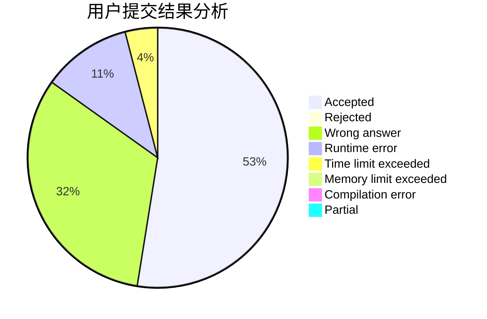
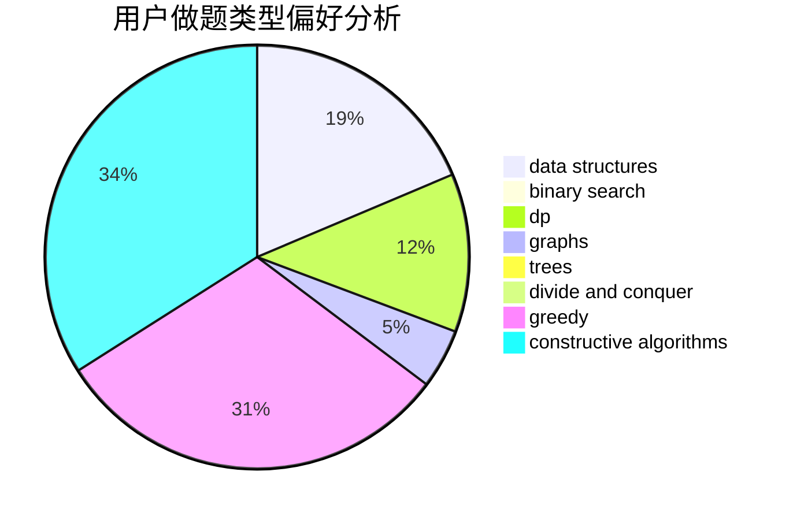
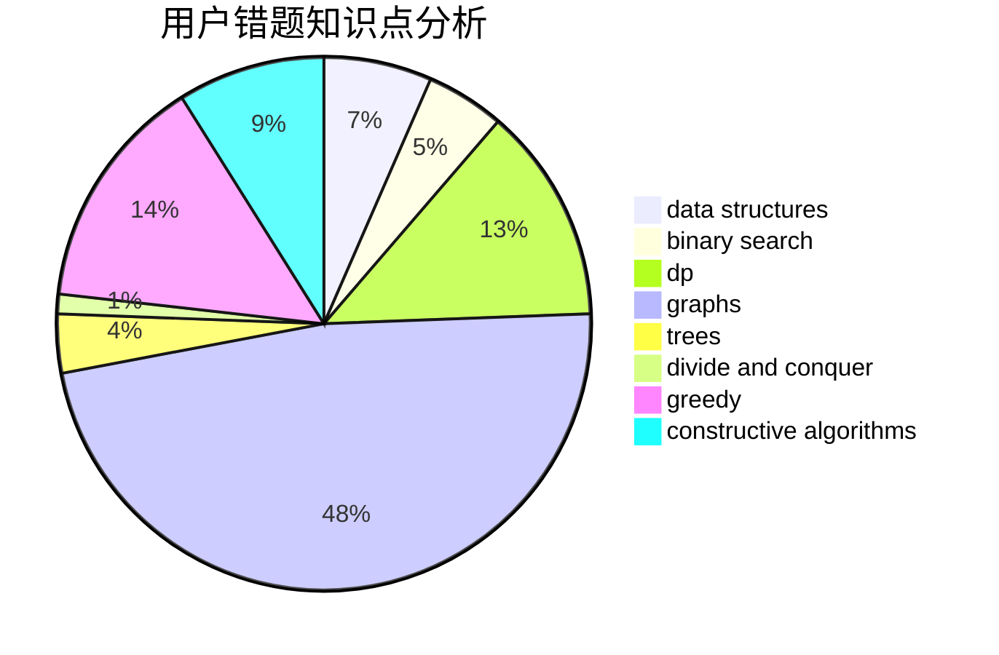

# pubgoso

<!-- tabs:start -->

#### **用户提交结果分析**

#### **用户做题类型偏好分析**

#### **用户错题知识点分析**

<!-- tabs:end -->
# 推荐题目
[1385D](https://codeforces.com/contest/1385/problem/D)		bitmasks,
                        brute force,
                        divide and conquer,
                        dp,
                        implementation		  
[227A](https://codeforces.com/contest/227/problem/A)		geometry		  
[99C](https://codeforces.com/contest/99/problem/C)		dsu,graphs,sortings,trees		  
[273D](https://codeforces.com/contest/273/problem/D)		dp		  
[643E](https://codeforces.com/contest/643/problem/E)		dp,
                        math,
                        probabilities,
                        trees		  
[513A](https://codeforces.com/contest/513/problem/A)		constructive algorithms,
                        math		  
[949D](https://codeforces.com/contest/949/problem/D)		binary search,
                        brute force,
                        greedy,
                        sortings		  
[992C](https://codeforces.com/contest/992/problem/C)		math		  
[853A](https://codeforces.com/contest/853/problem/A)		greedy		  
[258D](https://codeforces.com/contest/258/problem/D)		dp,
                        math,
                        probabilities		  
