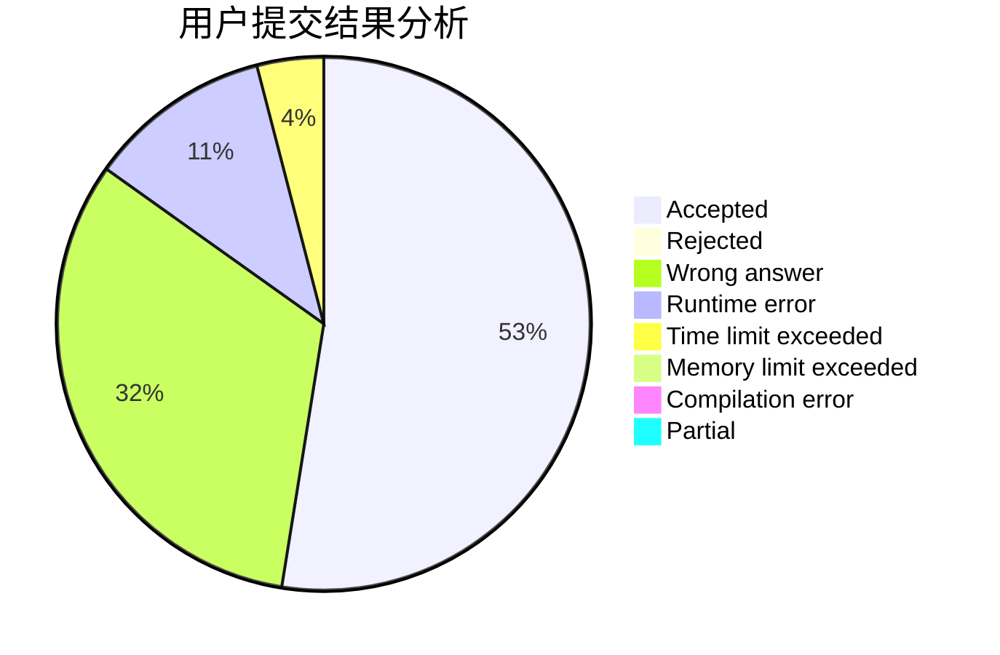
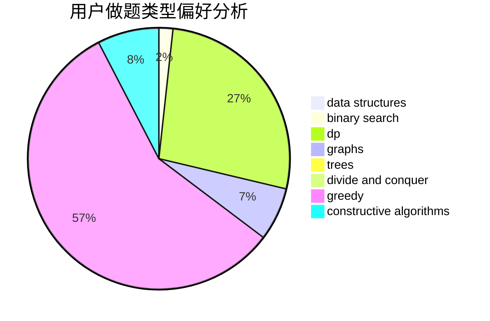

# pubgoso

<!-- tabs:start -->

#### **用户提交结果分析**

#### **用户做题类型偏好分析**

#### **用户错题知识点分析**

<!-- tabs:end -->
# 推荐题目
[1376A1](https://codeforces.com/contest/1376A/problem/1)		dsu,graphs,sortings,trees		  
[203B](https://codeforces.com/contest/203/problem/B)		brute force,
                        implementation		  
[984D](https://codeforces.com/contest/984/problem/D)		dsu,graphs,sortings,trees		  
[254D](https://codeforces.com/contest/254/problem/D)		brute force,
                        dfs and similar,
                        graphs,
                        implementation,
                        shortest paths		  
[620B](https://codeforces.com/contest/620/problem/B)		implementation		  
[493D](https://codeforces.com/contest/493/problem/D)		constructive algorithms,
                        games,
                        math		  
[926J](https://codeforces.com/contest/926/problem/J)		data structures		  
[978E](https://codeforces.com/contest/978/problem/E)		combinatorics,
                        math		  
[835C](https://codeforces.com/contest/835/problem/C)		dp,
                        implementation		  
[235E](https://codeforces.com/contest/235/problem/E)		combinatorics,
                        dp,
                        implementation,
                        math,
                        number theory		  
