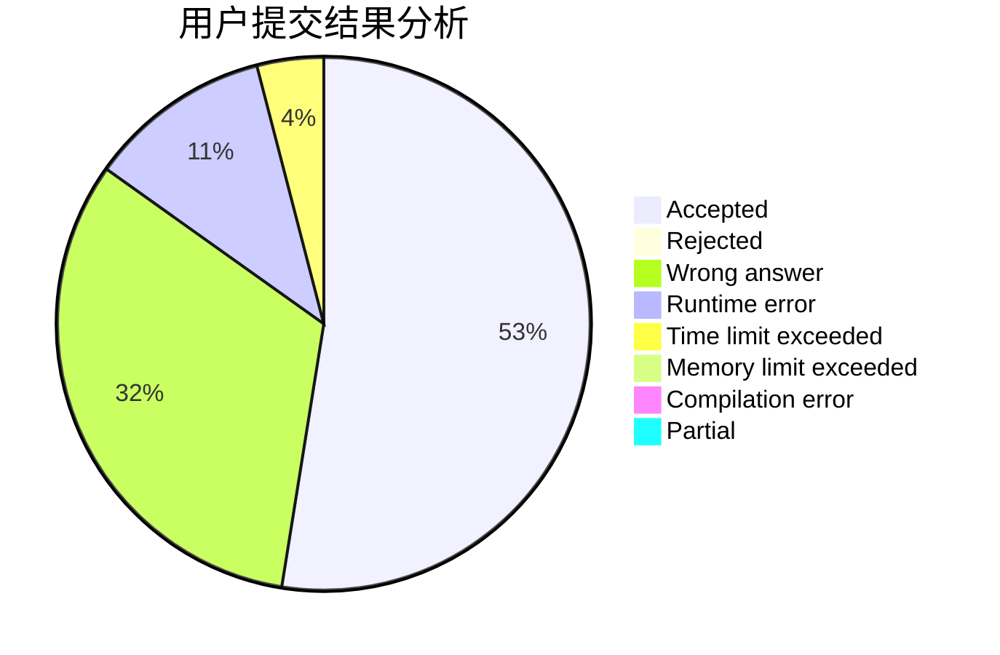
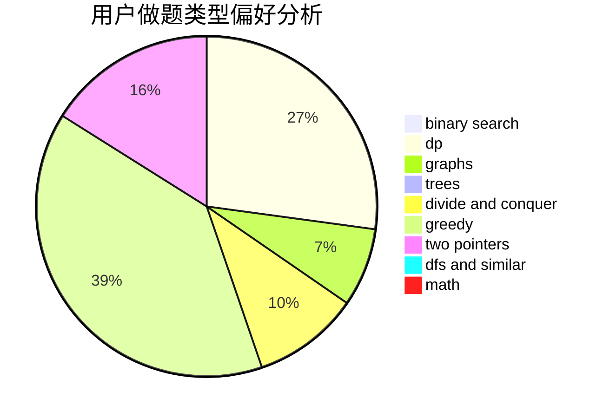

# pubgoso

<!-- tabs:start -->

#### **用户提交结果分析**

#### **用户做题类型偏好分析**

<!-- tabs:end -->
# 推荐题目
[1385D](https://codeforces.com/contest/1385/problem/D)
[227A](https://codeforces.com/contest/227/problem/A)
[99C](https://codeforces.com/contest/99/problem/C)
[273D](https://codeforces.com/contest/273/problem/D)
[643E](https://codeforces.com/contest/643/problem/E)
[513A](https://codeforces.com/contest/513/problem/A)
[949D](https://codeforces.com/contest/949/problem/D)
[992C](https://codeforces.com/contest/992/problem/C)
[853A](https://codeforces.com/contest/853/problem/A)
[258D](https://codeforces.com/contest/258/problem/D)
