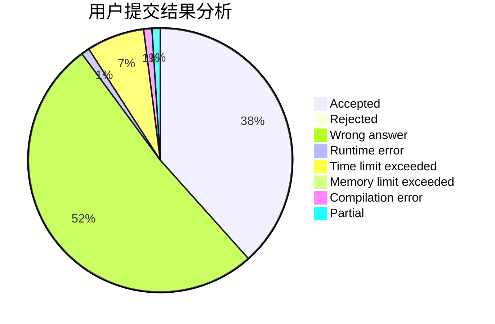
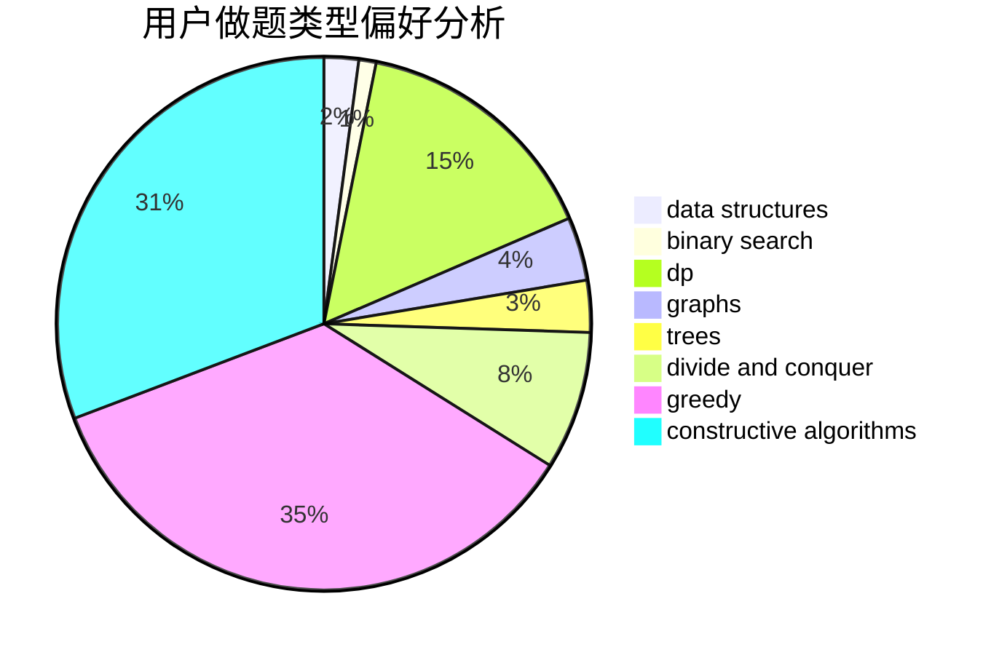
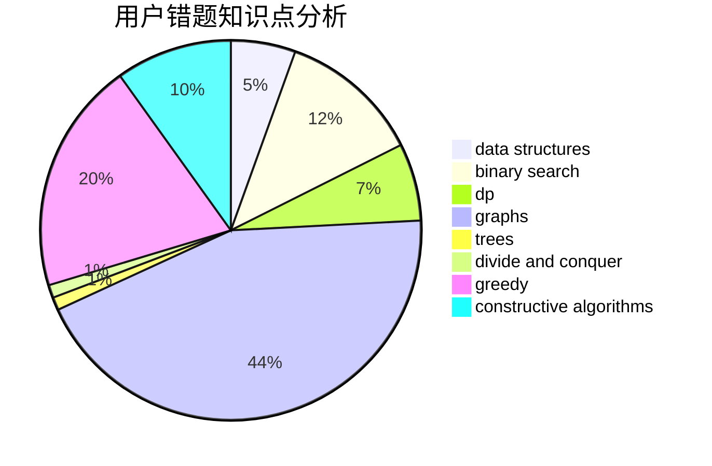

# pupiI

<!-- tabs:start -->

#### **用户提交结果分析**

#### **用户做题类型偏好分析**

#### **用户错题知识点分析**

<!-- tabs:end -->
# 推荐题目
[1223A](https://codeforces.com/contest/1223/problem/A)		math		  
[36B](https://codeforces.com/contest/36/problem/B)		implementation		  
[755C](https://codeforces.com/contest/755/problem/C)		dfs and similar,
                        dsu,
                        graphs,
                        interactive,
                        trees		  
[1214C](https://codeforces.com/contest/1214/problem/C)		data structures,
                        greedy		  
[353D](https://codeforces.com/contest/353/problem/D)		constructive algorithms,
                        dp		  
[1367C](https://codeforces.com/contest/1367/problem/C)		constructive algorithms,
                        greedy,
                        math		  
[1151F](https://codeforces.com/contest/1151/problem/F)		combinatorics,
                        dp,
                        matrices,
                        probabilities		  
[128C](https://codeforces.com/contest/128/problem/C)		combinatorics,
                        dp		  
[1140A](https://codeforces.com/contest/1140/problem/A)		implementation		  
[346A](https://codeforces.com/contest/346/problem/A)		games,
                        math,
                        number theory		  
