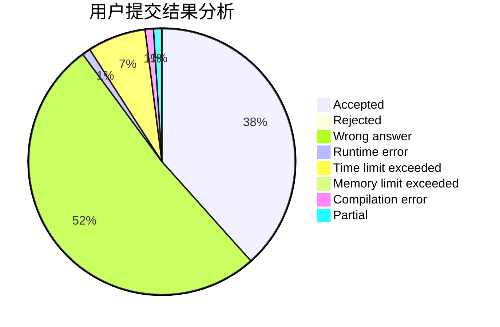
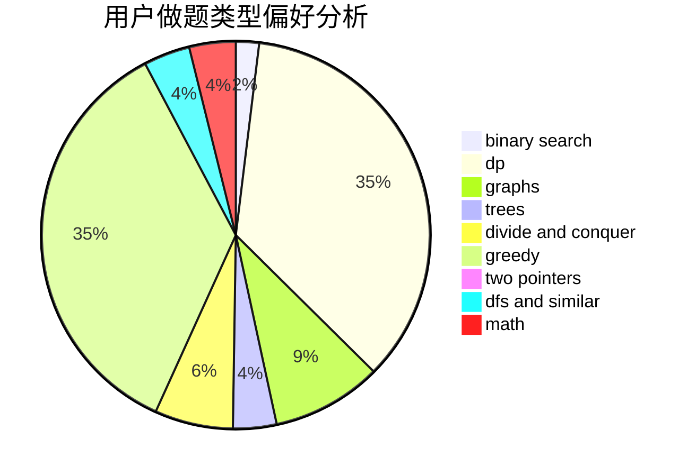

# pupiI

<!-- tabs:start -->

#### **用户提交结果分析**

#### **用户做题类型偏好分析**

<!-- tabs:end -->
# 推荐题目
[1223A](https://codeforces.com/contest/1223/problem/A)
[36B](https://codeforces.com/contest/36/problem/B)
[755C](https://codeforces.com/contest/755/problem/C)
[1214C](https://codeforces.com/contest/1214/problem/C)
[353D](https://codeforces.com/contest/353/problem/D)
[1367C](https://codeforces.com/contest/1367/problem/C)
[1151F](https://codeforces.com/contest/1151/problem/F)
[128C](https://codeforces.com/contest/128/problem/C)
[1140A](https://codeforces.com/contest/1140/problem/A)
[346A](https://codeforces.com/contest/346/problem/A)
