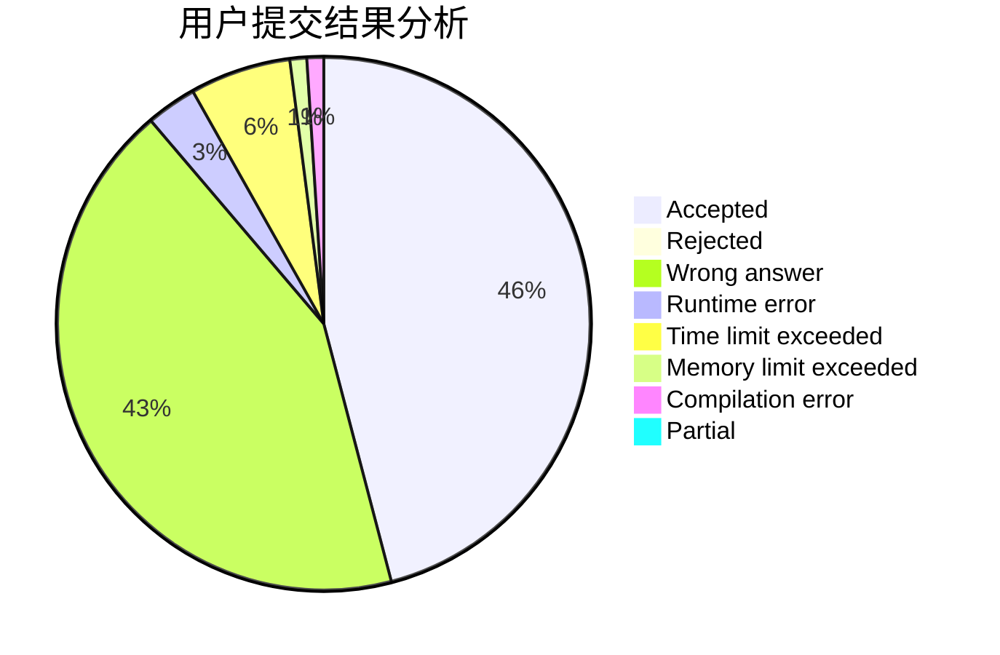
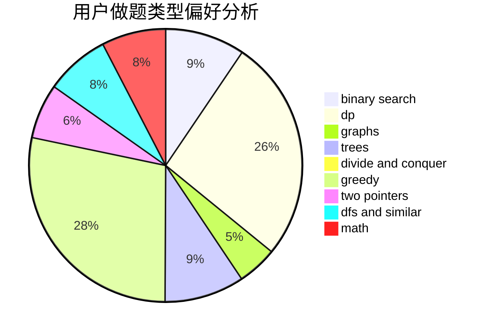

# purinliang

<!-- tabs:start -->

#### **用户提交结果分析**

#### **用户做题类型偏好分析**

<!-- tabs:end -->
# 推荐题目
[1485E](https://codeforces.com/contest/1485/problem/E)
[1456B](https://codeforces.com/contest/1456/problem/B)
[1321A](https://codeforces.com/contest/1321/problem/A)
[763A](https://codeforces.com/contest/763/problem/A)
[1332D](https://codeforces.com/contest/1332/problem/D)
[347A](https://codeforces.com/contest/347/problem/A)
[1214E](https://codeforces.com/contest/1214/problem/E)
[883M](https://codeforces.com/contest/883/problem/M)
[498B](https://codeforces.com/contest/498/problem/B)
[924D](https://codeforces.com/contest/924/problem/D)
