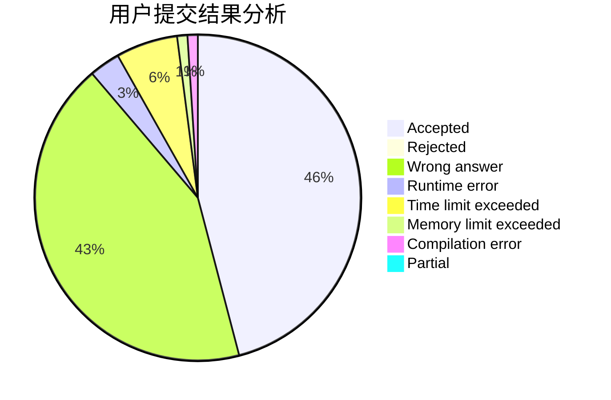
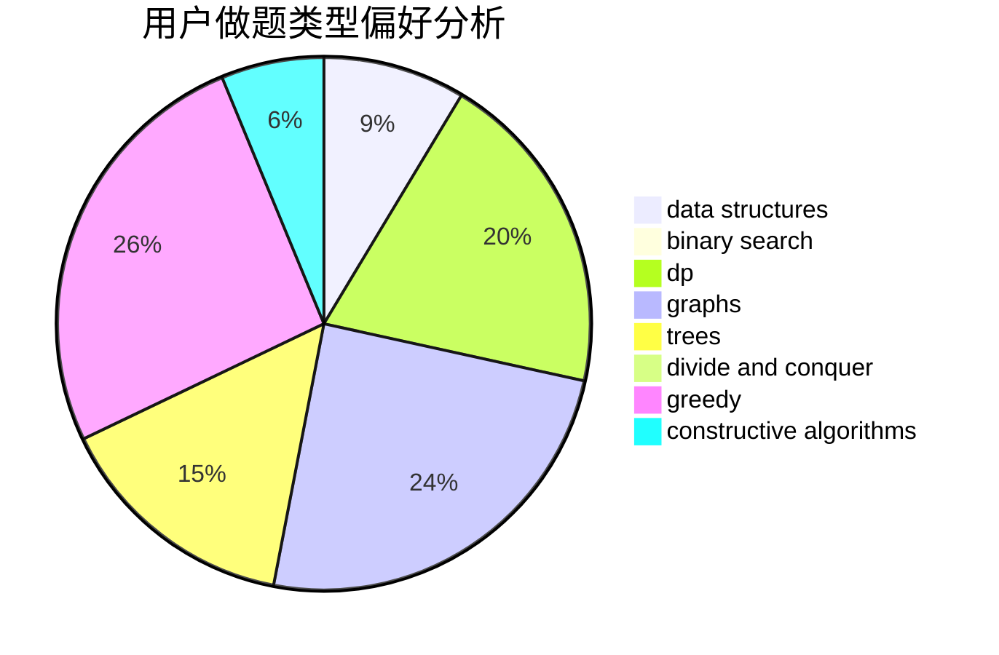
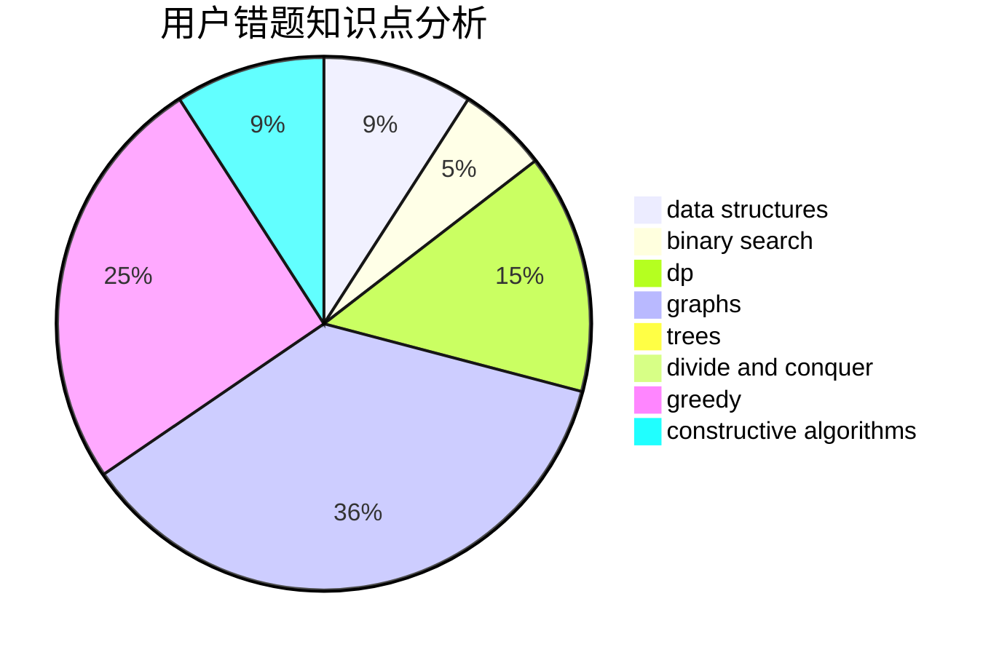

# purinliang

<!-- tabs:start -->

#### **用户提交结果分析**

#### **用户做题类型偏好分析**

#### **用户错题知识点分析**

<!-- tabs:end -->
# 推荐题目
[1476G](https://codeforces.com/contest/1476/problem/G)		data structures,
                        hashing,
                        sortings,
                        two pointers		  
[1446F](https://codeforces.com/contest/1446/problem/F)		binary search,
                        data structures,
                        geometry		  
[1311E](https://codeforces.com/contest/1311/problem/E)		brute force,
                        constructive algorithms,
                        trees		  
[742D](https://codeforces.com/contest/742/problem/D)		dsu,graphs,sortings,trees		  
[1326B](https://codeforces.com/contest/1326/problem/B)		implementation,
                        math		  
[317D](https://codeforces.com/contest/317/problem/D)		dp,
                        games		  
[1209A](https://codeforces.com/contest/1209/problem/A)		greedy,
                        implementation,
                        math		  
[864C](https://codeforces.com/contest/864/problem/C)		greedy,
                        implementation,
                        math		  
[478B](https://codeforces.com/contest/478/problem/B)		combinatorics,
                        constructive algorithms,
                        greedy,
                        math		  
[909F](https://codeforces.com/contest/909/problem/F)		constructive algorithms		  
