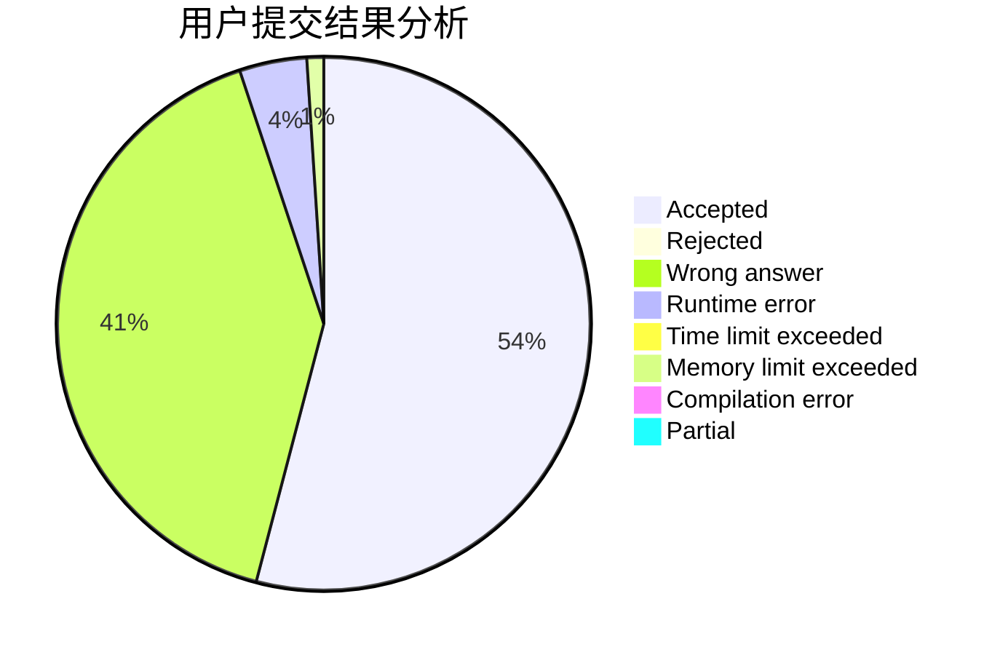
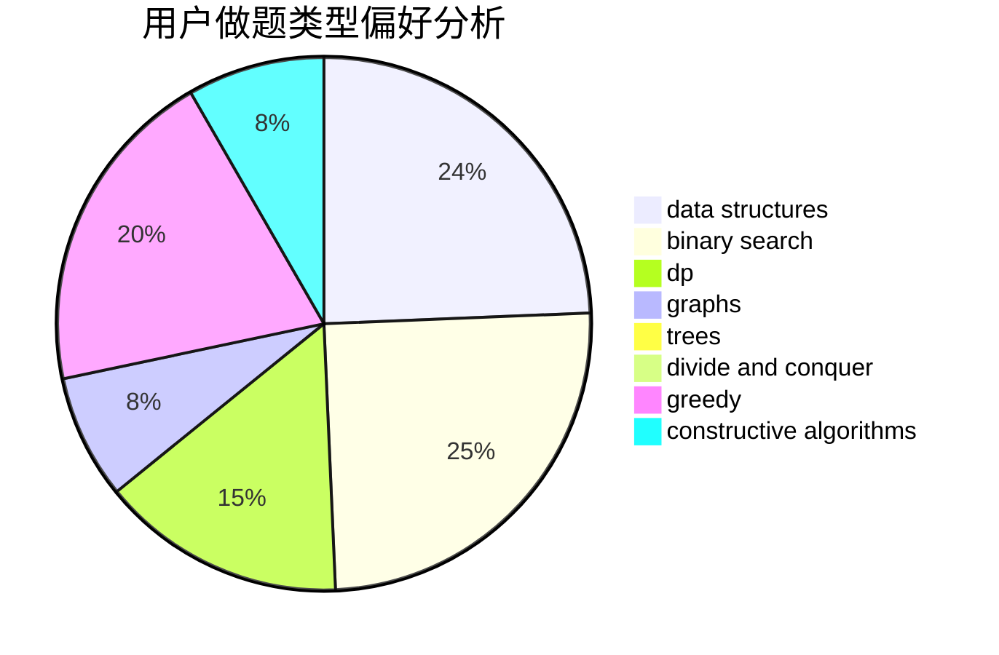
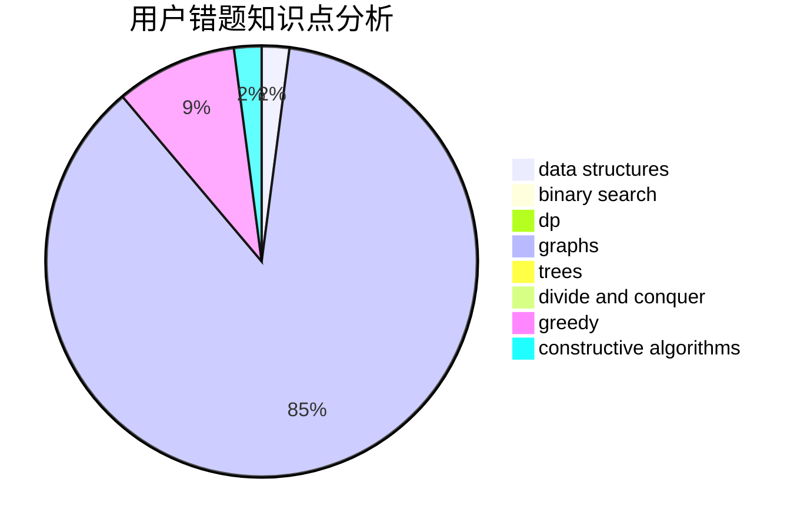

# purple_bro

<!-- tabs:start -->

#### **用户提交结果分析**

#### **用户做题类型偏好分析**

#### **用户错题知识点分析**

<!-- tabs:end -->
# 推荐题目
[1290C](https://codeforces.com/contest/1290/problem/C)		dfs and similar,
                        dsu,
                        graphs		  
[1336E2](https://codeforces.com/contest/1336E/problem/2)		bitmasks,
                        brute force,
                        combinatorics,
                        math		  
[277B](https://codeforces.com/contest/277/problem/B)		constructive algorithms,
                        geometry		  
[717E](https://codeforces.com/contest/717/problem/E)		dfs and similar		  
[482D](https://codeforces.com/contest/482/problem/D)		combinatorics,
                        dp,
                        trees		  
[36A](https://codeforces.com/contest/36/problem/A)		implementation		  
[341E](https://codeforces.com/contest/341/problem/E)		constructive algorithms,
                        greedy		  
[1196D1](https://codeforces.com/contest/1196D/problem/1)		implementation		  
[924D](https://codeforces.com/contest/924/problem/D)		nan		  
[920E](https://codeforces.com/contest/920/problem/E)		data structures,
                        dfs and similar,
                        dsu,
                        graphs		  
