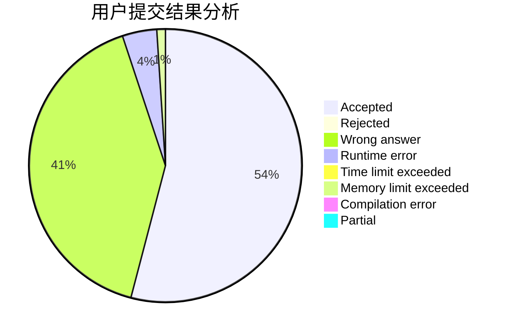
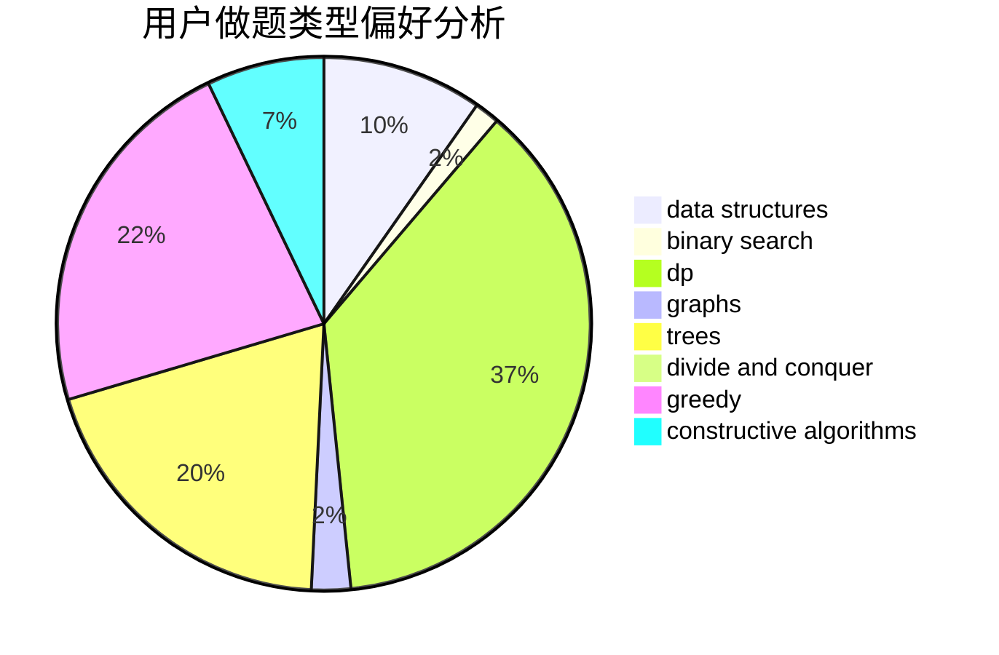
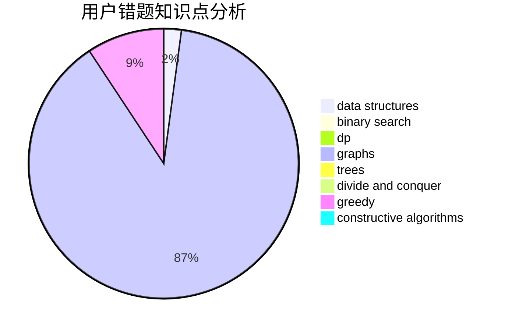

# purple_bro

<!-- tabs:start -->

#### **用户提交结果分析**

#### **用户做题类型偏好分析**

#### **用户错题知识点分析**

<!-- tabs:end -->
# 推荐题目
[1296F](https://codeforces.com/contest/1296/problem/F)		constructive algorithms,
                        dfs and similar,
                        greedy,
                        sortings,
                        trees		  
[1344A](https://codeforces.com/contest/1344/problem/A)		math,
                        number theory,
                        sortings		  
[292A](https://codeforces.com/contest/292/problem/A)		implementation		  
[735A](https://codeforces.com/contest/735/problem/A)		implementation,
                        strings		  
[501C](https://codeforces.com/contest/501/problem/C)		constructive algorithms,
                        data structures,
                        greedy,
                        sortings,
                        trees		  
[39F](https://codeforces.com/contest/39/problem/F)		implementation		  
[369B](https://codeforces.com/contest/369/problem/B)		constructive algorithms,
                        implementation,
                        math		  
[11E](https://codeforces.com/contest/11/problem/E)		binary search,
                        dp,
                        greedy		  
[948B](https://codeforces.com/contest/948/problem/B)		dsu,graphs,sortings,trees		  
[940D](https://codeforces.com/contest/940/problem/D)		binary search,
                        implementation		  
