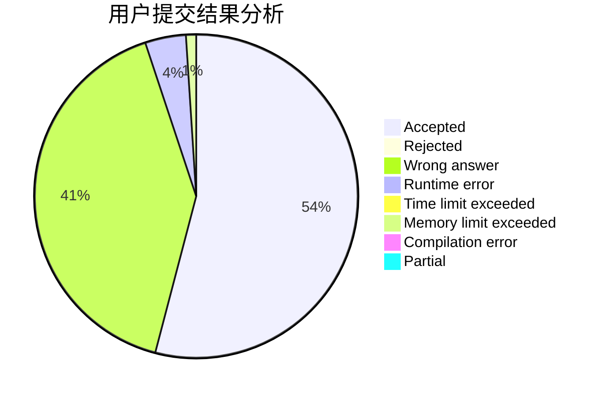
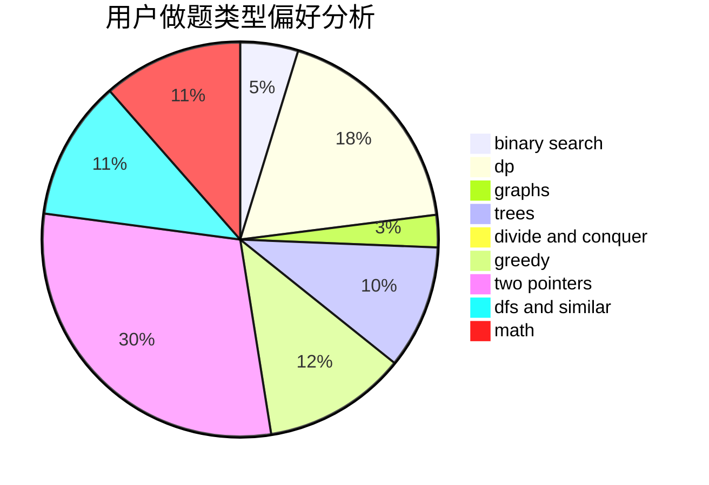

# purple_bro

<!-- tabs:start -->

#### **用户提交结果分析**

#### **用户做题类型偏好分析**

<!-- tabs:end -->
# 推荐题目
[1296F](https://codeforces.com/contest/1296/problem/F)
[1344A](https://codeforces.com/contest/1344/problem/A)
[292A](https://codeforces.com/contest/292/problem/A)
[735A](https://codeforces.com/contest/735/problem/A)
[501C](https://codeforces.com/contest/501/problem/C)
[39F](https://codeforces.com/contest/39/problem/F)
[369B](https://codeforces.com/contest/369/problem/B)
[11E](https://codeforces.com/contest/11/problem/E)
[948B](https://codeforces.com/contest/948/problem/B)
[940D](https://codeforces.com/contest/940/problem/D)
