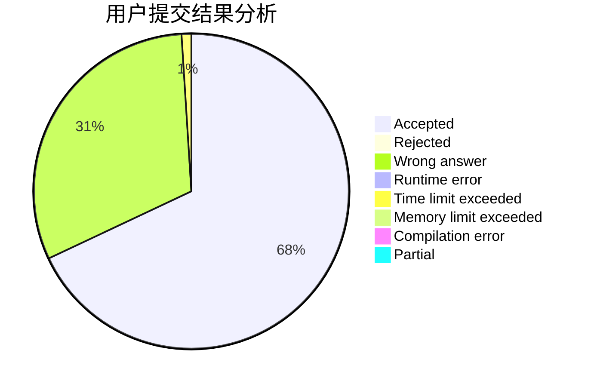
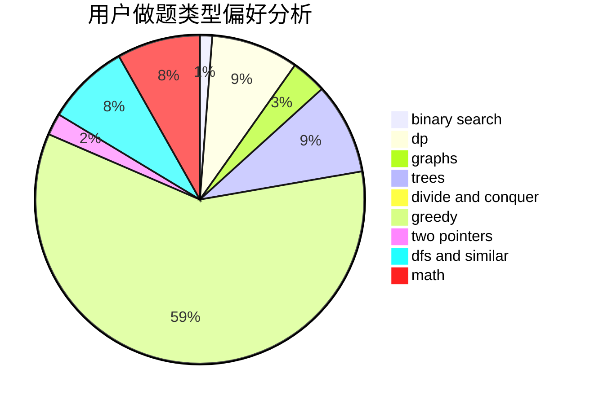

# pyd20001201

<!-- tabs:start -->

#### **用户提交结果分析**

#### **用户做题类型偏好分析**

<!-- tabs:end -->
# 推荐题目
[1341B](https://codeforces.com/contest/1341/problem/B)
[1459E](https://codeforces.com/contest/1459/problem/E)
[776D](https://codeforces.com/contest/776/problem/D)
[58E](https://codeforces.com/contest/58/problem/E)
[911D](https://codeforces.com/contest/911/problem/D)
[1295D](https://codeforces.com/contest/1295/problem/D)
[696B](https://codeforces.com/contest/696/problem/B)
[1360H](https://codeforces.com/contest/1360/problem/H)
[688D](https://codeforces.com/contest/688/problem/D)
[103E](https://codeforces.com/contest/103/problem/E)
