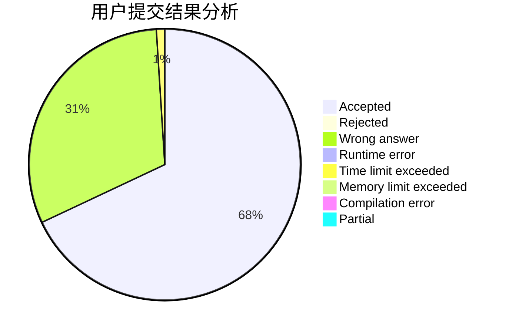
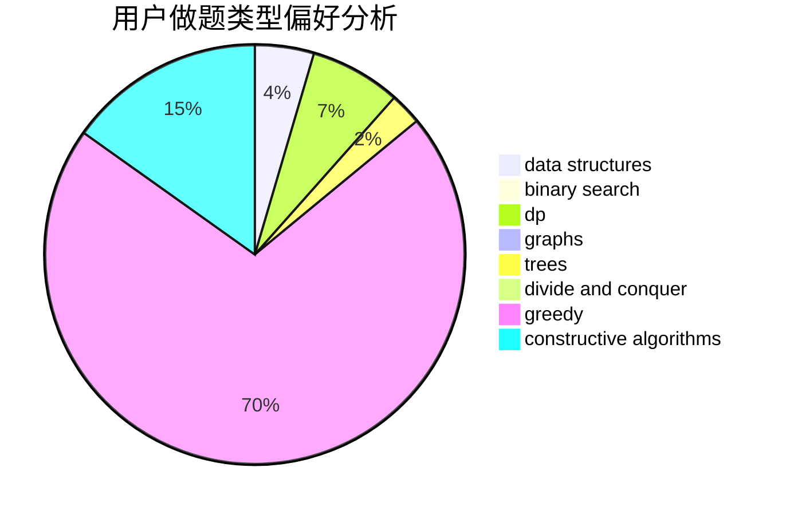
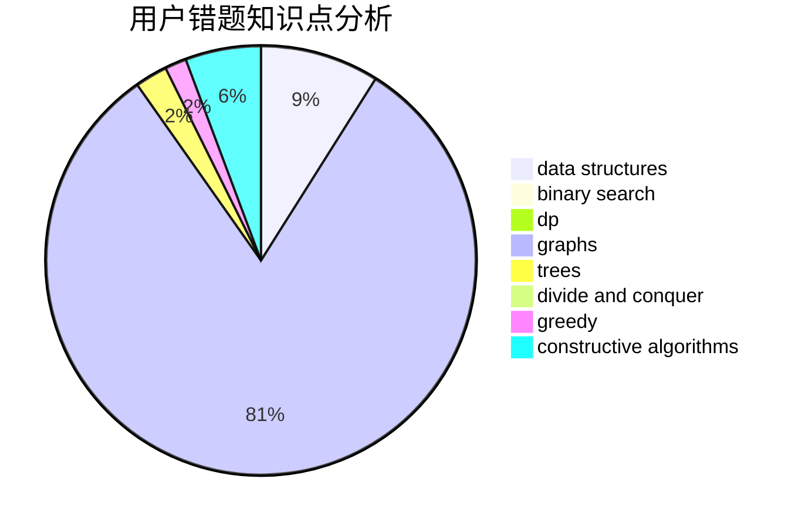

# pyd20001201

<!-- tabs:start -->

#### **用户提交结果分析**

#### **用户做题类型偏好分析**

#### **用户错题知识点分析**

<!-- tabs:end -->
# 推荐题目
[1341B](https://codeforces.com/contest/1341/problem/B)		greedy,
                        implementation		  
[1459E](https://codeforces.com/contest/1459/problem/E)		dsu,graphs,sortings,trees		  
[776D](https://codeforces.com/contest/776/problem/D)		2-sat,
                        dfs and similar,
                        dsu,
                        graphs		  
[58E](https://codeforces.com/contest/58/problem/E)		dp		  
[911D](https://codeforces.com/contest/911/problem/D)		brute force,
                        math		  
[1295D](https://codeforces.com/contest/1295/problem/D)		math,
                        number theory		  
[696B](https://codeforces.com/contest/696/problem/B)		dfs and similar,
                        math,
                        probabilities,
                        trees		  
[1360H](https://codeforces.com/contest/1360/problem/H)		binary search,
                        bitmasks,
                        brute force,
                        constructive algorithms		  
[688D](https://codeforces.com/contest/688/problem/D)		dsu,graphs,sortings,trees		  
[103E](https://codeforces.com/contest/103/problem/E)		flows,
                        graph matchings		  
