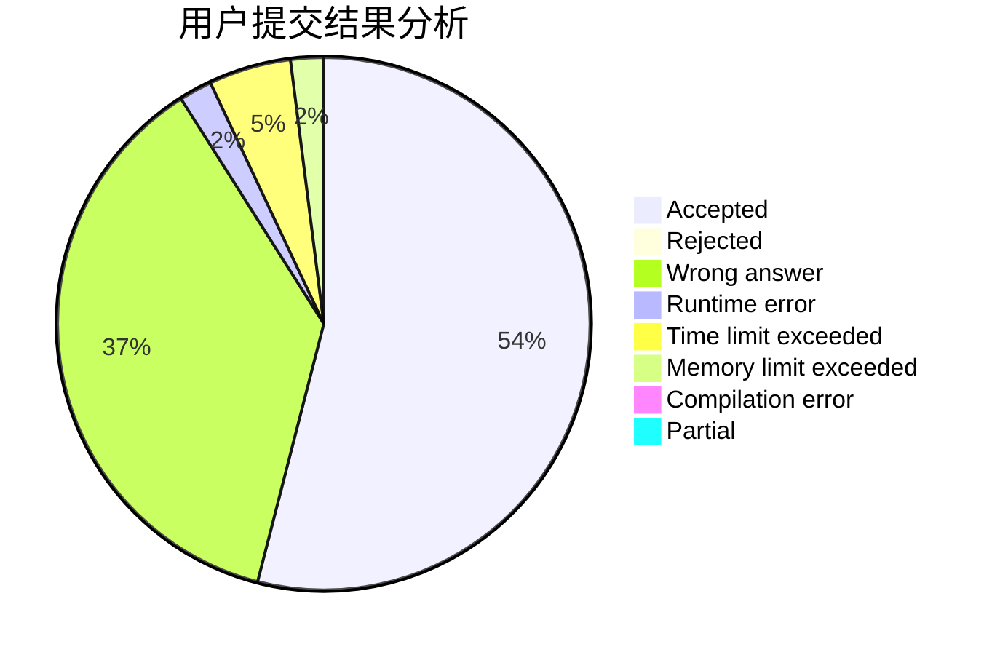
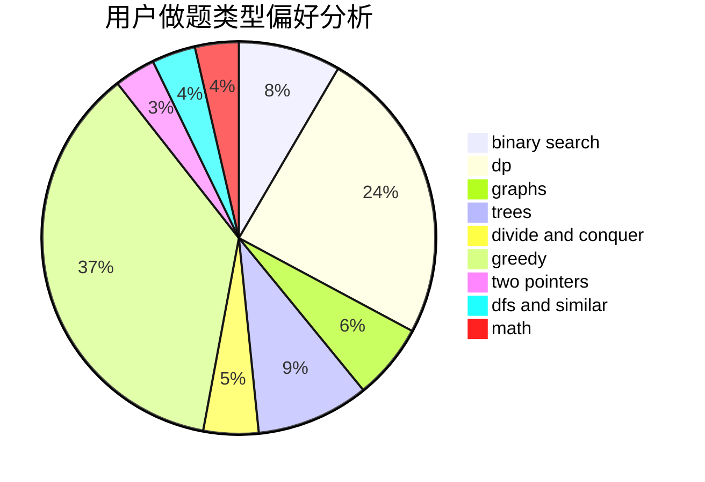

# pyqjw

<!-- tabs:start -->

#### **用户提交结果分析**

#### **用户做题类型偏好分析**

<!-- tabs:end -->
# 推荐题目
[468E](https://codeforces.com/contest/468/problem/E)
[1397C](https://codeforces.com/contest/1397/problem/C)
[523A](https://codeforces.com/contest/523/problem/A)
[21D](https://codeforces.com/contest/21/problem/D)
[924A](https://codeforces.com/contest/924/problem/A)
[260A](https://codeforces.com/contest/260/problem/A)
[551C](https://codeforces.com/contest/551/problem/C)
[112B](https://codeforces.com/contest/112/problem/B)
[360D](https://codeforces.com/contest/360/problem/D)
[1010E](https://codeforces.com/contest/1010/problem/E)
