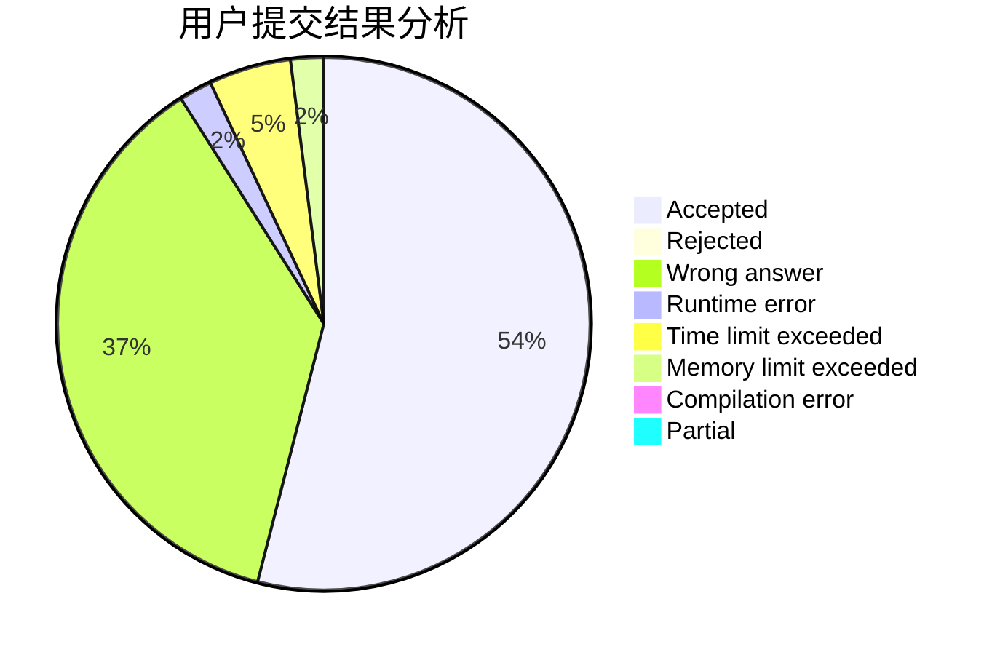
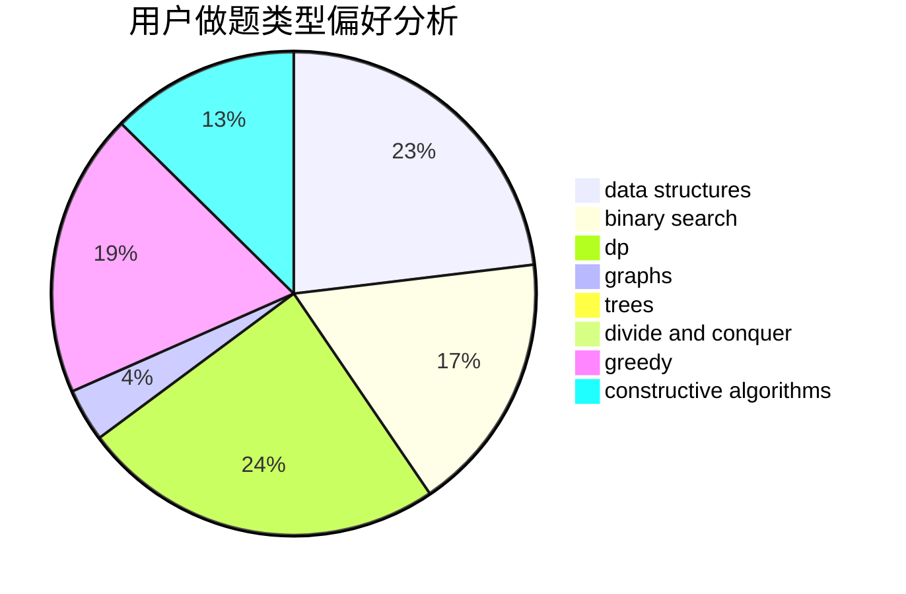
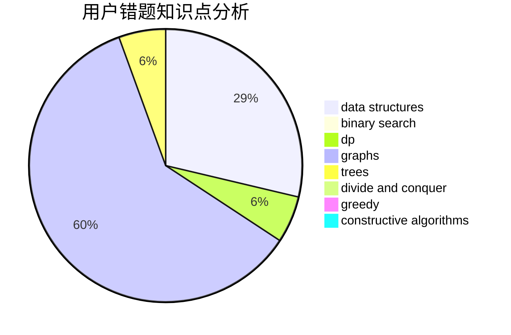

# pyqjw

<!-- tabs:start -->

#### **用户提交结果分析**

#### **用户做题类型偏好分析**

#### **用户错题知识点分析**

<!-- tabs:end -->
# 推荐题目
[449B](https://codeforces.com/contest/449/problem/B)		graphs,
                        greedy,
                        shortest paths		  
[1387C](https://codeforces.com/contest/1387/problem/C)		*special problem,
                        dp,
                        shortest paths,
                        string suffix structures		  
[501C](https://codeforces.com/contest/501/problem/C)		constructive algorithms,
                        data structures,
                        greedy,
                        sortings,
                        trees		  
[198E](https://codeforces.com/contest/198/problem/E)		binary search,
                        data structures,
                        sortings		  
[909C](https://codeforces.com/contest/909/problem/C)		dp		  
[238D](https://codeforces.com/contest/238/problem/D)		data structures,
                        implementation		  
[527C](https://codeforces.com/contest/527/problem/C)		binary search,
                        data structures,
                        implementation		  
[1120C](https://codeforces.com/contest/1120/problem/C)		dp,
                        strings		  
[334B](https://codeforces.com/contest/334/problem/B)		sortings		  
[1010B](https://codeforces.com/contest/1010/problem/B)		binary search,
                        interactive		  
