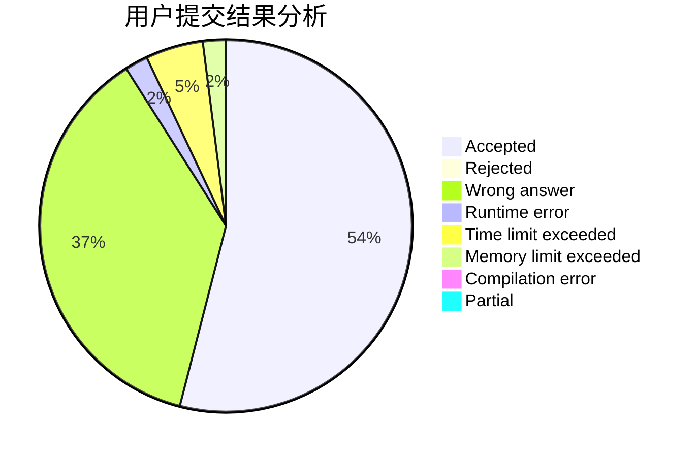
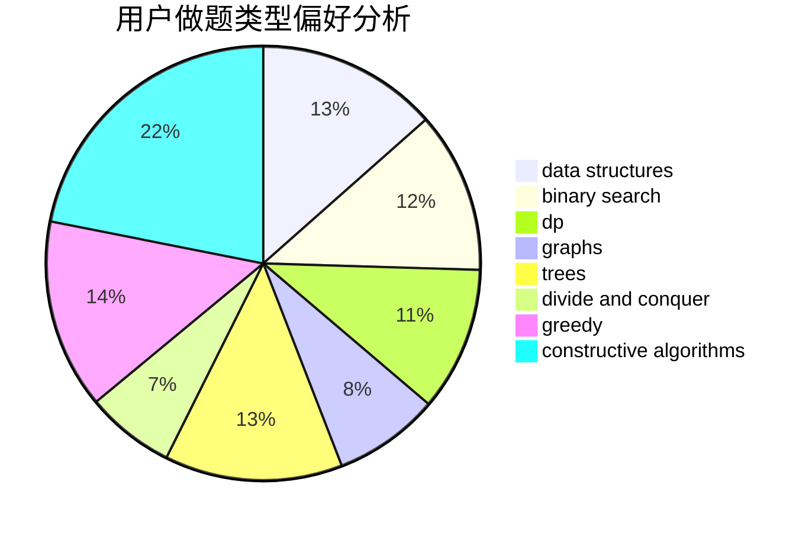
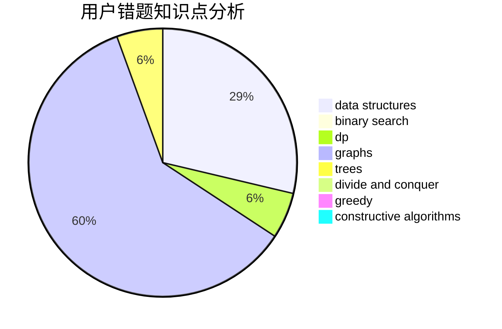

# pyqjw

<!-- tabs:start -->

#### **用户提交结果分析**

#### **用户做题类型偏好分析**

#### **用户错题知识点分析**

<!-- tabs:end -->
# 推荐题目
[468E](https://codeforces.com/contest/468/problem/E)		dp,
                        graph matchings,
                        math,
                        meet-in-the-middle		  
[1397C](https://codeforces.com/contest/1397/problem/C)		dsu,graphs,sortings,trees		  
[523A](https://codeforces.com/contest/523/problem/A)		*special problem,
                        implementation		  
[21D](https://codeforces.com/contest/21/problem/D)		bitmasks,
                        graph matchings,
                        graphs		  
[924A](https://codeforces.com/contest/924/problem/A)		greedy,
                        implementation		  
[260A](https://codeforces.com/contest/260/problem/A)		implementation,
                        math		  
[551C](https://codeforces.com/contest/551/problem/C)		binary search,
                        greedy		  
[112B](https://codeforces.com/contest/112/problem/B)		implementation,
                        math		  
[360D](https://codeforces.com/contest/360/problem/D)		number theory		  
[1010E](https://codeforces.com/contest/1010/problem/E)		data structures		  
