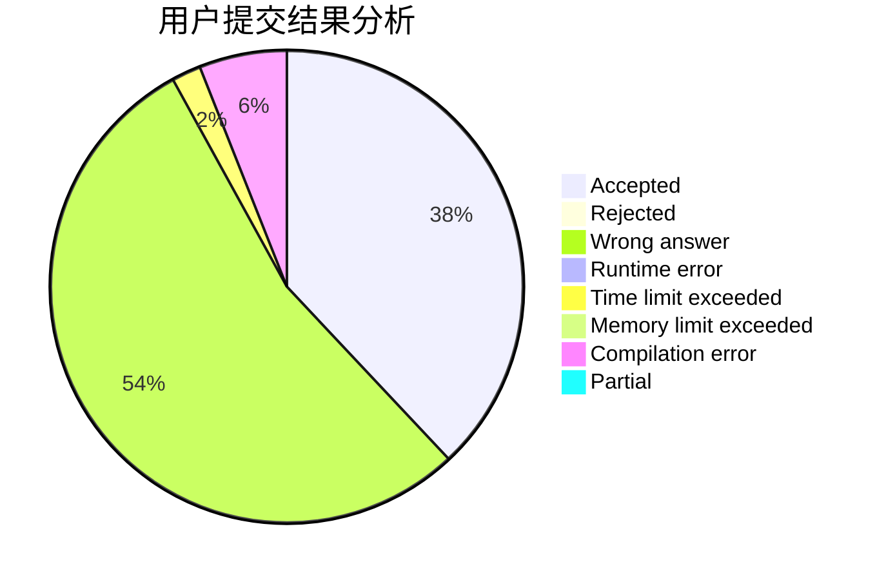
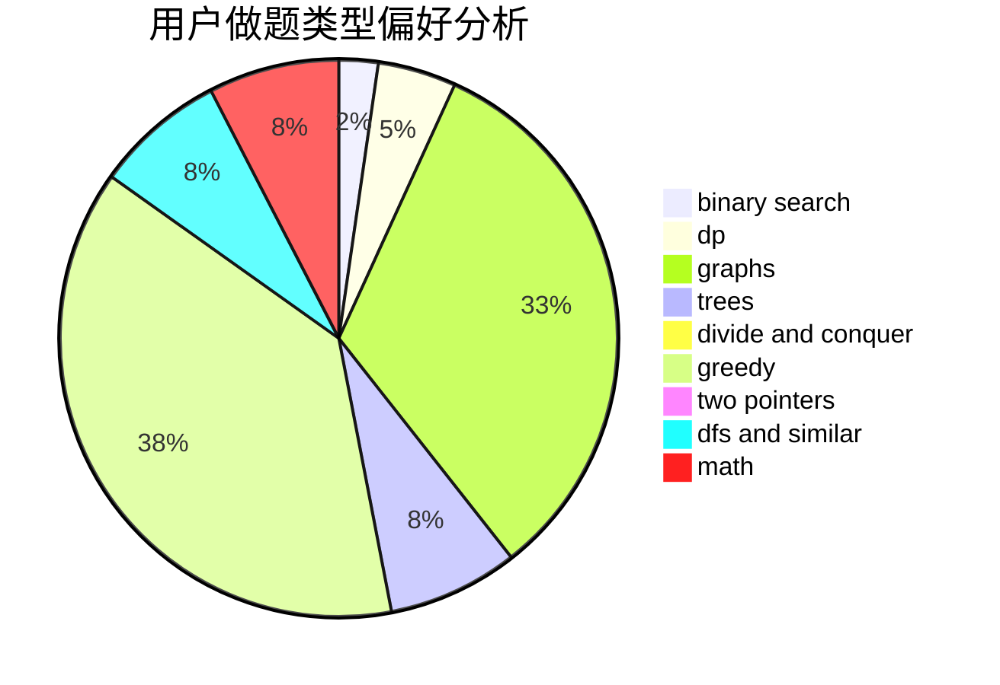

# pyqpyq

<!-- tabs:start -->

#### **用户提交结果分析**

#### **用户做题类型偏好分析**

<!-- tabs:end -->
# 推荐题目
[1310C](https://codeforces.com/contest/1310/problem/C)
[486E](https://codeforces.com/contest/486/problem/E)
[1262A](https://codeforces.com/contest/1262/problem/A)
[551D](https://codeforces.com/contest/551/problem/D)
[1383D](https://codeforces.com/contest/1383/problem/D)
[1286B](https://codeforces.com/contest/1286/problem/B)
[1490C](https://codeforces.com/contest/1490/problem/C)
[1497B](https://codeforces.com/contest/1497/problem/B)
[1491C](https://codeforces.com/contest/1491/problem/C)
[1484C](https://codeforces.com/contest/1484/problem/C)
