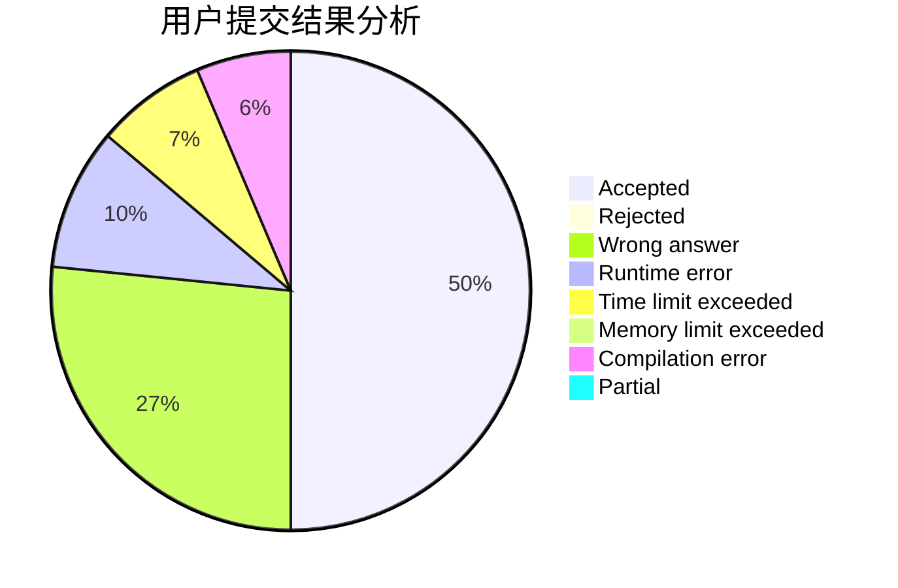
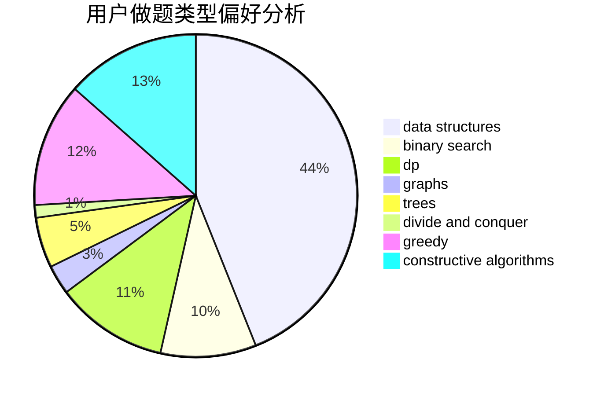
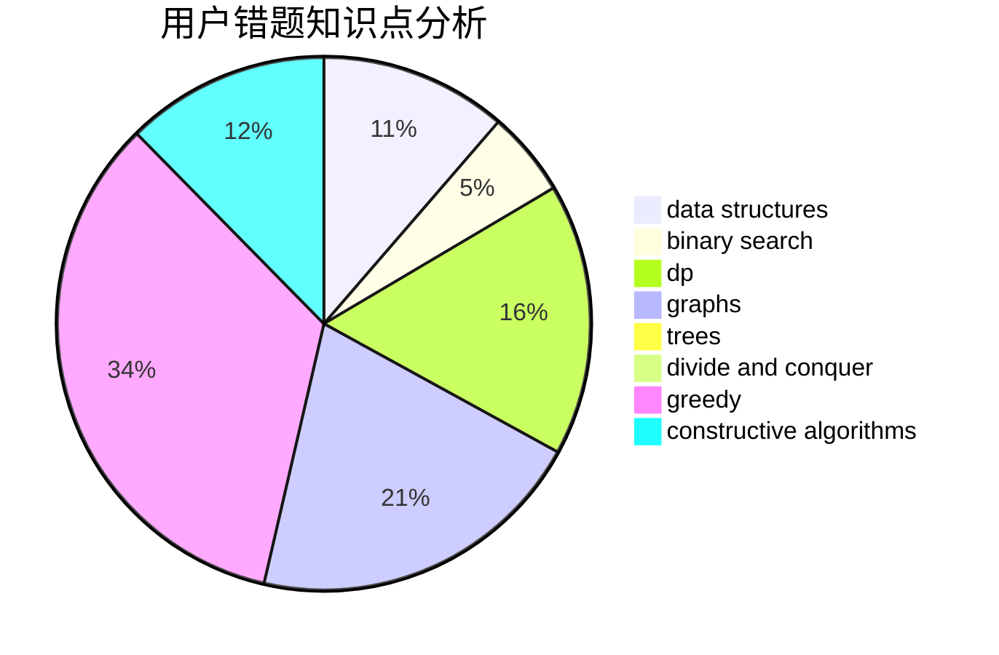

# 141forever

<!-- tabs:start -->

#### **用户提交结果分析**

#### **用户做题类型偏好分析**

#### **用户错题知识点分析**

<!-- tabs:end -->
# 推荐题目
[1151C](https://codeforces.com/contest/1151/problem/C)		constructive algorithms,
                        math		  
[1146B](https://codeforces.com/contest/1146/problem/B)		implementation,
                        strings		  
[1147F](https://codeforces.com/contest/1147/problem/F)		games,
                        interactive		  
[114D](https://codeforces.com/contest/114/problem/D)		dsu,graphs,sortings,trees		  
[1150A](https://codeforces.com/contest/1150/problem/A)		greedy,
                        implementation		  
[1095C](https://codeforces.com/contest/1095/problem/C)		bitmasks,
                        greedy		  
[1131A](https://codeforces.com/contest/1131/problem/A)		math		  
[1146E](https://codeforces.com/contest/1146/problem/E)		bitmasks,
                        data structures,
                        divide and conquer,
                        implementation		  
[1148H](https://codeforces.com/contest/1148/problem/H)		data structures		  
[1145D](https://codeforces.com/contest/1145/problem/D)		implementation		  
