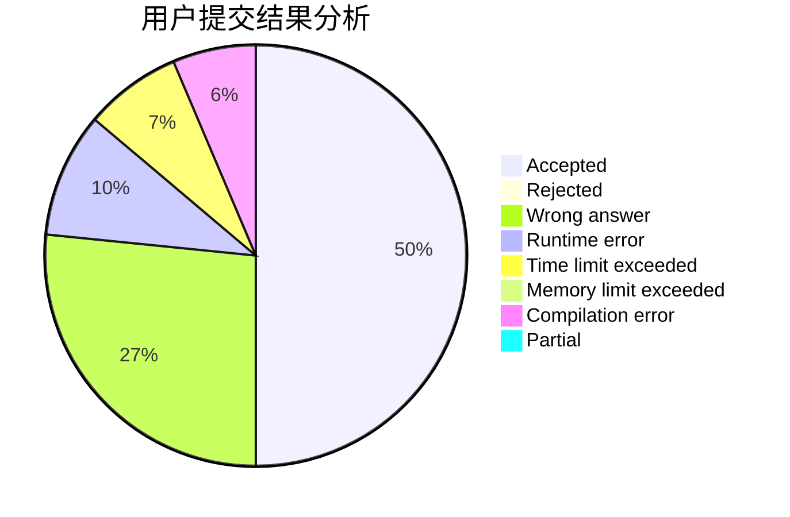
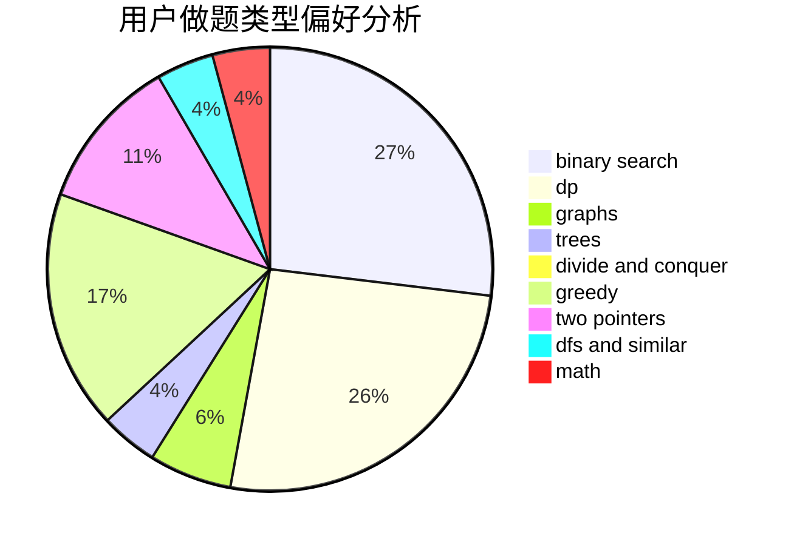

# 141forever

<!-- tabs:start -->

#### **用户提交结果分析**

#### **用户做题类型偏好分析**

<!-- tabs:end -->
# 推荐题目
[1153C](https://codeforces.com/contest/1153/problem/C)
[1148B](https://codeforces.com/contest/1148/problem/B)
[1149E](https://codeforces.com/contest/1149/problem/E)
[11521](https://codeforces.com/contest/1152/problem/1)
[1152A](https://codeforces.com/contest/1152/problem/A)
[1095F](https://codeforces.com/contest/1095/problem/F)
[1132G](https://codeforces.com/contest/1132/problem/G)
[1148E](https://codeforces.com/contest/1148/problem/E)
[1150C](https://codeforces.com/contest/1150/problem/C)
[1147E](https://codeforces.com/contest/1147/problem/E)
