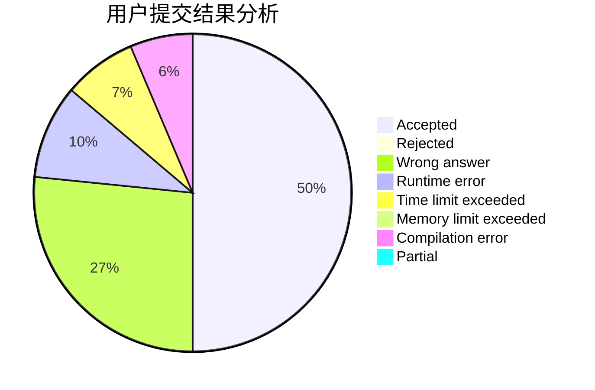
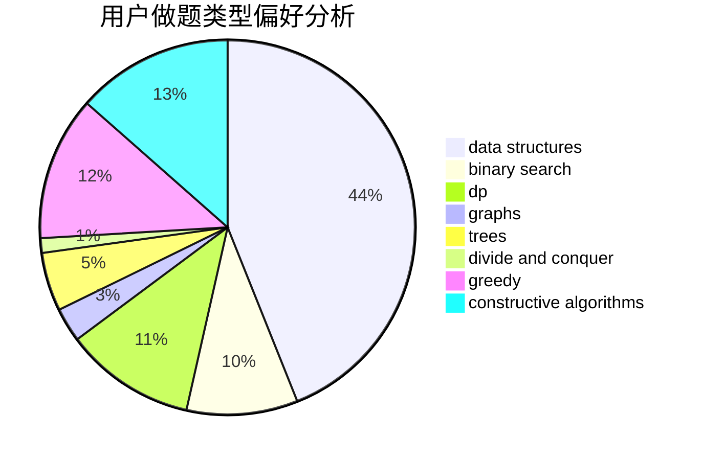
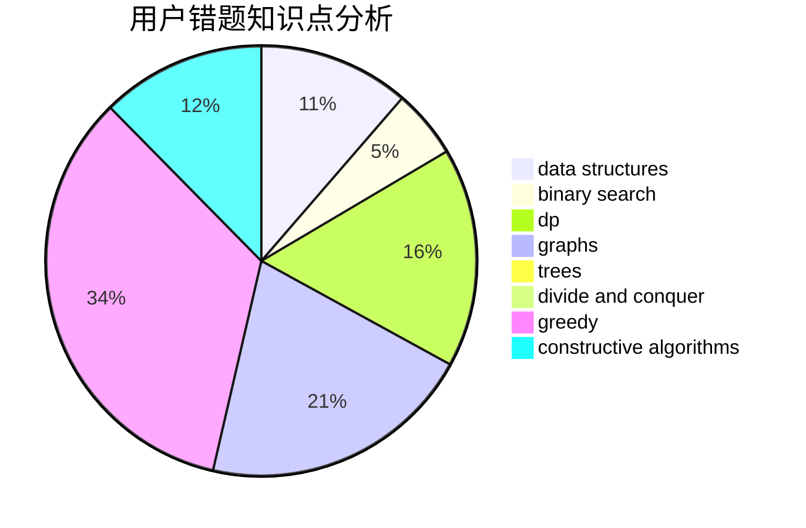

# 141forever
<!-- tabs:start -->
#### **用户提交结果分析**

#### **用户做题类型偏好分析**

#### **用户错题知识点分析**

<!-- tabs:end -->
# 推荐题目
[Problem for Nazar](http://codeforces.com/problemset/problem/1151/C)		constructive algorithms,
                        math		  
[Hate "A"](http://codeforces.com/problemset/problem/1146/B)		implementation,
                        strings		  
[Earth Wind and Fire](http://codeforces.com/problemset/problem/1148/E)		constructive algorithms,
                        greedy,
                        math,
                        sortings,
                        two pointers		  
[Zigzag Game](http://codeforces.com/problemset/problem/1147/F)		games,
                        interactive		  
[Equalize Them All](http://codeforces.com/problemset/problem/1144/D)		constructive algorithms,
                        greedy		  
[Pigeon d'Or](http://codeforces.com/problemset/problem/1145/D)		implementation		  
[Leaf Partition](http://codeforces.com/problemset/problem/1146/F)		dp,
                        trees		  
[Hot is Cold](http://codeforces.com/problemset/problem/1146/E)		bitmasks,
                        data structures,
                        divide and conquer,
                        implementation		  
[Holy Diver](http://codeforces.com/problemset/problem/1148/H)		data structures		  
[Mystery Circuit](http://codeforces.com/problemset/problem/1145/C)		bitmasks,
                        brute force		  
<!-- tabs:start -->
#### **data structures**
[Problem for Nazar](http://codeforces.com/problemset/problem/1146/E)		bitmasks,
                        data structures,
                        divide and conquer,
                        implementation		  
[Hate "A"](http://codeforces.com/problemset/problem/1148/H)		data structures		  
[Earth Wind and Fire](https://codeforces.com/contest/114/problem/D)		brute force,
                        data structures,
                        hashing,
                        strings		  
[Zigzag Game](http://codeforces.com/problemset/problem/1149/C)		data structures,
                        implementation,
                        trees		  
[Equalize Them All](http://codeforces.com/problemset/problem/1151/E)		combinatorics,
                        data structures,
                        dp,
                        math		  
[Pigeon d'Or](https://codeforces.com/contest/1150/problem/E)		data structures,
                        implementation,
                        trees		  
[Leaf Partition](http://codeforces.com/problemset/problem/1492/C)		binary search,
                        data structures,
                        dp,
                        greedy,
                        two pointers		  
[Hot is Cold](http://codeforces.com/problemset/problem/1490/G)		binary search,
                        data structures,
                        math		  
[Holy Diver](http://codeforces.com/problemset/problem/1479/D)		binary search,
                        bitmasks,
                        brute force,
                        data structures,
                        probabilities,
                        trees		  
[Mystery Circuit](http://codeforces.com/problemset/problem/1497/A)		brute force,
                        data structures,
                        greedy,
                        sortings		  
#### **binary search**
[Problem for Nazar](http://codeforces.com/problemset/problem/1148/B)		binary search,
                        brute force,
                        two pointers		  
[Hate "A"](http://codeforces.com/problemset/problem/1056/F)		binary search,
                        dp,
                        math		  
[Earth Wind and Fire](http://codeforces.com/problemset/problem/1492/C)		binary search,
                        data structures,
                        dp,
                        greedy,
                        two pointers		  
[Zigzag Game](http://codeforces.com/problemset/problem/1463/D)		binary search,
                        constructive algorithms,
                        greedy,
                        two pointers		  
[Equalize Them All](http://codeforces.com/problemset/problem/1490/G)		binary search,
                        data structures,
                        math		  
[Pigeon d'Or](http://codeforces.com/problemset/problem/1479/D)		binary search,
                        bitmasks,
                        brute force,
                        data structures,
                        probabilities,
                        trees		  
[Leaf Partition](http://codeforces.com/problemset/problem/1436/E)		binary search,
                        data structures,
                        two pointers		  
[Hot is Cold](http://codeforces.com/problemset/problem/1461/D)		binary search,
                        brute force,
                        data structures,
                        divide and conquer,
                        implementation,
                        sortings		  
[Holy Diver](http://codeforces.com/problemset/problem/1493/C)		binary search,
                        brute force,
                        constructive algorithms,
                        greedy,
                        strings		  
[Mystery Circuit](http://codeforces.com/problemset/problem/1487/D)		binary search,
                        brute force,
                        math,
                        number theory		  
#### **dp**
[Problem for Nazar](http://codeforces.com/problemset/problem/1146/F)		dp,
                        trees		  
[Hate "A"](http://codeforces.com/problemset/problem/1056/F)		binary search,
                        dp,
                        math		  
[Earth Wind and Fire](http://codeforces.com/problemset/problem/1144/G)		dp,
                        greedy		  
[Zigzag Game](http://codeforces.com/problemset/problem/1151/B)		bitmasks,
                        brute force,
                        constructive algorithms,
                        dp		  
[Equalize Them All](http://codeforces.com/problemset/problem/1137/C)		dp,
                        graphs,
                        implementation		  
[Pigeon d'Or](http://codeforces.com/problemset/problem/1149/D)		brute force,
                        dp,
                        graphs,
                        greedy		  
[Leaf Partition](http://codeforces.com/problemset/problem/1151/E)		combinatorics,
                        data structures,
                        dp,
                        math		  
[Hot is Cold](http://codeforces.com/problemset/problem/1151/F)		combinatorics,
                        dp,
                        matrices,
                        probabilities		  
[Holy Diver](http://codeforces.com/problemset/problem/1149/B)		dp,
                        implementation,
                        strings		  
[Mystery Circuit](http://codeforces.com/problemset/problem/1146/G)		dp,
                        flows,
                        graphs		  
#### **graph**
[Problem for Nazar](http://codeforces.com/problemset/problem/1146/C)		bitmasks,
                        graphs,
                        interactive		  
[Hate "A"](http://codeforces.com/problemset/problem/1149/E)		games,
                        graphs		  
[Earth Wind and Fire](http://codeforces.com/problemset/problem/1147/A)		graphs		  
[Zigzag Game](http://codeforces.com/problemset/problem/114/B)		bitmasks,
                        brute force,
                        graphs		  
[Equalize Them All](http://codeforces.com/problemset/problem/1144/F)		dfs and similar,
                        graphs		  
[Pigeon d'Or](http://codeforces.com/problemset/problem/1147/D)		dfs and similar,
                        graphs		  
[Leaf Partition](http://codeforces.com/problemset/problem/1148/G)		constructive algorithms,
                        graphs,
                        math,
                        number theory,
                        probabilities		  
[Hot is Cold](http://codeforces.com/problemset/problem/1137/C)		dp,
                        graphs,
                        implementation		  
[Holy Diver](http://codeforces.com/problemset/problem/1149/D)		brute force,
                        dp,
                        graphs,
                        greedy		  
[Mystery Circuit](http://codeforces.com/problemset/problem/1067/B)		dfs and similar,
                        graphs,
                        shortest paths		  
#### **trees**
[Problem for Nazar](http://codeforces.com/problemset/problem/1146/F)		dp,
                        trees		  
[Hate "A"](http://codeforces.com/problemset/problem/1149/C)		data structures,
                        implementation,
                        trees		  
[Earth Wind and Fire](https://codeforces.com/contest/1150/problem/E)		data structures,
                        implementation,
                        trees		  
[Zigzag Game](http://codeforces.com/problemset/problem/1479/D)		binary search,
                        bitmasks,
                        brute force,
                        data structures,
                        probabilities,
                        trees		  
[Equalize Them All](http://codeforces.com/problemset/problem/1511/C)		brute force,
                        data structures,
                        implementation,
                        trees		  
[Pigeon d'Or](http://codeforces.com/problemset/problem/1499/F)		combinatorics,
                        dfs and similar,
                        dp,
                        trees		  
[Leaf Partition](http://codeforces.com/problemset/problem/1491/E)		brute force,
                        dfs and similar,
                        divide and conquer,
                        number theory,
                        trees		  
[Hot is Cold](http://codeforces.com/problemset/problem/1466/D)		data structures,
                        greedy,
                        sortings,
                        trees		  
[Holy Diver](http://codeforces.com/problemset/problem/1495/D)		combinatorics,
                        dfs and similar,
                        graphs,
                        math,
                        shortest paths,
                        trees		  
[Mystery Circuit](http://codeforces.com/problemset/problem/1303/G)		data structures,
                        divide and conquer,
                        geometry,
                        trees		  
#### **divide and conquer**
[Problem for Nazar](http://codeforces.com/problemset/problem/1146/E)		bitmasks,
                        data structures,
                        divide and conquer,
                        implementation		  
[Hate "A"](http://codeforces.com/problemset/problem/1461/D)		binary search,
                        brute force,
                        data structures,
                        divide and conquer,
                        implementation,
                        sortings		  
[Earth Wind and Fire](http://codeforces.com/problemset/problem/1466/G)		combinatorics,
                        divide and conquer,
                        hashing,
                        math,
                        string suffix structures,
                        strings		  
[Zigzag Game](http://codeforces.com/problemset/problem/1490/D)		dfs and similar,
                        divide and conquer,
                        implementation		  
[Equalize Them All](https://codeforces.com/contest/1483/problem/C)		data structures,
                        divide and conquer,
                        dp		  
[Pigeon d'Or](http://codeforces.com/problemset/problem/1491/E)		brute force,
                        dfs and similar,
                        divide and conquer,
                        number theory,
                        trees		  
[Leaf Partition](http://codeforces.com/problemset/problem/1303/G)		data structures,
                        divide and conquer,
                        geometry,
                        trees		  
[Hot is Cold](http://codeforces.com/problemset/problem/1494/D)		constructive algorithms,
                        data structures,
                        dfs and similar,
                        divide and conquer,
                        dsu,
                        greedy,
                        sortings,
                        trees		  
[Holy Diver](http://codeforces.com/problemset/problem/1482/E)		data structures,
                        divide and conquer,
                        dp		  
[Mystery Circuit](http://codeforces.com/problemset/problem/566/C)		dfs and similar,
                        divide and conquer,
                        trees		  
#### **greedy**
[Problem for Nazar](http://codeforces.com/problemset/problem/1148/E)		constructive algorithms,
                        greedy,
                        math,
                        sortings,
                        two pointers		  
[Hate "A"](http://codeforces.com/problemset/problem/1144/D)		constructive algorithms,
                        greedy		  
[Earth Wind and Fire](http://codeforces.com/problemset/problem/1150/A)		greedy,
                        implementation		  
[Zigzag Game](http://codeforces.com/problemset/problem/1095/C)		bitmasks,
                        greedy		  
[Equalize Them All](http://codeforces.com/problemset/problem/1144/G)		dp,
                        greedy		  
[Pigeon d'Or](http://codeforces.com/problemset/problem/1151/D)		greedy,
                        math,
                        sortings		  
[Leaf Partition](http://codeforces.com/problemset/problem/1152/A)		greedy,
                        implementation,
                        math		  
[Hot is Cold](http://codeforces.com/problemset/problem/1149/D)		brute force,
                        dp,
                        graphs,
                        greedy		  
[Holy Diver](http://codeforces.com/problemset/problem/1150/B)		greedy,
                        implementation		  
[Mystery Circuit](http://codeforces.com/problemset/problem/1148/A)		greedy		  
#### **constructive algorithms**
[Problem for Nazar](http://codeforces.com/problemset/problem/1151/C)		constructive algorithms,
                        math		  
[Hate "A"](http://codeforces.com/problemset/problem/1148/E)		constructive algorithms,
                        greedy,
                        math,
                        sortings,
                        two pointers		  
[Earth Wind and Fire](http://codeforces.com/problemset/problem/1144/D)		constructive algorithms,
                        greedy		  
[Zigzag Game](http://codeforces.com/problemset/problem/1151/B)		bitmasks,
                        brute force,
                        constructive algorithms,
                        dp		  
[Equalize Them All](http://codeforces.com/problemset/problem/1148/G)		constructive algorithms,
                        graphs,
                        math,
                        number theory,
                        probabilities		  
[Pigeon d'Or](http://codeforces.com/problemset/problem/1025/G)		constructive algorithms,
                        math		  
[Leaf Partition](http://codeforces.com/problemset/problem/1148/F)		bitmasks,
                        constructive algorithms		  
[Hot is Cold](http://codeforces.com/problemset/problem/1103/A)		constructive algorithms,
                        implementation		  
[Holy Diver](https://codeforces.com/contest/1150/problem/C)		constructive algorithms,
                        greedy,
                        math,
                        number theory		  
[Mystery Circuit](http://codeforces.com/problemset/problem/1149/A)		constructive algorithms,
                        greedy,
                        math,
                        number theory		  
#### **sortings**
[Problem for Nazar](http://codeforces.com/problemset/problem/1148/E)		constructive algorithms,
                        greedy,
                        math,
                        sortings,
                        two pointers		  
[Hate "A"](http://codeforces.com/problemset/problem/1151/D)		greedy,
                        math,
                        sortings		  
[Earth Wind and Fire](http://codeforces.com/problemset/problem/1148/D)		greedy,
                        sortings		  
[Zigzag Game](http://codeforces.com/problemset/problem/1148/C)		constructive algorithms,
                        sortings		  
[Equalize Them All](https://codeforces.com/contest/1496/problem/C)		geometry,
                        greedy,
                        math,
                        sortings		  
[Pigeon d'Or](http://codeforces.com/problemset/problem/1495/A)		geometry,
                        greedy,
                        math,
                        sortings		  
[Leaf Partition](http://codeforces.com/problemset/problem/1497/A)		brute force,
                        data structures,
                        greedy,
                        sortings		  
[Hot is Cold](http://codeforces.com/problemset/problem/1427/A)		math,
                        sortings		  
[Holy Diver](http://codeforces.com/problemset/problem/1461/D)		binary search,
                        brute force,
                        data structures,
                        divide and conquer,
                        implementation,
                        sortings		  
[Mystery Circuit](http://codeforces.com/problemset/problem/1437/C)		dp,
                        flows,
                        graph matchings,
                        greedy,
                        math,
                        sortings		  
<!-- tabs:end -->
