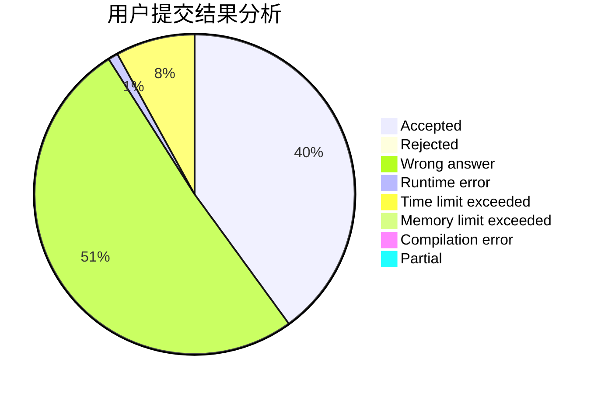
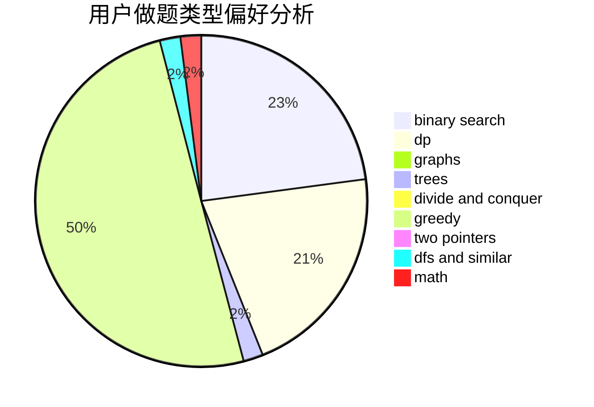

# C20161009

<!-- tabs:start -->

#### **用户提交结果分析**

#### **用户做题类型偏好分析**

<!-- tabs:end -->
# 推荐题目
[1129D](https://codeforces.com/contest/1129/problem/D)
[1279E](https://codeforces.com/contest/1279/problem/E)
[1081D](https://codeforces.com/contest/1081/problem/D)
[1203A](https://codeforces.com/contest/1203/problem/A)
[1131F](https://codeforces.com/contest/1131/problem/F)
[218B](https://codeforces.com/contest/218/problem/B)
[11302](https://codeforces.com/contest/1130/problem/2)
[190E](https://codeforces.com/contest/190/problem/E)
[599B](https://codeforces.com/contest/599/problem/B)
[12862](https://codeforces.com/contest/1286/problem/2)
