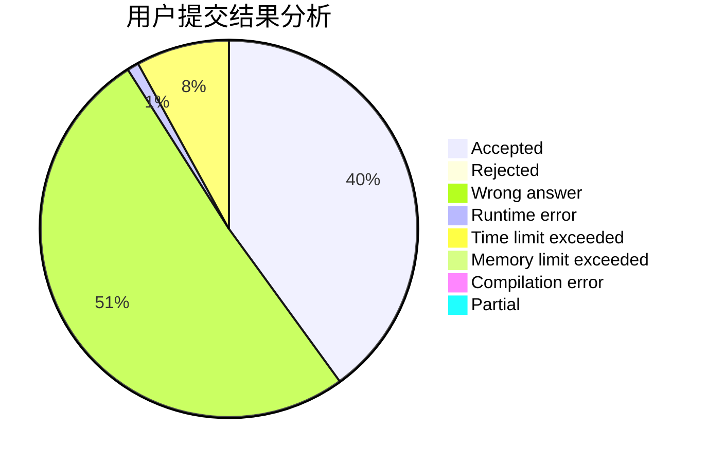
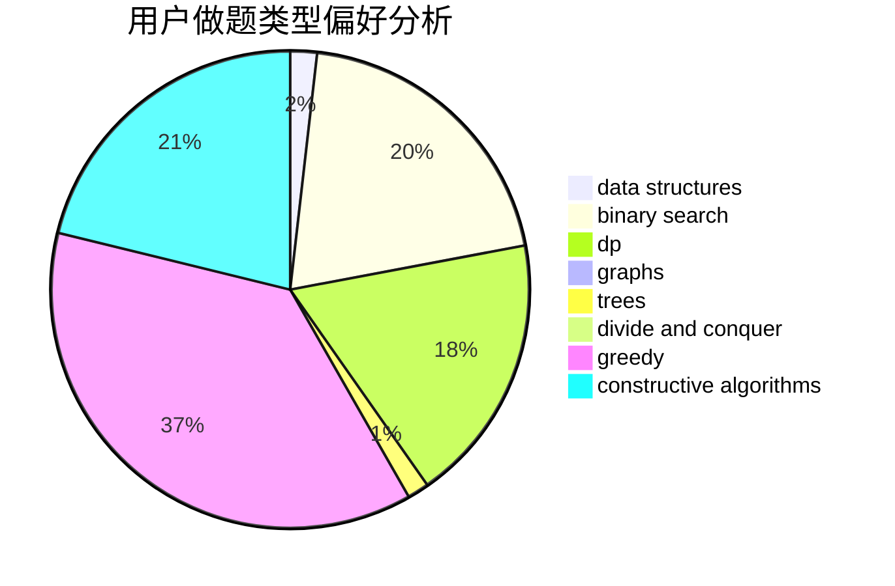
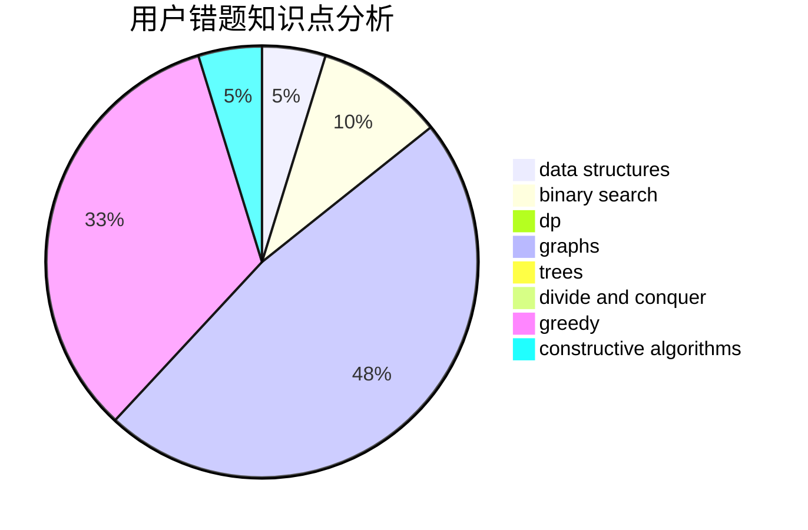

# C20161009

<!-- tabs:start -->

#### **用户提交结果分析**

#### **用户做题类型偏好分析**

#### **用户错题知识点分析**

<!-- tabs:end -->
# 推荐题目
[1129D](https://codeforces.com/contest/1129/problem/D)		data structures,
                        dp		  
[1279E](https://codeforces.com/contest/1279/problem/E)		combinatorics,
                        dp		  
[1081D](https://codeforces.com/contest/1081/problem/D)		dsu,
                        graphs,
                        shortest paths,
                        sortings		  
[1203A](https://codeforces.com/contest/1203/problem/A)		implementation		  
[1131F](https://codeforces.com/contest/1131/problem/F)		constructive algorithms,
                        dsu		  
[218B](https://codeforces.com/contest/218/problem/B)		implementation		  
[11302](https://codeforces.com/contest/1130/problem/2)		dsu,graphs,sortings,trees		  
[190E](https://codeforces.com/contest/190/problem/E)		data structures,
                        dsu,
                        graphs,
                        hashing,
                        sortings		  
[599B](https://codeforces.com/contest/599/problem/B)		implementation		  
[12862](https://codeforces.com/contest/1286/problem/2)		dsu,graphs,sortings,trees		  
