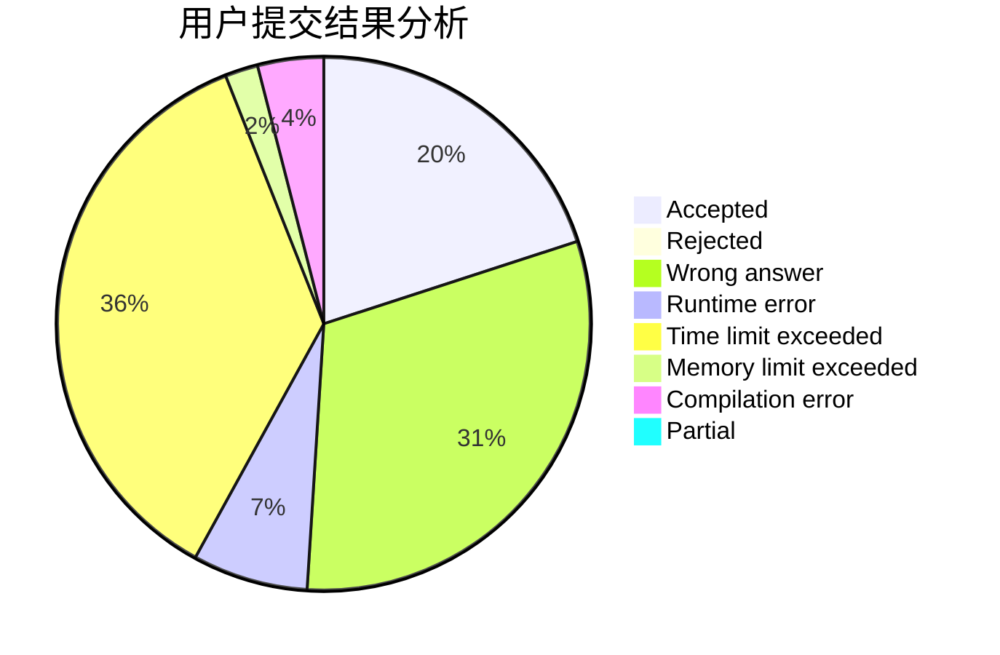
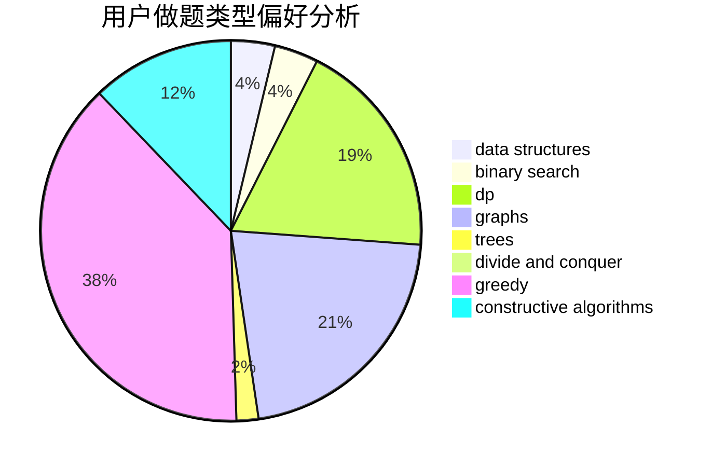
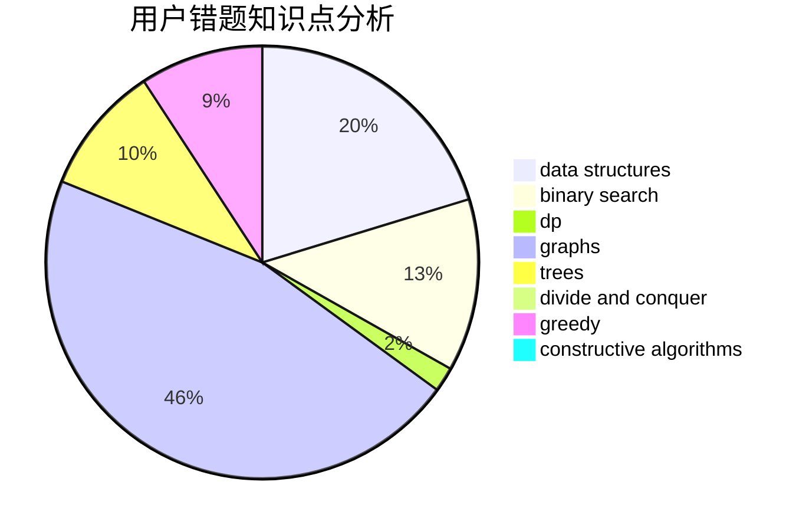

# pythoner713

<!-- tabs:start -->

#### **用户提交结果分析**

#### **用户做题类型偏好分析**

#### **用户错题知识点分析**

<!-- tabs:end -->
# 推荐题目
[18E](https://codeforces.com/contest/18/problem/E)		dp		  
[1029D](https://codeforces.com/contest/1029/problem/D)		implementation,
                        math		  
[1030E](https://codeforces.com/contest/1030/problem/E)		bitmasks,
                        dp		  
[1077C](https://codeforces.com/contest/1077/problem/C)		nan		  
[571C](https://codeforces.com/contest/571/problem/C)		constructive algorithms,
                        dfs and similar,
                        graphs,
                        greedy		  
[1163C2](https://codeforces.com/contest/1163C/problem/2)		data structures,
                        geometry,
                        implementation,
                        math		  
[1240A](https://codeforces.com/contest/1240/problem/A)		dsu,graphs,sortings,trees		  
[600A](https://codeforces.com/contest/600/problem/A)		implementation,
                        strings		  
[828C](https://codeforces.com/contest/828/problem/C)		dsu,graphs,sortings,trees		  
[1016C](https://codeforces.com/contest/1016/problem/C)		dp,
                        implementation		  
