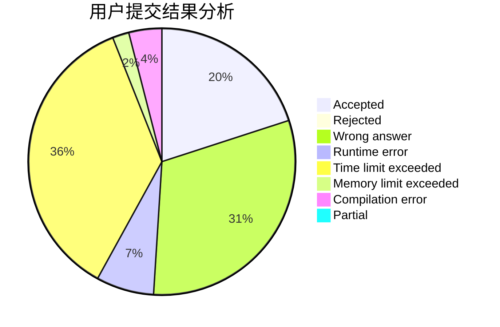
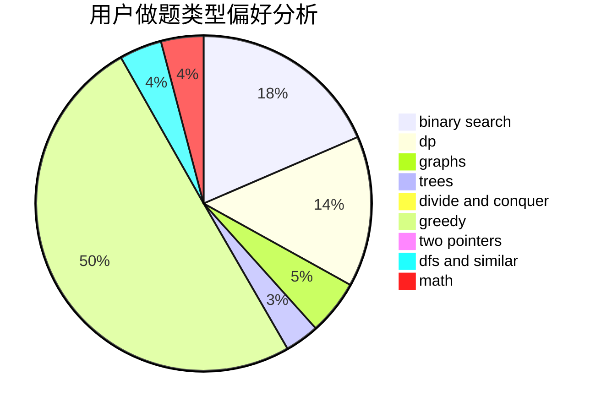

# pythoner713

<!-- tabs:start -->

#### **用户提交结果分析**

#### **用户做题类型偏好分析**

<!-- tabs:end -->
# 推荐题目
[215C](https://codeforces.com/contest/215/problem/C)
[102A](https://codeforces.com/contest/102/problem/A)
[1031B](https://codeforces.com/contest/1031/problem/B)
[1077D](https://codeforces.com/contest/1077/problem/D)
[591D](https://codeforces.com/contest/591/problem/D)
[11651](https://codeforces.com/contest/1165/problem/1)
[1245D](https://codeforces.com/contest/1245/problem/D)
[618G](https://codeforces.com/contest/618/problem/G)
[846F](https://codeforces.com/contest/846/problem/F)
[1016F](https://codeforces.com/contest/1016/problem/F)
