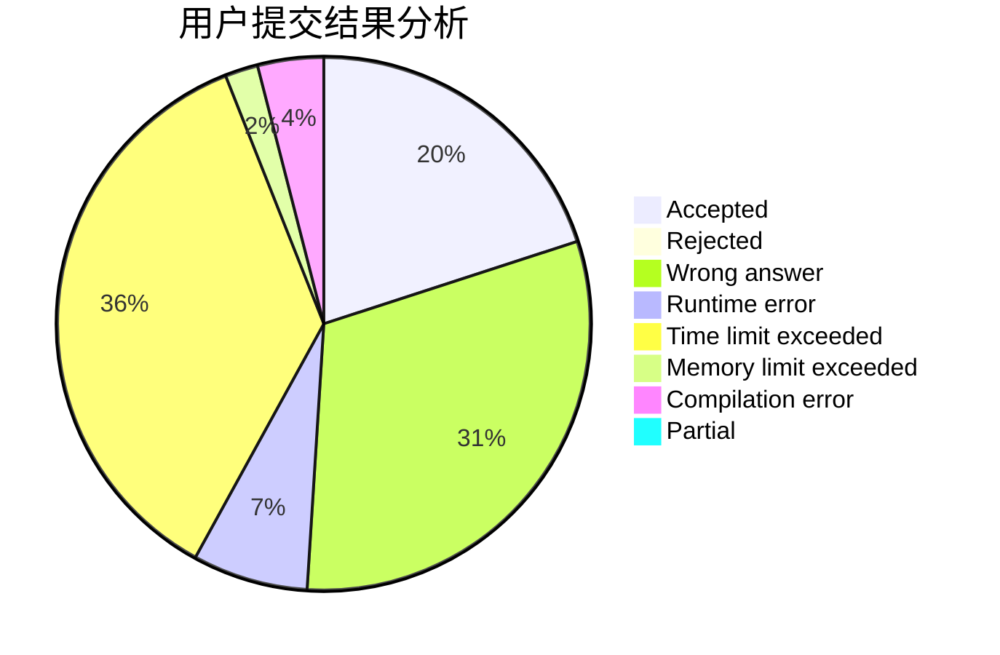
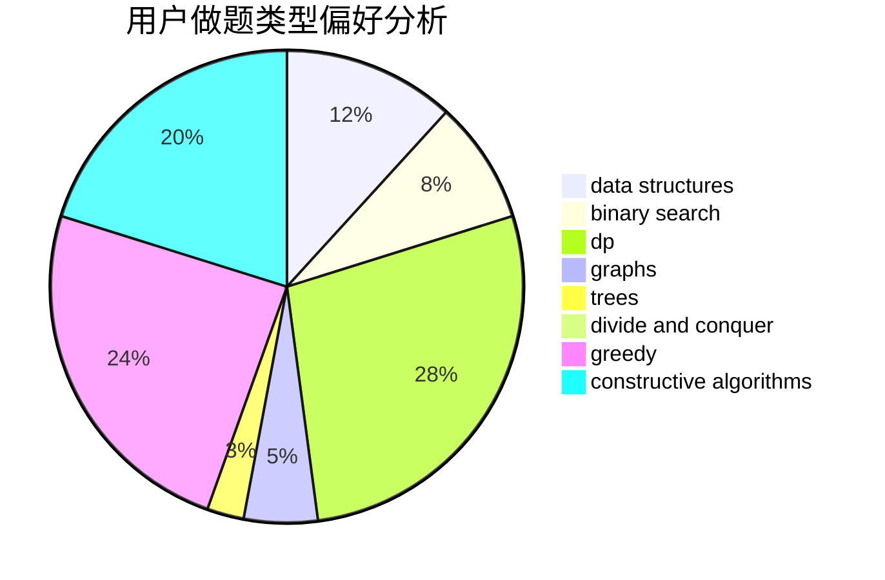
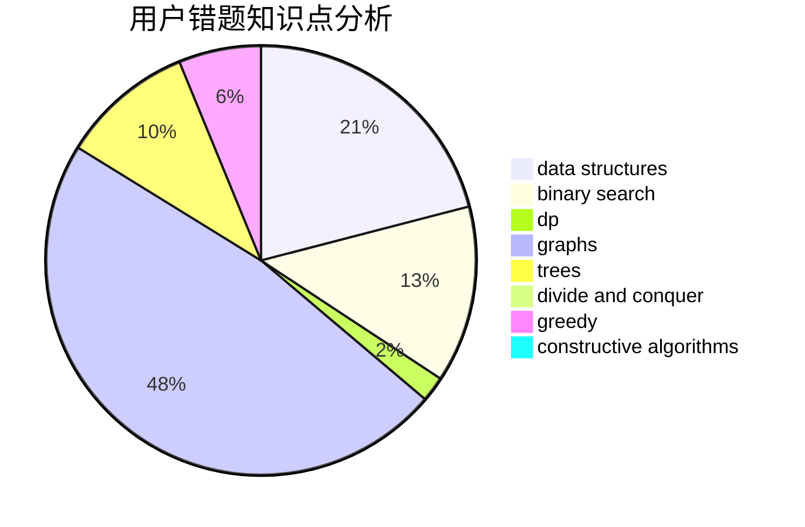

# pythoner713

<!-- tabs:start -->

#### **用户提交结果分析**

#### **用户做题类型偏好分析**

#### **用户错题知识点分析**

<!-- tabs:end -->
# 推荐题目
[215C](https://codeforces.com/contest/215/problem/C)		brute force,
                        implementation		  
[102A](https://codeforces.com/contest/102/problem/A)		brute force		  
[1031B](https://codeforces.com/contest/1031/problem/B)		nan		  
[1077D](https://codeforces.com/contest/1077/problem/D)		binary search,
                        sortings		  
[591D](https://codeforces.com/contest/591/problem/D)		dsu,graphs,sortings,trees		  
[11651](https://codeforces.com/contest/1165/problem/1)		dsu,graphs,sortings,trees		  
[1245D](https://codeforces.com/contest/1245/problem/D)		dsu,
                        graphs,
                        greedy,
                        shortest paths,
                        trees		  
[618G](https://codeforces.com/contest/618/problem/G)		dp,
                        math,
                        matrices,
                        probabilities		  
[846F](https://codeforces.com/contest/846/problem/F)		data structures,
                        math,
                        probabilities,
                        two pointers		  
[1016F](https://codeforces.com/contest/1016/problem/F)		dfs and similar,
                        dp,
                        trees		  
