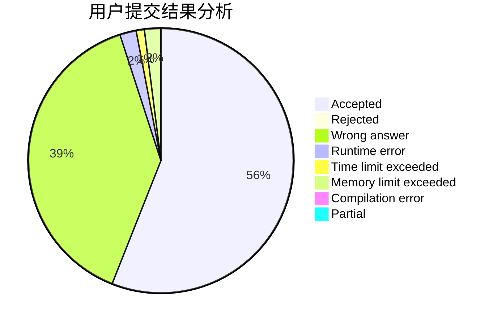
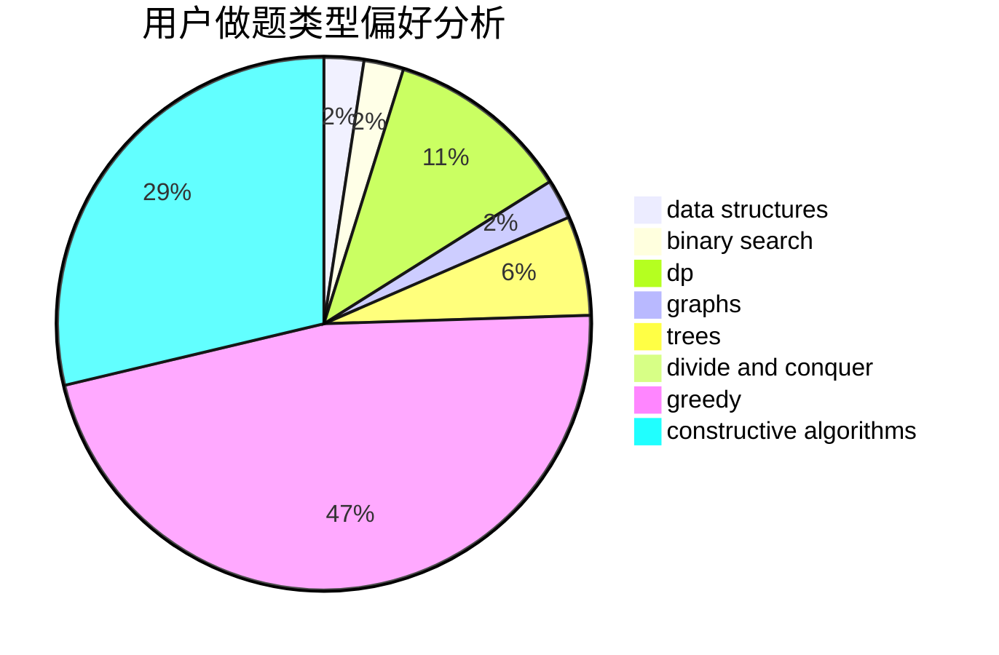
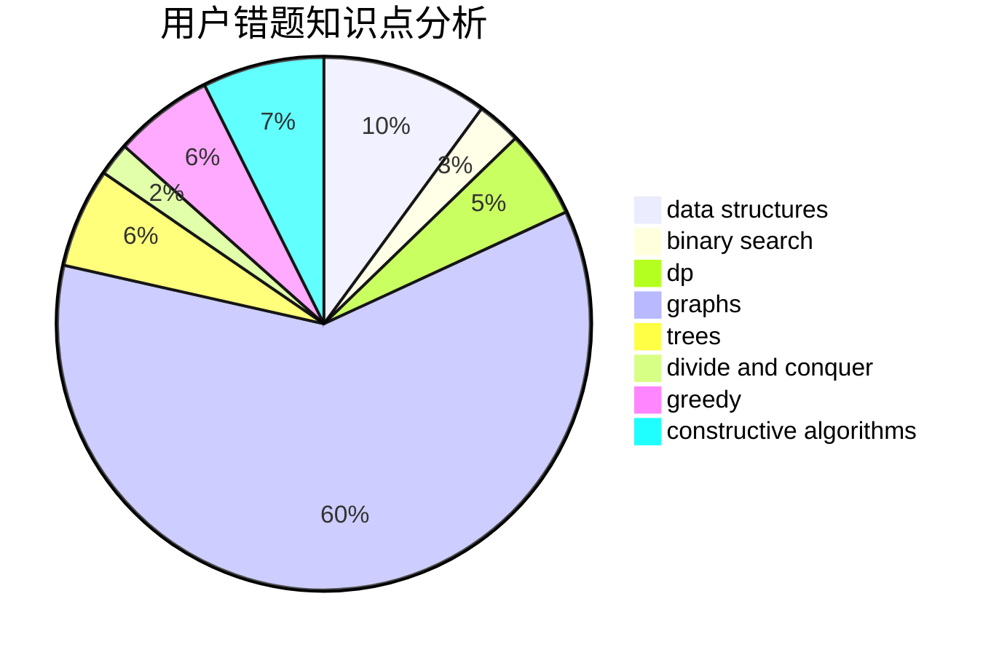

# pzc2004

<!-- tabs:start -->

#### **用户提交结果分析**

#### **用户做题类型偏好分析**

#### **用户错题知识点分析**

<!-- tabs:end -->
# 推荐题目
[311A](https://codeforces.com/contest/311/problem/A)		constructive algorithms,
                        implementation		  
[797C](https://codeforces.com/contest/797/problem/C)		data structures,
                        greedy,
                        strings		  
[1328C](https://codeforces.com/contest/1328/problem/C)		greedy,
                        implementation		  
[780B](https://codeforces.com/contest/780/problem/B)		binary search		  
[299C](https://codeforces.com/contest/299/problem/C)		dsu,graphs,sortings,trees		  
[1369F](https://codeforces.com/contest/1369/problem/F)		dfs and similar,
                        dp,
                        games		  
[771E](https://codeforces.com/contest/771/problem/E)		dp,
                        greedy		  
[888B](https://codeforces.com/contest/888/problem/B)		greedy		  
[616C](https://codeforces.com/contest/616/problem/C)		dfs and similar		  
[1311A](https://codeforces.com/contest/1311/problem/A)		greedy,
                        implementation,
                        math		  
