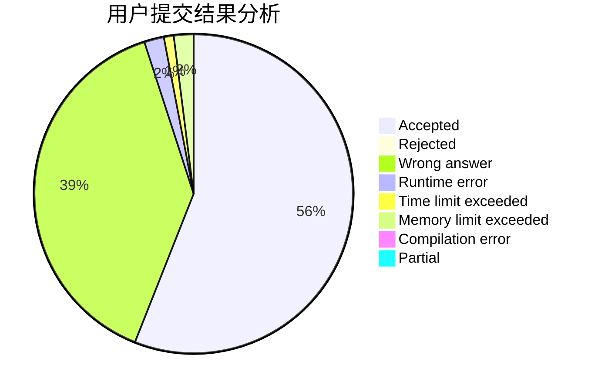
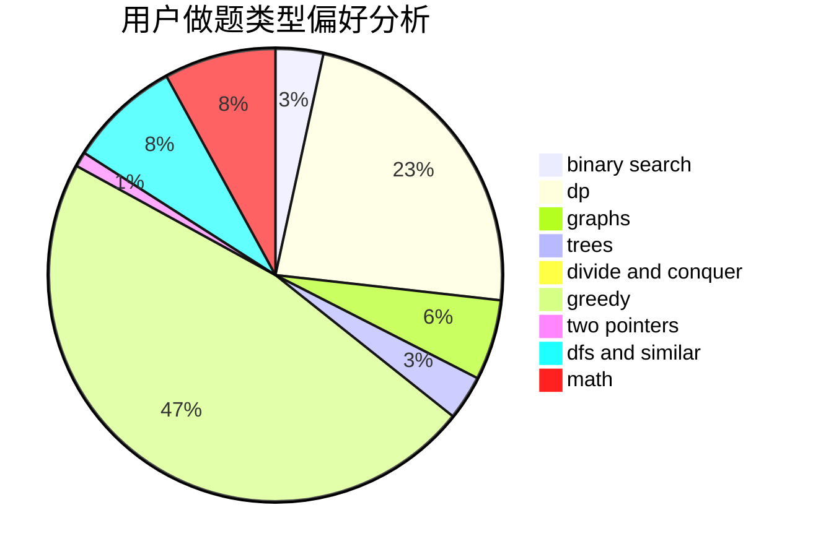

# pzc2004

<!-- tabs:start -->

#### **用户提交结果分析**

#### **用户做题类型偏好分析**

<!-- tabs:end -->
# 推荐题目
[311A](https://codeforces.com/contest/311/problem/A)
[797C](https://codeforces.com/contest/797/problem/C)
[1328C](https://codeforces.com/contest/1328/problem/C)
[780B](https://codeforces.com/contest/780/problem/B)
[299C](https://codeforces.com/contest/299/problem/C)
[1369F](https://codeforces.com/contest/1369/problem/F)
[771E](https://codeforces.com/contest/771/problem/E)
[888B](https://codeforces.com/contest/888/problem/B)
[616C](https://codeforces.com/contest/616/problem/C)
[1311A](https://codeforces.com/contest/1311/problem/A)
