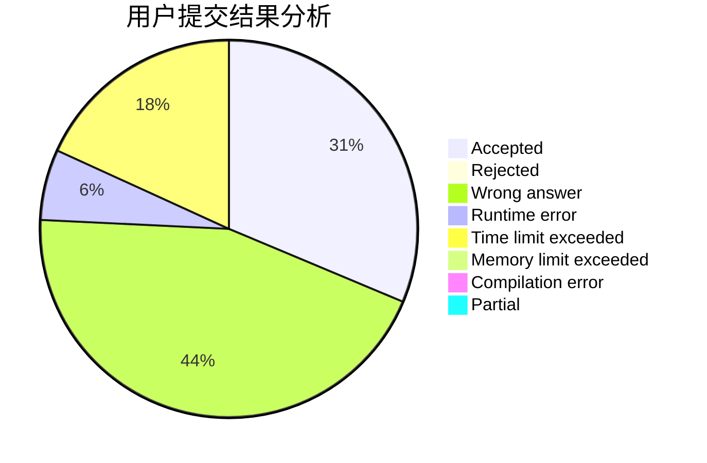
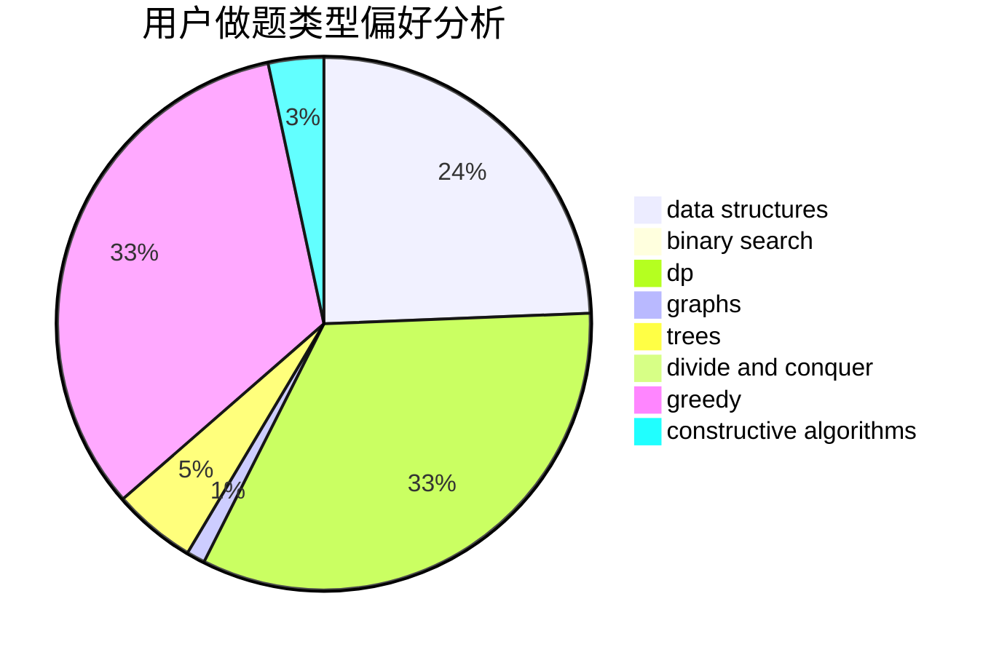
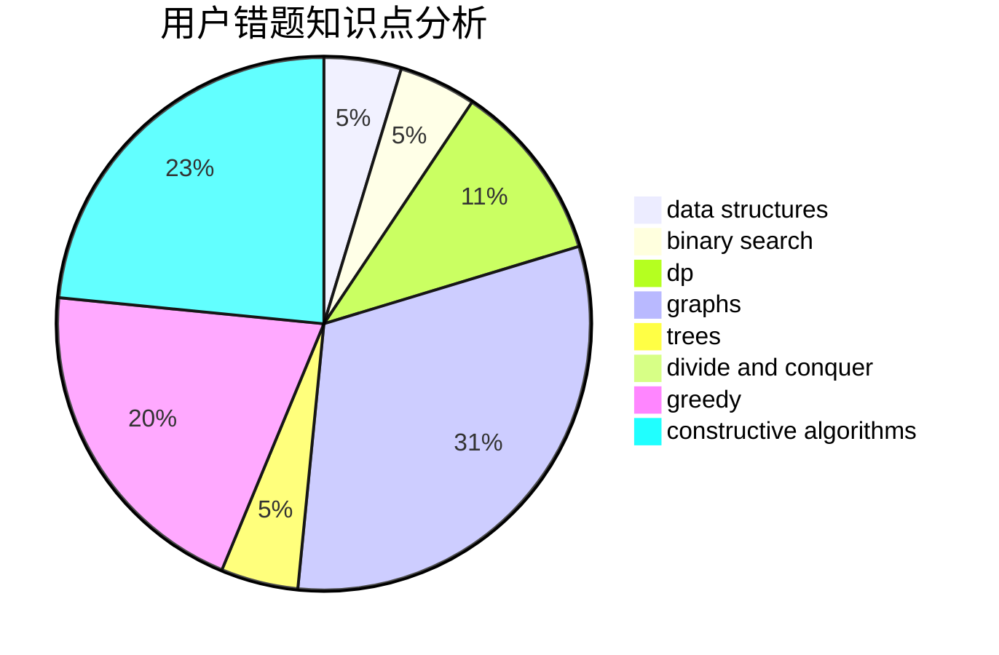

# q-w-q-w-q

<!-- tabs:start -->

#### **用户提交结果分析**

#### **用户做题类型偏好分析**

#### **用户错题知识点分析**

<!-- tabs:end -->
# 推荐题目
[1486E](https://codeforces.com/contest/1486/problem/E)		binary search,
                        brute force,
                        constructive algorithms,
                        dp,
                        flows,
                        graphs,
                        shortest paths		  
[870C](https://codeforces.com/contest/870/problem/C)		dp,
                        greedy,
                        math,
                        number theory		  
[1292E](https://codeforces.com/contest/1292/problem/E)		constructive algorithms,
                        greedy,
                        interactive,
                        math		  
[99C](https://codeforces.com/contest/99/problem/C)		dsu,graphs,sortings,trees		  
[412D](https://codeforces.com/contest/412/problem/D)		dfs and similar		  
[720C](https://codeforces.com/contest/720/problem/C)		constructive algorithms		  
[1324C](https://codeforces.com/contest/1324/problem/C)		binary search,
                        data structures,
                        dfs and similar,
                        greedy,
                        implementation		  
[13931](https://codeforces.com/contest/1393/problem/1)		dsu,graphs,sortings,trees		  
[261E](https://codeforces.com/contest/261/problem/E)		brute force,
                        dp,
                        two pointers		  
[1006A](https://codeforces.com/contest/1006/problem/A)		implementation		  
