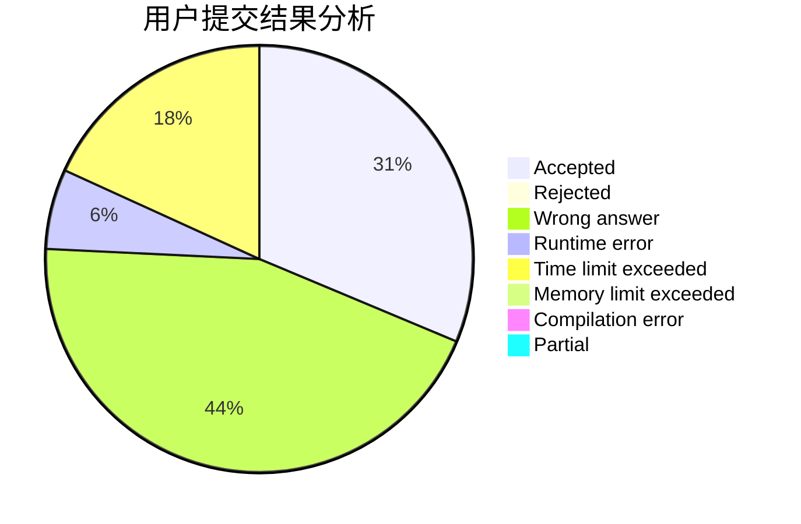
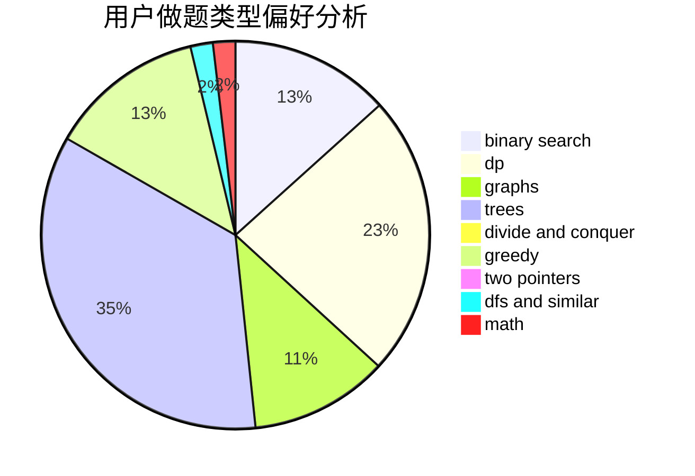

# q-w-q-w-q

<!-- tabs:start -->

#### **用户提交结果分析**

#### **用户做题类型偏好分析**

<!-- tabs:end -->
# 推荐题目
[1486E](https://codeforces.com/contest/1486/problem/E)
[870C](https://codeforces.com/contest/870/problem/C)
[1292E](https://codeforces.com/contest/1292/problem/E)
[99C](https://codeforces.com/contest/99/problem/C)
[412D](https://codeforces.com/contest/412/problem/D)
[720C](https://codeforces.com/contest/720/problem/C)
[1324C](https://codeforces.com/contest/1324/problem/C)
[13931](https://codeforces.com/contest/1393/problem/1)
[261E](https://codeforces.com/contest/261/problem/E)
[1006A](https://codeforces.com/contest/1006/problem/A)
