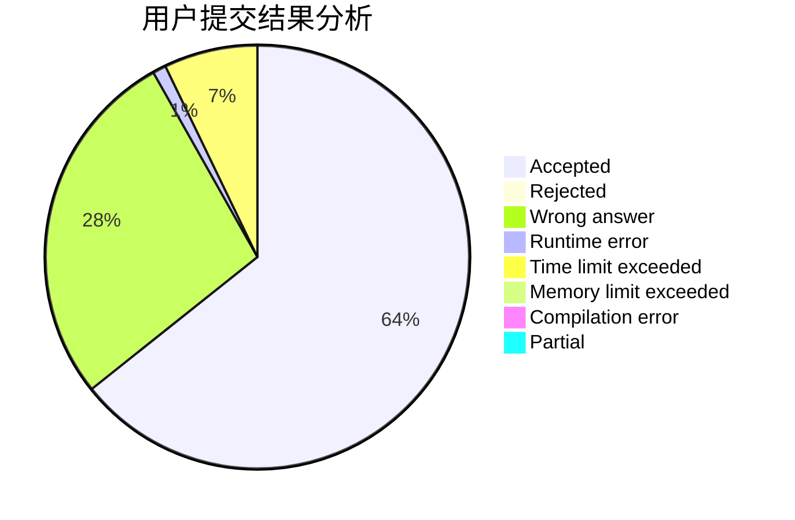
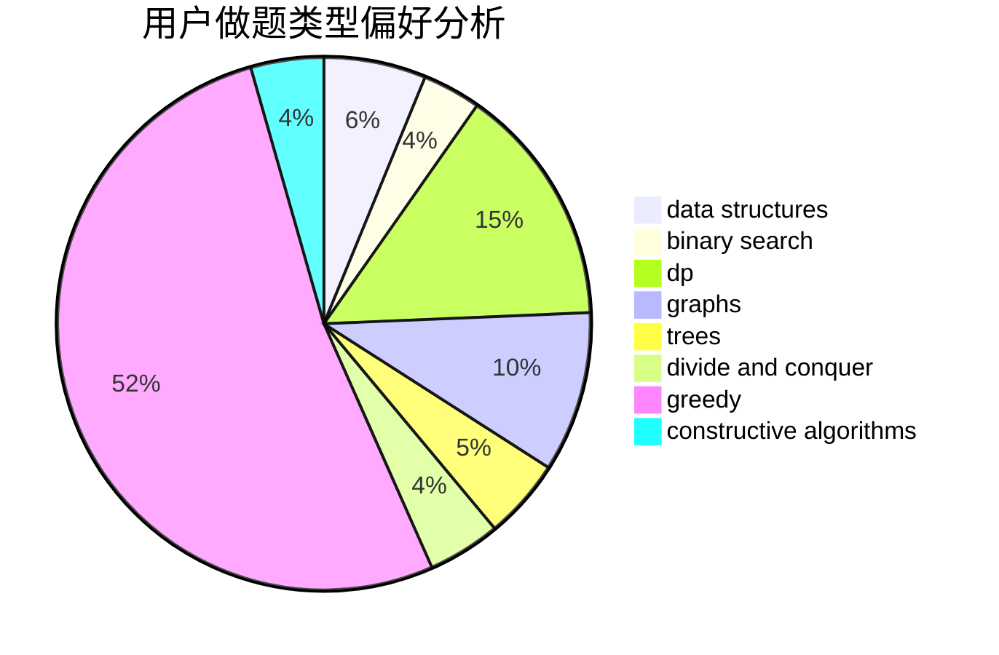
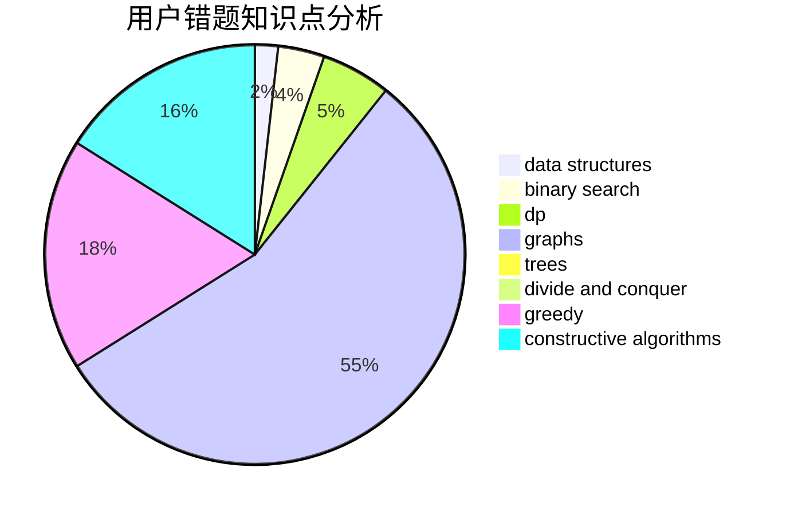

# qazswedx2

<!-- tabs:start -->

#### **用户提交结果分析**

#### **用户做题类型偏好分析**

#### **用户错题知识点分析**

<!-- tabs:end -->
# 推荐题目
[498D](https://codeforces.com/contest/498/problem/D)		data structures,
                        dp,
                        number theory		  
[962G](https://codeforces.com/contest/962/problem/G)		data structures,
                        dsu,
                        geometry,
                        trees		  
[913C](https://codeforces.com/contest/913/problem/C)		bitmasks,
                        dp,
                        greedy		  
[1065C](https://codeforces.com/contest/1065/problem/C)		greedy		  
[916E](https://codeforces.com/contest/916/problem/E)		data structures,
                        trees		  
[1136C](https://codeforces.com/contest/1136/problem/C)		constructive algorithms,
                        sortings		  
[4A](https://codeforces.com/contest/4/problem/A)		brute force,
                        math		  
[866D](https://codeforces.com/contest/866/problem/D)		dsu,graphs,sortings,trees		  
[666E](https://codeforces.com/contest/666/problem/E)		data structures,
                        string suffix structures		  
[721C](https://codeforces.com/contest/721/problem/C)		dp,
                        graphs		  
