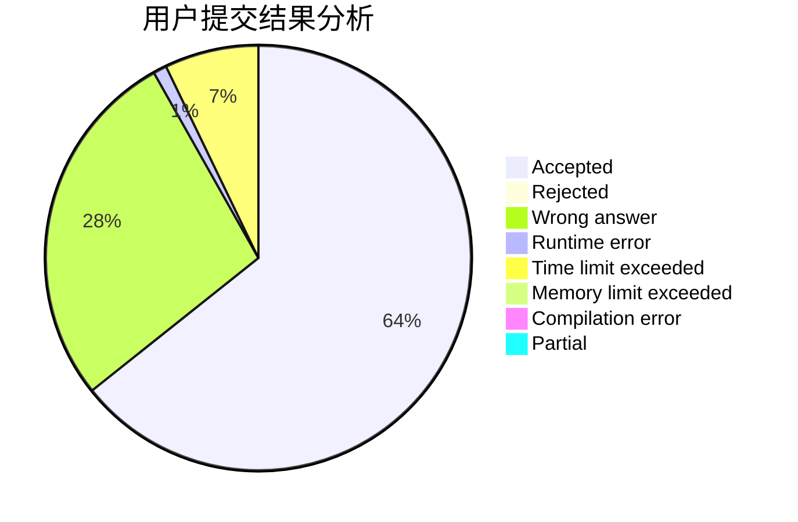
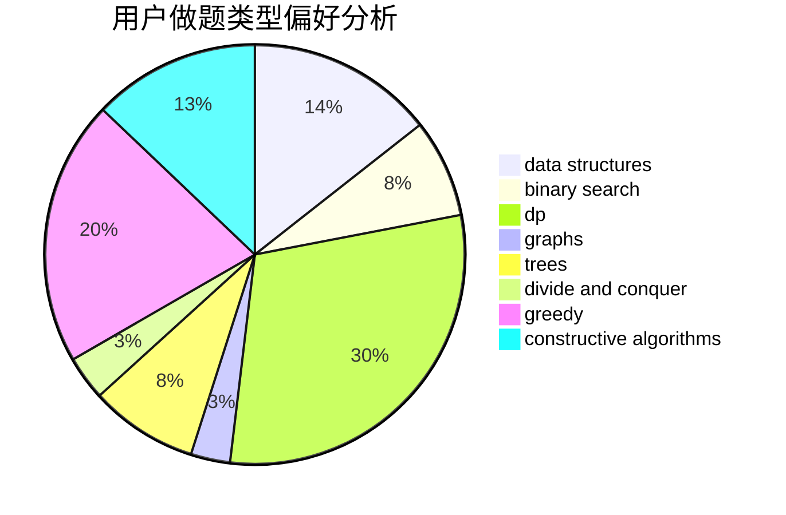

# qazswedx2

<!-- tabs:start -->

#### **用户提交结果分析**

#### **用户做题类型偏好分析**

#### **用户错题知识点分析**

<!-- tabs:end -->
# 推荐题目
[519D](https://codeforces.com/contest/519/problem/D)		data structures,
                        dp,
                        two pointers		  
[985E](https://codeforces.com/contest/985/problem/E)		binary search,
                        data structures,
                        dp,
                        greedy,
                        two pointers		  
[932A](https://codeforces.com/contest/932/problem/A)		constructive algorithms		  
[1065G](https://codeforces.com/contest/1065/problem/G)		strings		  
[937A](https://codeforces.com/contest/937/problem/A)		implementation,
                        sortings		  
[1138E](https://codeforces.com/contest/1138/problem/E)		dsu,graphs,sortings,trees		  
[520A](https://codeforces.com/contest/520/problem/A)		implementation,
                        strings		  
[886F](https://codeforces.com/contest/886/problem/F)		geometry		  
[688D](https://codeforces.com/contest/688/problem/D)		dsu,graphs,sortings,trees		  
[739A](https://codeforces.com/contest/739/problem/A)		constructive algorithms,
                        greedy		  
