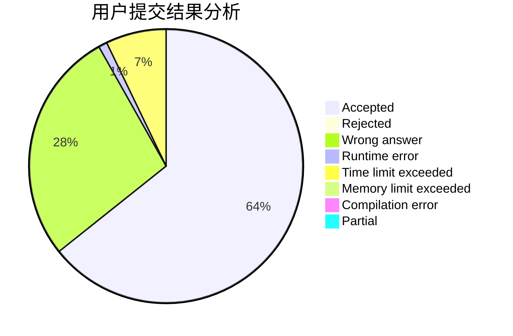
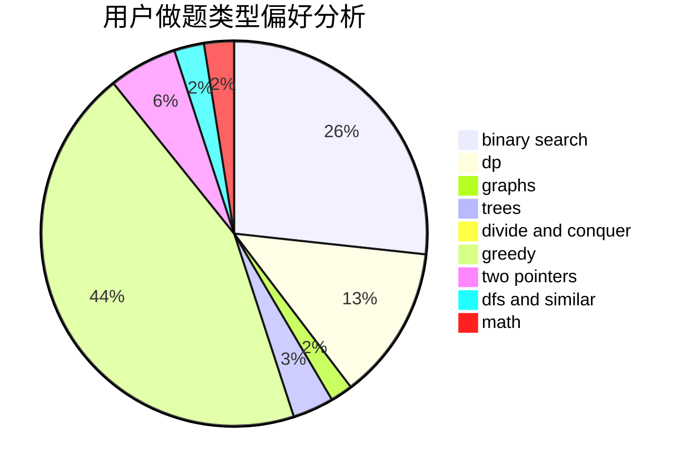

# qazswedx2

<!-- tabs:start -->

#### **用户提交结果分析**

#### **用户做题类型偏好分析**

<!-- tabs:end -->
# 推荐题目
[519D](https://codeforces.com/contest/519/problem/D)
[985E](https://codeforces.com/contest/985/problem/E)
[932A](https://codeforces.com/contest/932/problem/A)
[1065G](https://codeforces.com/contest/1065/problem/G)
[937A](https://codeforces.com/contest/937/problem/A)
[1138E](https://codeforces.com/contest/1138/problem/E)
[520A](https://codeforces.com/contest/520/problem/A)
[886F](https://codeforces.com/contest/886/problem/F)
[688D](https://codeforces.com/contest/688/problem/D)
[739A](https://codeforces.com/contest/739/problem/A)
