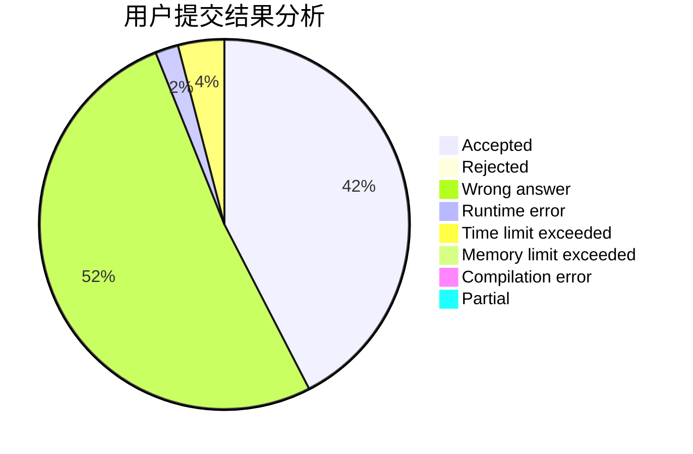
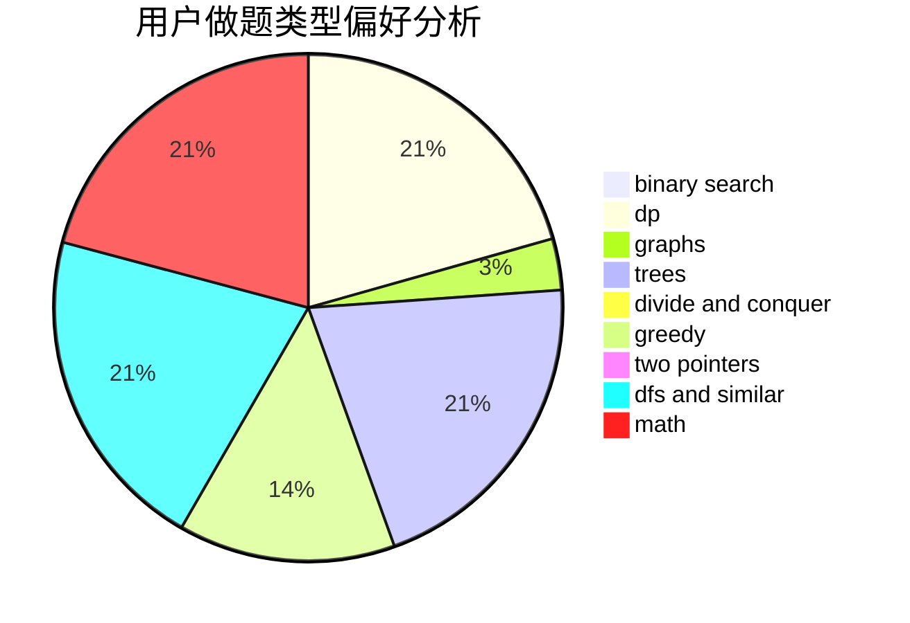

# qccccc

<!-- tabs:start -->

#### **用户提交结果分析**

#### **用户做题类型偏好分析**

<!-- tabs:end -->
# 推荐题目
[1349E](https://codeforces.com/contest/1349/problem/E)
[1033B](https://codeforces.com/contest/1033/problem/B)
[187C](https://codeforces.com/contest/187/problem/C)
[144E](https://codeforces.com/contest/144/problem/E)
[461D](https://codeforces.com/contest/461/problem/D)
[472D](https://codeforces.com/contest/472/problem/D)
[148A](https://codeforces.com/contest/148/problem/A)
[1442F](https://codeforces.com/contest/1442/problem/F)
[1072D](https://codeforces.com/contest/1072/problem/D)
[1509D](https://codeforces.com/contest/1509/problem/D)
