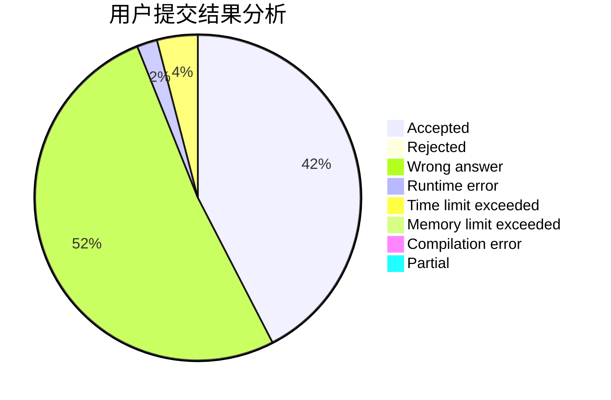
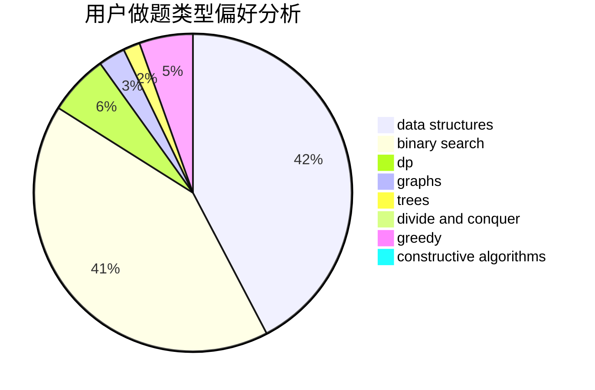
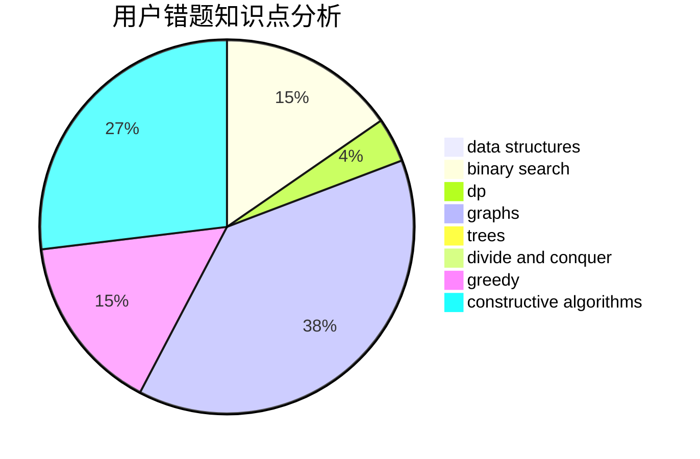

# qccccc

<!-- tabs:start -->

#### **用户提交结果分析**

#### **用户做题类型偏好分析**

#### **用户错题知识点分析**

<!-- tabs:end -->
# 推荐题目
[1343A](https://codeforces.com/contest/1343/problem/A)		brute force,
                        math		  
[1032E](https://codeforces.com/contest/1032/problem/E)		dp,
                        math		  
[161C](https://codeforces.com/contest/161/problem/C)		divide and conquer		  
[1438D](https://codeforces.com/contest/1438/problem/D)		bitmasks,
                        constructive algorithms,
                        math		  
[43B](https://codeforces.com/contest/43/problem/B)		implementation,
                        strings		  
[451A](https://codeforces.com/contest/451/problem/A)		implementation		  
[1481F](https://codeforces.com/contest/1481/problem/F)		dp,
                        greedy,
                        trees		  
[1433A](https://codeforces.com/contest/1433/problem/A)		implementation,
                        math		  
[1072A](https://codeforces.com/contest/1072/problem/A)		dsu,graphs,sortings,trees		  
[1499D](https://codeforces.com/contest/1499/problem/D)		dp,
                        math,
                        number theory		  
