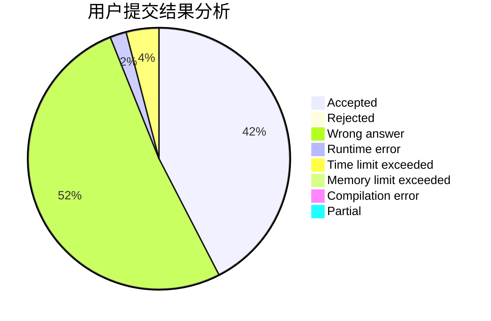
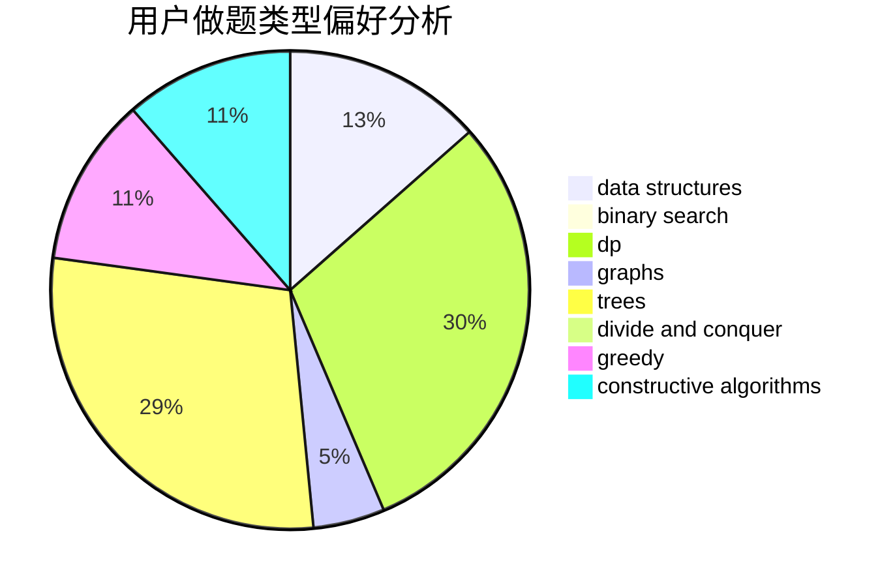
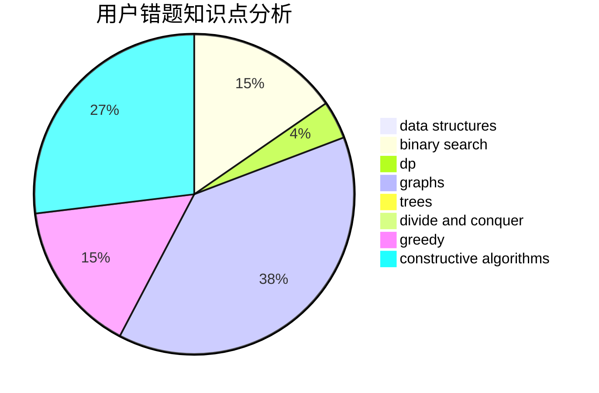

# qccccc

<!-- tabs:start -->

#### **用户提交结果分析**

#### **用户做题类型偏好分析**

#### **用户错题知识点分析**

<!-- tabs:end -->
# 推荐题目
[1349E](https://codeforces.com/contest/1349/problem/E)		constructive algorithms,
                        dp,
                        greedy		  
[1033B](https://codeforces.com/contest/1033/problem/B)		math,
                        number theory		  
[187C](https://codeforces.com/contest/187/problem/C)		dfs and similar,
                        dsu		  
[144E](https://codeforces.com/contest/144/problem/E)		data structures,
                        greedy		  
[461D](https://codeforces.com/contest/461/problem/D)		dsu,
                        math		  
[472D](https://codeforces.com/contest/472/problem/D)		dfs and similar,
                        dsu,
                        shortest paths,
                        trees		  
[148A](https://codeforces.com/contest/148/problem/A)		constructive algorithms,
                        implementation,
                        math		  
[1442F](https://codeforces.com/contest/1442/problem/F)		games,
                        interactive		  
[1072D](https://codeforces.com/contest/1072/problem/D)		dsu,graphs,sortings,trees		  
[1509D](https://codeforces.com/contest/1509/problem/D)		dsu,graphs,sortings,trees		  
