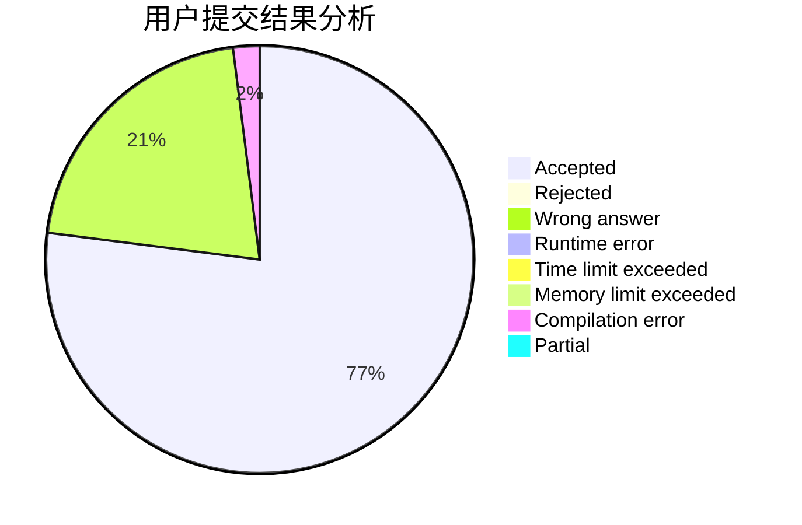
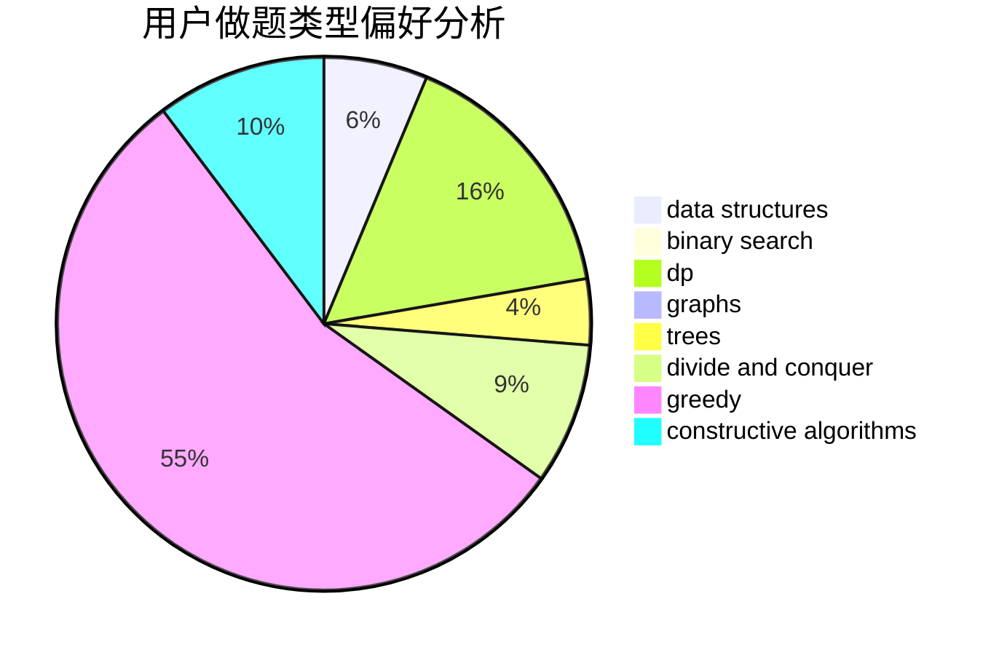
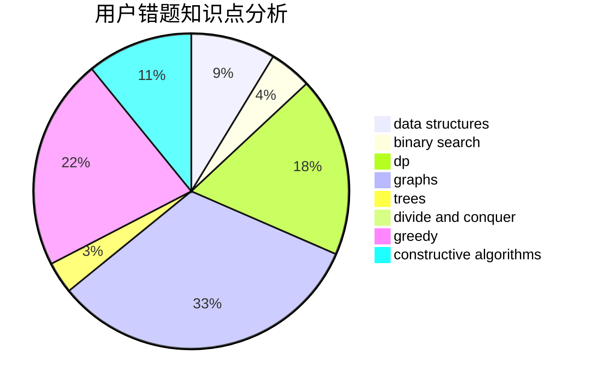

# qdd

<!-- tabs:start -->

#### **用户提交结果分析**

#### **用户做题类型偏好分析**

#### **用户错题知识点分析**

<!-- tabs:end -->
# 推荐题目
[343B](https://codeforces.com/contest/343/problem/B)		data structures,
                        greedy,
                        implementation		  
[1290D](https://codeforces.com/contest/1290/problem/D)		constructive algorithms,
                        graphs,
                        interactive		  
[645F](https://codeforces.com/contest/645/problem/F)		combinatorics,
                        math,
                        number theory		  
[986B](https://codeforces.com/contest/986/problem/B)		combinatorics,
                        math		  
[768D](https://codeforces.com/contest/768/problem/D)		dp,
                        math,
                        probabilities		  
[438E](https://codeforces.com/contest/438/problem/E)		combinatorics,
                        divide and conquer,
                        fft,
                        number theory		  
[672C](https://codeforces.com/contest/672/problem/C)		dsu,graphs,sortings,trees		  
[453E](https://codeforces.com/contest/453/problem/E)		data structures		  
[807C](https://codeforces.com/contest/807/problem/C)		dsu,graphs,sortings,trees		  
[668A](https://codeforces.com/contest/668/problem/A)		dsu,graphs,sortings,trees		  
